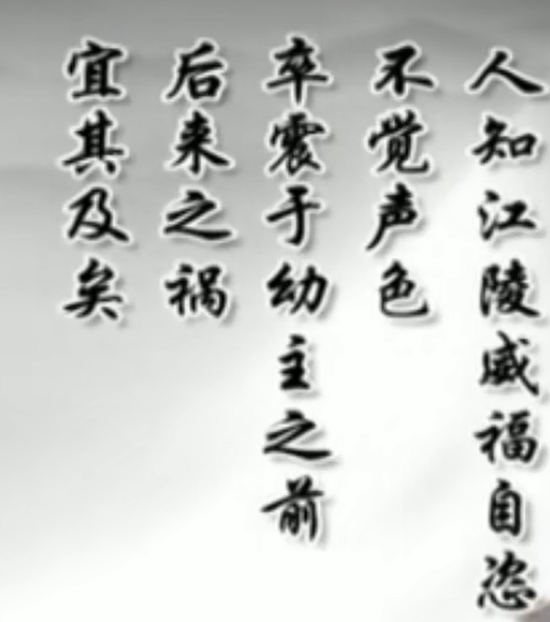

## 人物
- 最好的老师：宰相之杰张居正，大明的天才
	- 外形描述：
		为人颀面秀眉目，须长至腹，勇敢任事，豪杰自许
		**颀（qi）面：英俊的面孔**
		**秀眉目：细眉毛，长眼睛，卧蚕眉，丹凤眼**
	- 隆庆和万历的老师，在隆庆时的教师团队资历靠后
	- 一生追求
		- 进行一场成功的改革
		- 培养一个优秀的接班人
- 最好的陪读：司礼监大太监冯保-大伴
	- 推荐张居正给李太后的原因
		
- 最好的学生：万历
	- 十岁登基
	- 称呼张居正为：先生，和万历感情相当好（万历一年到万历十年（1582年）推行：万历新政）
	- 万历新政效果：
		

- 最好的家长：李太后
	- 万历的母亲

## 课上
- 张居正权高震主，但不自知。为后续埋下伏笔

- 张居正的童年如何，为什么会对小万历进行强势教育。**弗洛伊德：一个人的童年决定了一个人的一生**。

