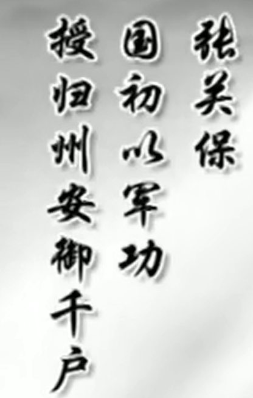
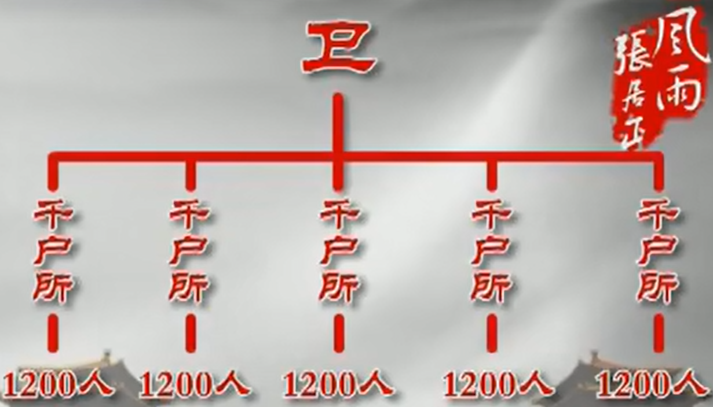
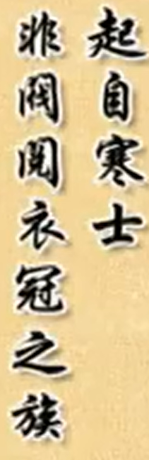
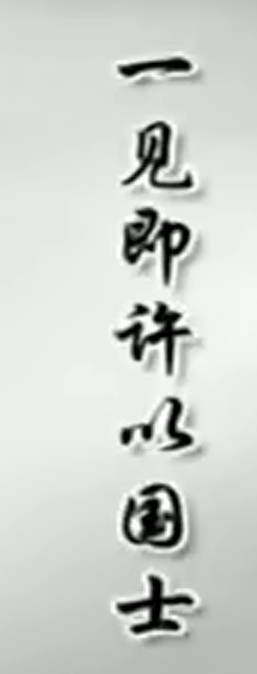
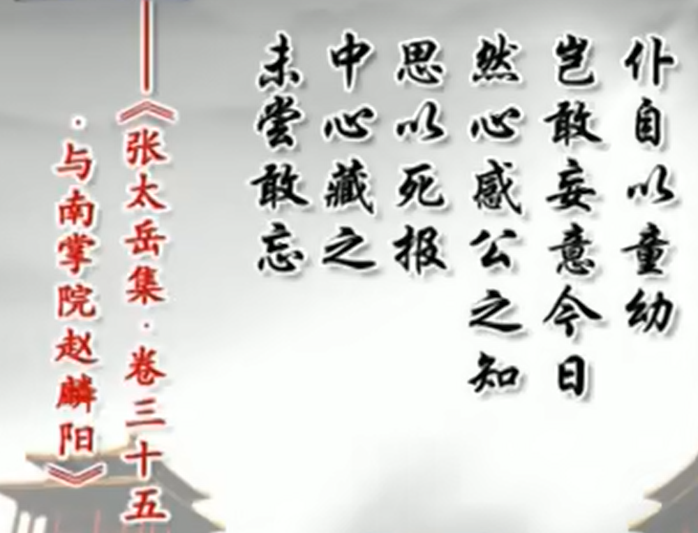

大明1471年后的天才儿童：
- 唐伯虎
- 徐文长
- 张居正
- 
- 古代栋梁之才：“学而优则仕”，“齐家治国平天下”
## 张居正
### 第一次落榜
- 家世：
	- 军人世家（张关保跟随朱元璋打天下：千户官职）**张居正描述：以军功仕千户**
		- 
		- 
	- 张居正现实理想：国富兵强
- 家庭分布
	- 
	- 七世祖：张关保
		- 曾祖父：张诚
			- 祖父：张镇排行老二，老大张钺，老三张釴（青铜时代梦想）
				- 张镇不学无术，家庭条件并不好，但游侠仗义
				
				- 父亲：张文明
嘉靖年间张居正怀胎12个月出生了，前一天晚上：
- 张诚梦到水里有白乌龟：古代祥瑞文化：青铜时代的想法
- 张镇梦到有水从张少保地里流过来
- **周公解梦：梦里梦到水是一个吉兆**
- 原名张白圭，不到两岁认字，五岁做诗，十岁可以写文章，十二岁考中秀才
- **考秀才时，荆州夫长官李士翱做梦，梦到天帝有一个白玉印要给一个小孩，然后开榜后遇到张白圭就感觉是他。主考官给他改名因为当官不合适，就改名为张居正**
- 第二年张居正乡试，结果落榜

- 体现出了张居正的野心和抱负。但也是天才儿童的自我膨胀。因此对于儿童调节的时机和方式非常重要。，张居正自身也做得相当好。
### 落榜原因
- 顾璘很看好张居正，同时顾璘也觉得张居正太小了，需要给予一些挫折培养一下。如果不能好好培养，觉得很浪费人才。同时十三岁孩子，相当成熟，能理解顾璘的看法。
- 
	- 
	- 张居正有非常强的能力应对挫折，超越常人的心理素质，非常强，凤凰涅槃
	- **也正是他成为天才的原因**