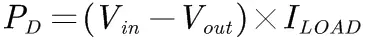
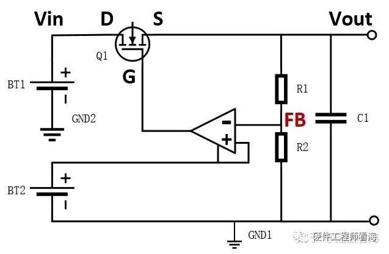
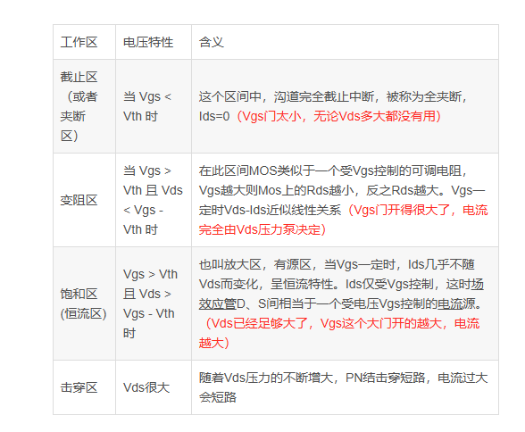

输入>输出+压降

[电源大师1——DCDC电源分类：线性电源、开关电源、电荷泵。_哔哩哔哩_bilibili](https://www.bilibili.com/video/BV1xv411w7aU/?spm_id_from=333.337.search-card.all.click&vd_source=ba62f878ab81b77525d122fe32118844)

## 一、线性电源分类
线性电源主要分为两种传统线性稳压器和低压差稳压器

1. 传统线性稳压器
    - 压差较高（通常≥2V），输入电压需显著高于输出电压。
    - 典型芯片：LM7805（压差约2V）。
2. 低压差稳压器（LDO, Low Dropout Regulator）[LDO](2、LDO.md)
    - 压差极低（可低至0.1V-0.5V），适合输入输出电压接近的场景。
    - 典型芯片：AMS1117（压差约1.1V）、MCP1700（压差低至0.18V）。
    - 优势：减少能量损耗，延长电池设备续航时间。

### **1. 按功率管类型分类**
#### **（1）双极型晶体管（BJT）稳压器**
+ **核心器件**：使用双极结型晶体管（BJT）作为调整管。
+ **特点**： 
    - **压差较高**（通常≥2V）：BJT需要一定的基极驱动电压和饱和压降。
    - **静态电流较大**：基极电流会导致额外损耗，效率较低。
    - **成本低**：工艺成熟，适合低成本应用。
+ **典型芯片**：LM78xx系列（如LM7805）、LM317。
+ **适用场景**：传统高输入电压、非电池供电的场合。

#### **（2）MOSFET型稳压器（LDO）**
+ **核心器件**：使用MOSFET（金属-氧化物半导体场效应管）作为调整管。
+ **特点**： 
    - **低压差（Low Dropout, LDO）**：压差可低至0.1~0.5V，MOSFET的导通电阻（Rds(on)）极小。
    - **静态电流极低**：栅极驱动电流几乎为零，适合电池供电设备。
    - **高频性能好**：MOSFET开关速度快，支持快速瞬态响应。
+ **典型芯片**：TPS7A系列（如TPS7A4700）、MCP1700。
+ **适用场景**：输入输出电压接近的低功耗场景（如手机、IoT设备）。

---

### **2. 按功率管工作模式分类**
#### **（1）NPN型稳压器**
+ **结构**：使用NPN晶体管作为调整管，需较高的基极驱动电压。
+ **缺点**：压差大（通常≥2V），效率较低。
+ **典型代表**：传统78xx系列稳压器。

#### **（2）PNP型稳压器**
+ **结构**：使用PNP晶体管作为调整管，基极驱动电压要求较低。
+ **优势**：压差略低于NPN型（约1~1.5V），但仍高于LDO。
+ **典型代表**：部分早期LDO型号（如LM2931）。

#### **（3）PMOS/NMOS型稳压器**
+ **结构**：使用PMOS或NMOS作为调整管，无需基极驱动电流。
+ **优势**： 
    - **极低压差**（PMOS型典型压差为0.2V，NMOS型更低）。
    - **低静态电流**：适合超低功耗场景。
+ **典型芯片**：PMOS型（如AMS1117），NMOS型（如ADP1740）。

---

### **3. 按功率管集成方式分类**
#### **（1）分立式稳压器**
+ **结构**：功率管外置于稳压电路（如使用外部MOSFET或BJT）。
+ **优势**：灵活选择功率管参数，适合大电流或定制化设计。
+ **缺点**：外围电路复杂，体积较大。
+ **典型应用**：大功率线性电源、实验室设备。

#### **（2）集成式稳压器**
+ **结构**：功率管与控制器集成在同一芯片内。
+ **优势**：体积小、设计简单，适合标准化应用。
+ **典型芯片**：LM317（BJT集成）、LT3080（MOSFET集成）。

---

### **4. 功率管对性能的影响**
+ **压差（Dropout Voltage）**： 
    - BJT稳压器压差大（2V以上），MOSFET（LDO）压差极小（0.1~0.5V）。
+ **效率**： 
    - BJT因基极电流损耗效率较低，MOSFET损耗集中在导通电阻（Rds(on)），效率更高。
+ **静态电流**： 
    - BJT稳压器静态电流（mA级）远高于MOSFET型（µA级）。
+ **散热设计**： 
    - 大电流或高压差场景需重点考虑功率管散热（如TO-220封装加装散热片）。

---

### **5. 典型芯片对比**
| **功率管类型** | **典型芯片** | **压差** | **静态电流** | **适用场景** |
| --- | --- | --- | --- | --- |
| 双极型（BJT） | LM7805 | 2V | 5mA | 传统电源适配器 |
| PNP型（LDO） | LM2931 | 0.4V | 1mA | 车载电子、工业设备 |
| PMOS型（LDO） | AMS1117 | 1.1V | 5µA | 便携设备、传感器 |
| NMOS型（LDO） | ADP1740 | 0.2V | 30µA | 电池供电设备（如手机） |

---

### **总结**
线性稳压器的分类与功率管类型直接相关：

1. **双极型（BJT）稳压器**：成本低，但压差大、效率低，适合非低功耗场景。
2. **MOSFET型（LDO）**：压差极小、静态电流低，适合现代电子设备的节能需求。
3. **选择依据**： 
    - **输入输出电压差**：压差大选BJT，压差小选LDO。
    - **功耗要求**：电池供电优先选MOSFET型。
    - **成本与复杂度**：BJT方案更简单，LDO需权衡性能与成本。

## 二、问题
### 1、线性电源的参数（选型注意事项）
①$V_I$（输入电压）: 电路输入端施加的电压。

②$V_O$（输出电压）：有些是固定的，有些是外接电阻可调的

③压差（Dropout Voltage)：电压差称为压差维持电路正常工作所需的输入与输 出电压的最小差值。

④噪声：干扰信号，影响精度和信号质量。

⑤$I_Q$（静态电流Quiescent Current）：线性电源空载时候的电流大小，便携式设备就需要$I_Q$很小

⑥$I_O$（输出电流）：电路输出端能提供的最大电流。

### 2、线性电源的效率一定低于开关电源吗？
效率$\eta=\frac{V_O}{V_I}$

不一定，低压差线性电源的效率可以很高。

#### **线性电源功率耗散计算公式**

可见，高压降比和高负载电流会产生较高的功率耗散。

愈高的功率耗散一般需要愈大的LDO封装尺寸，这将增加整体成本、PCB面积，以及应用系统的运作温度。

当LDO功率耗散高于0.8W左右时，转为使用降压转换器(Buck)是较明智的作法。

挑选LDO时，必须考虑输入和输出的电压范围、LDO的负载能力，以及芯片封装的功率耗散能力。

### 3、线性电源不能并联扩流

## 三、功率管的工作原理
功率管是当作调整器来作用的，也就是工作在放大区，即可变电阻区域。开关电源是工作在截至区和饱和区。

### 1、电路分析
当Vout出现降低时，此时FB也会降低，对应此时栅极Vg会增大，减少Q管的电阻，提高电流，进一步提升Vout，当Vout有出现增长时，反之进行进一步改善。因此MOS管起到一个可变电阻的作用。

### 2、mos管相关知识
[MOS管相关知识_mos管的三个工作状态-CSDN博客](https://blog.csdn.net/azj2019/article/details/124780249)

[MOSFET工作区域判定方法_mosfet的工作区-CSDN博客](https://blog.csdn.net/weixin_38662069/article/details/132295072)

[图文讲解三极管3种工作状态-CSDN博客](https://blog.csdn.net/ybhuangfugui/article/details/106416558)

