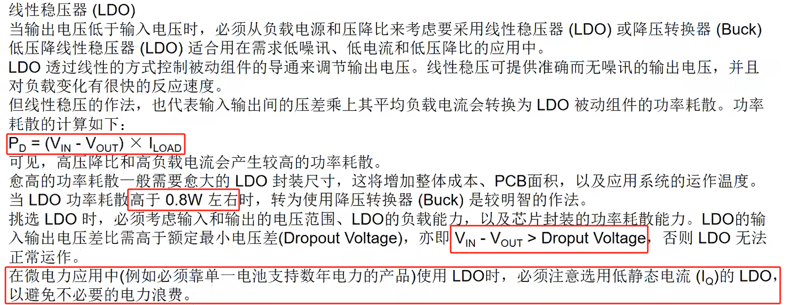
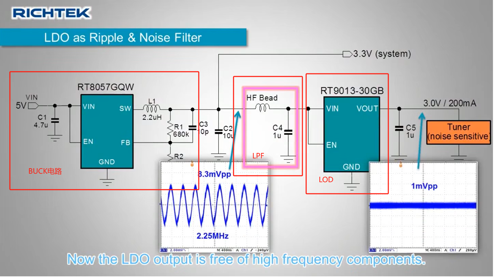
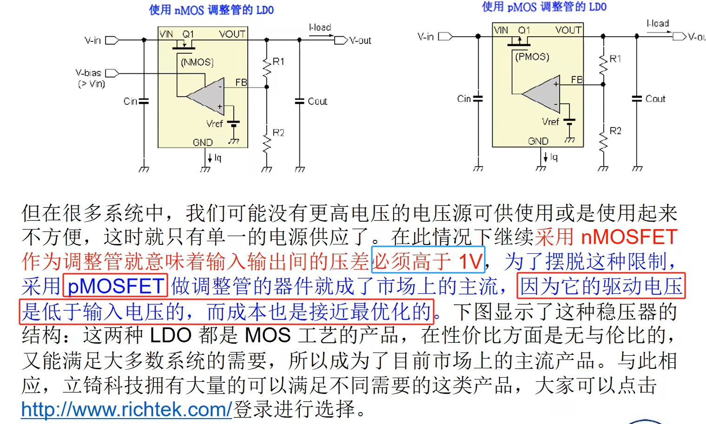

[电子电路学习笔记（14）——LDO(低压差线性稳压器)_ldo电路-CSDN博客](https://blog.csdn.net/qq_36347513/article/details/121019508)

[LDO VS buck的优缺点对比：LDO（效率低但稳压）；DCDC（降压buck，效率高但噪声大）_buck和ldo电路的优缺点-CSDN博客](https://blog.csdn.net/ank1983/article/details/139884660)

低压差线性稳压器（**low dropout regulator**）

现流行LDO主要使用PNP和PMOS管。

### **1、LDO（低压差线性稳压器）的优缺点分析**
---

#### **一、LDO的核心特点**
LDO（Low Dropout Regulator）是一种特殊的线性稳压器，其核心优势在于极低的**压差电压**（Dropout Voltage，即输入与输出的最小允许压差）。相较于传统线性稳压器（如7805需2V以上压差），LDO的压差可低至 **0.1V–0.5V**，特别适用于输入电压接近输出电压的场景（如电池供电设备）。

---

#### **二、LDO的优点**
1. **低压差能力**
    - **延长电池寿命**：在电池供电设备中，允许输入电压（如锂电3.7V）直接稳压至3.3V输出，避免传统线性稳压器因压差不足导致的提前断电。
    - **适应宽输入范围**：输入电压仅需略高于输出电压即可工作，适合多级电源系统中后级稳压。
2. **低噪声与高精度**
    - **无开关噪声**：与开关电源（DC-DC）相比，LDO无高频开关动作，输出纹波极低（µV级），适合**模拟电路**（如ADC、传感器）和**射频电路**。
    - **高电源抑制比（PSRR）**：可有效抑制输入电压的高频噪声（如50Hz–100kHz），典型PSRR值在60dB以上。
3. **设计简单与低成本**
    - **外围电路简单**：仅需输入/输出电容即可工作，无需电感等复杂元件，PCB面积小。
    - **快速启动**：无软启动延迟，适合需瞬时响应的系统。
4. **静态电流低**
    - **待机功耗低**：先进LDO的静态电流（Quiescent Current）可低至**1µA–100µA**，适用于物联网设备等低功耗场景。
5. **保护功能完善**
    - **过流/短路保护**：自动限制输出电流，防止芯片损坏。
    - **过热保护**：温度超限时关闭输出，提高系统可靠性。

---

#### **三、LDO的缺点**
1. **效率较低**
    - **效率公式**：η = Vout / Vin × 100%。当输入电压显著高于输出电压时，效率急剧下降（如Vin=5V、Vout=1.8V时，η=36%），功耗以热能形式浪费，需依赖散热设计。
2. **输出电流受限**
    - **散热瓶颈**：大电流应用（如>1A）会导致功率管发热严重，需额外散热片或限制使用场景。
    - **芯片封装限制**：小型封装（如SOT-23）的LDO通常仅支持数百mA电流。
3. **输入电压范围有限**
    - **耐压限制**：多数LDO输入电压上限为5V–30V，高压输入需搭配预稳压电路。
4. **压差与负载的权衡**
    - **动态性能下降**：在接近最小压差时，LDO的瞬态响应可能变慢，输出稳定性降低。
5. **成本高于传统线性稳压器**
    - **高性能LDO价格较高**：低噪声、超低压差的LDO（如用于医疗设备）成本显著高于标准型号。

---

#### **四、LDO与开关电源（DC-DC）的对比**
| **特性** | **LDO** | **开关电源（DC-DC）** |
| --- | --- | --- |
| **效率** | 低（30%-80%） | 高（85%-95%） |
| **噪声** | 极低（µV级） | 较高（需滤波设计） |
| **压差** | 0.1V–0.5V | 无要求（支持升降压） |
| **体积** | 小（无电感） | 较大（需电感/电容） |
| **成本** | 低（简单设计） | 较高（复杂拓扑） |
| **适用场景** | 低功耗、高精度模拟电路 | 大电流、高效率、宽压差场景 |

---

#### **五、总结：LDO的适用场景**
+ **推荐使用**： 
    - 电池供电设备（如手机、穿戴设备）。
    - 噪声敏感电路（音频/射频/传感器信号链）。
    - 低功耗待机系统（如IoT传感器）。
+ **避免使用**： 
    - 输入输出电压差大且需高电流（如12V转3.3V/2A）。
    - 对效率要求苛刻的场合（优先选择DC-DC）。

**设计建议**：在混合电源系统中，可结合LDO与DC-DC，利用LDO后级稳压滤除开关噪声，同时兼顾效率与精度。

[DCDC与LDO结合使用](2、LDO.md#FCrRl)

## 2、BUCK和LDO组合使用

BUCK电路降压输出电压通过磁珠与电容组成的低通滤波器再通过LDO能够有效的降低输出电压纹波。

## 3、LDO功率管设计

PMOS管的压差可以做到很小是因为，PMOS管要求栅极电压是要低于源极电压Vs才能导通，所以可以做到很小。[功率管](3、功率管.md)

