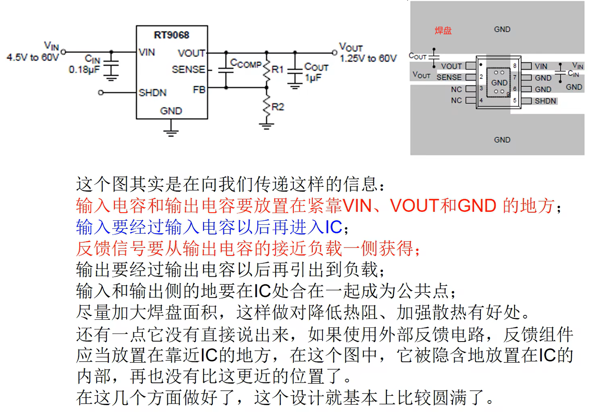
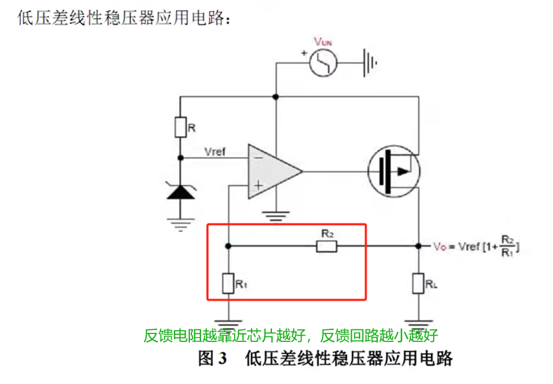
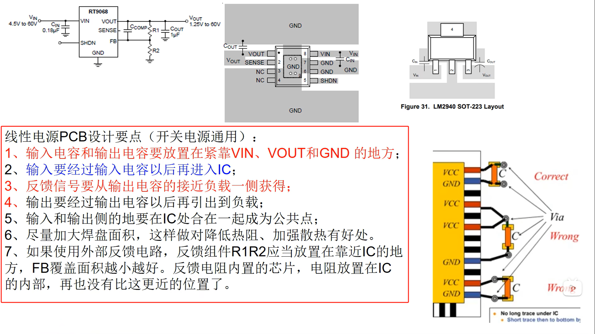
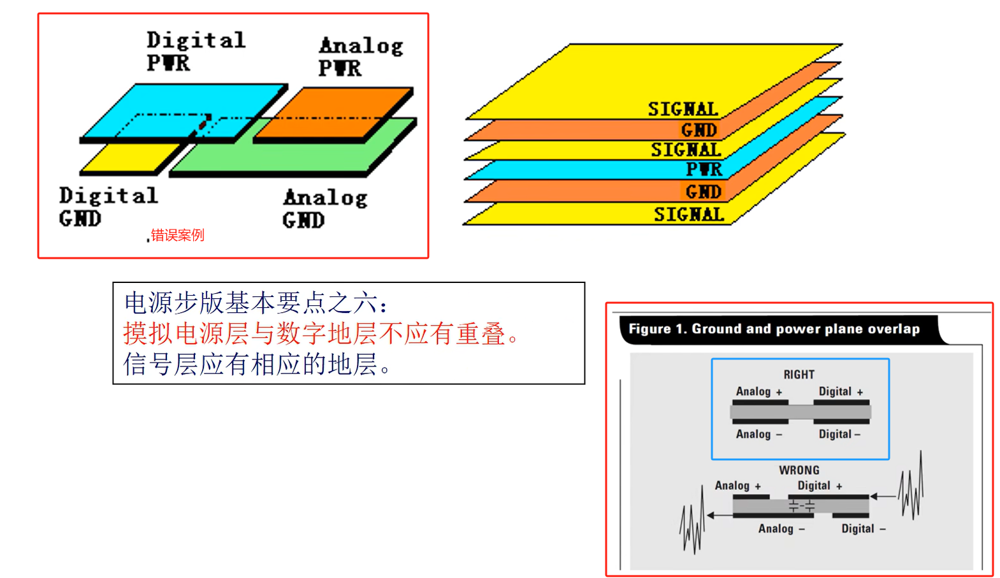
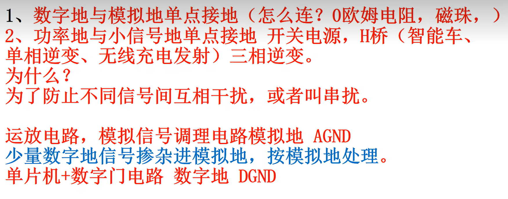
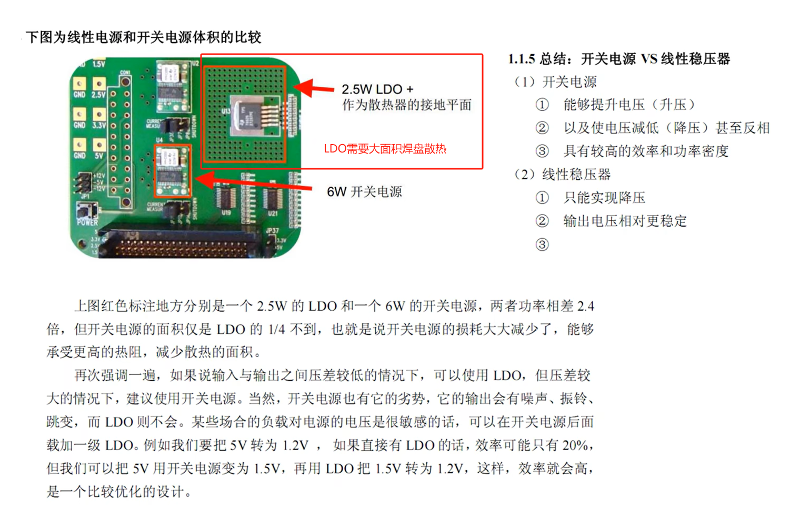

## 线性电源PCB绘制注意事项

反馈信号从靠近IC的部分去取样。如下图所示，其中$ C_1,C_2 $为输出滤波电容，$ C_3 $为IC输入滤波电容。这时候反馈信号的取值就应该从$ C_2 $右侧取值。

## PCB数字电源层和地层分割要求
数字电源层和模拟地层不要有重叠！！！

数字电源和模拟电源中间用磁珠或者小电感相互连接，模拟地和数字地之间用0欧姆电阻或者磁珠相连接！！！

PCB走线尽量保持过渡圆润，尽量走渐变线，不要出现突变，突变会引起不好信号的反射。

## LDO应用

