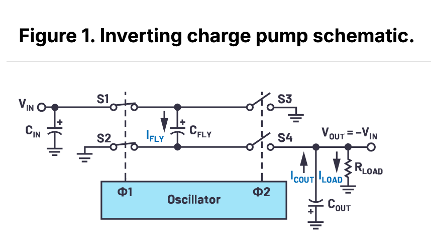
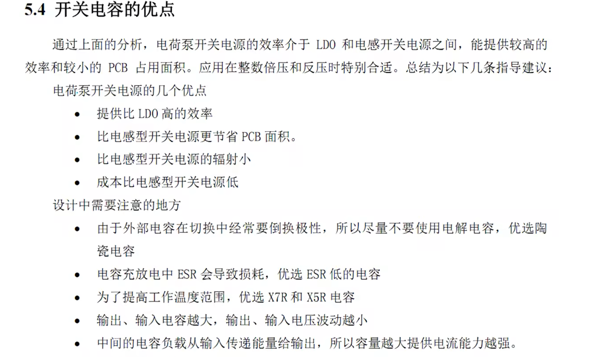
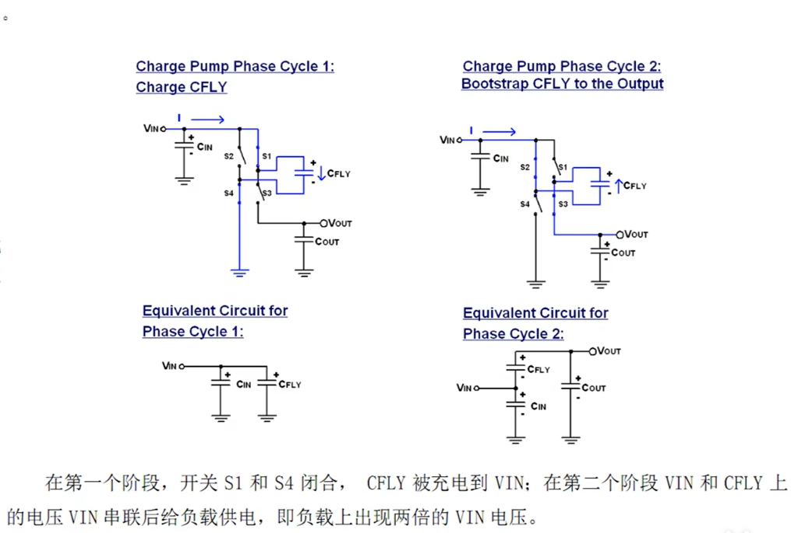
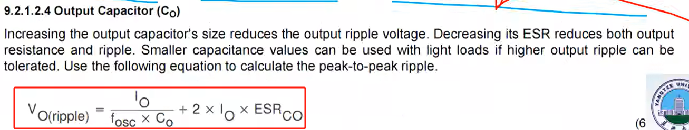
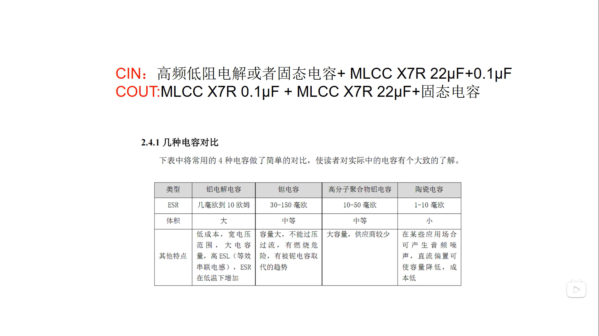

[电源大师3——电容式开关电源（电荷泵）工作原理、数据手册、PCB设计。_哔哩哔哩_bilibili](https://www.bilibili.com/video/BV1dM4y1g785?spm_id_from=333.788.videopod.sections&vd_source=ba62f878ab81b77525d122fe32118844)
根据电容两端电压差值不可以突变的准则，设计电压反向电路，用于产生负电压。

## 一、传统反向电荷泵

工作原理：其中$s_1,s_2,s_3,s_4$均为开关，其中$s_1,s_2$的时钟周期为一样的为clk1，$s_3,s_4$为一样的为clk2，当clk1闭合时，为电容$C_{FLY}$充电，然后clk1打开，紧接着clk2闭合，此时由于电容两端电压差不能突变，原本$C_{FLY}$为正的此时接地，那么电容下端即为等大的负电压，对此实现了电荷转移。（和nmos管做电源开关时的自举电路原理相一致）。

其中$C_{FLY}$叫飞跨电容，当开关频率越高时飞跨电容应该越小。

参考链接如下，其中交错式反向电荷泵原理也是类似的。

[交错式反相电荷泵——第一部分：用于低噪声负电压电源的新拓扑结构 | Analog Devices](https://www.analog.com/cn/resources/analog-dialogue/articles/the-interleaved-inverting-charge-pump-part-1.html)

## 二、开关电容的优点

开关电容可用于倍压，半压，负压。

倍压型

飞跨电容由于电容在开关关闭的瞬间会产生很大的电流，所以飞跨电容不能太大，一般取两倍的推荐电容。因为电容的数值会一直下降，所以选两倍较好。例如，推荐1uF，用2uF。

## 三、输出滤波电容的选取

输出电压的纹波大小和开关频率，输出电流的大小有关。开关频率在出厂时已经设计好了，所以只能动输出电流和输出滤波电容大小。输出电流管不了所以只需要调节输出滤波电容。

ESR排序：MLCC<钽电容<固态电容<高频低阻电解电容<电解电容

输出电容电容量越大越好。

电荷泵带载能力差，适用于低功率场合。非稳压型效率很高

