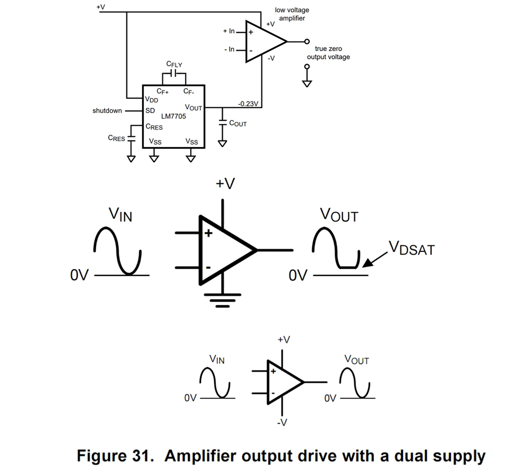
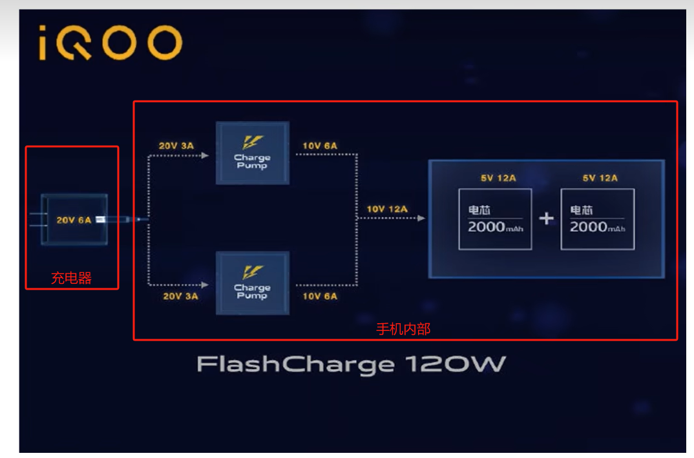
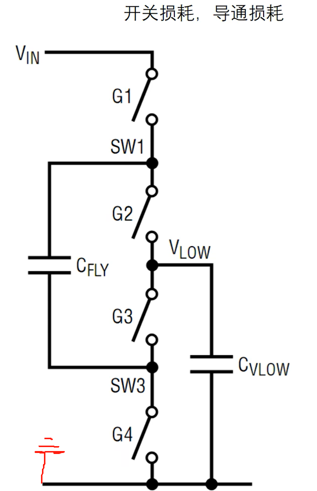

### 分类
分为两种：第一种就是稳压部分给电容进行充放电，进而实现稳压电荷泵，第二种就是非稳压性电荷泵后面接稳压器件实现稳压

### 应用
#### 运放信号放大

其中LM7705就是一个稳压性电荷泵。

对于运放放大弱信号时一定要用双电源供电，否则在放大微弱信号时误差会特别大存在失真如上图所示。

原理就是运放内部输出级三极管具有饱和压降，三极管需要导通才能放大。

[运放单电源供电和双电源供电_运放单电源供电和双电源供电区别-CSDN博客](https://blog.csdn.net/chenhuanqiangnihao/article/details/122112766)

#### 手机充电
手机充电都采用高压低电流，根据$ I^2R $可知电流小损失功率就小。高压进入手机内部后，仅在电荷泵进行降压扩流，进行充电。

工作原理：

先把两个电容串联，然后再并联就实现了半压

