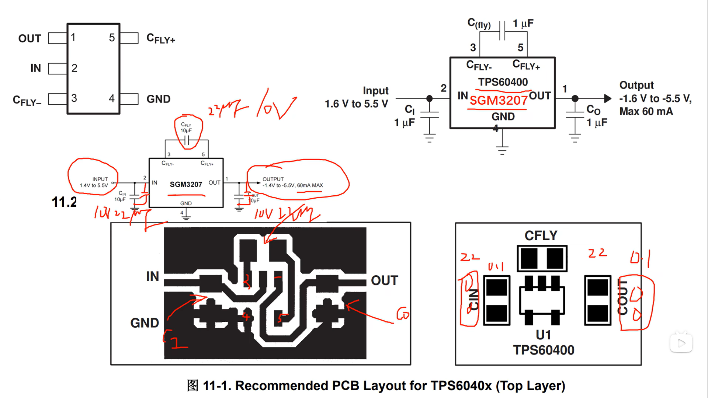
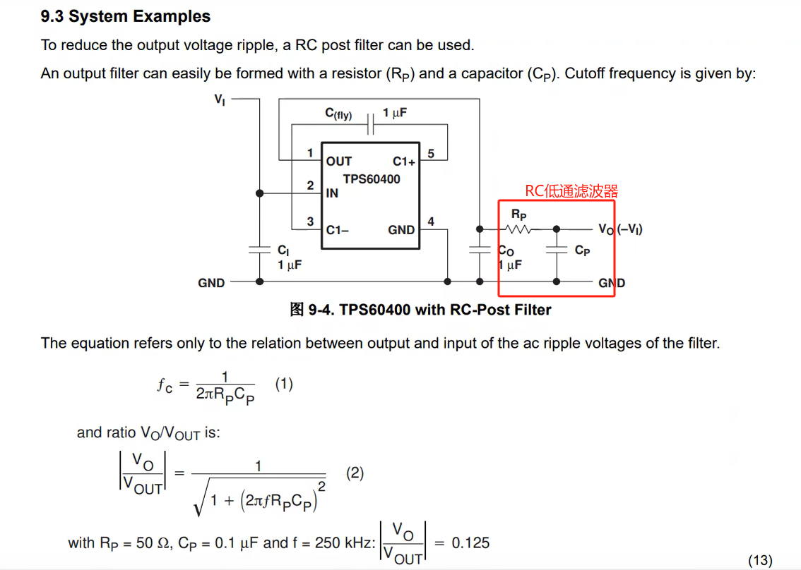
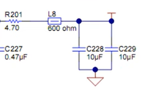

### 元器件选型
输出输入电容还有飞跨电容都尽可能的靠近芯片引脚。飞跨电容选取采用推荐的2倍。对于输入和输出滤波电容，建议再推荐的基础上在并一个小电容，其中添加的输入电容越小越靠近芯片，添加的输出滤波电容越大越靠近芯片。

其中$ C_{fly} $选择两倍左右也就是4.7uF，$ C_{IN} $右端加一个小电容，$ c_{out} $右端加一个小电容。降低输出电压的纹波。

其中$ R_P $不需要特别大，也可以用10uH的电感，也可用磁珠。$ C_P $要求不多。

输出接RC低通滤波和磁珠加电容组成LC低通滤波，对纹波信号进行滤除。

