# BUCK变换

## 一、工作原理

对于BUCK电路主要起降压作用。工作场景可以是：假设输出电压为5V，限制输出电压$V_0$，例如设计输出电压为3V，当输出达到3v时，控制mos管断开，由电感储能元件进行供电，电流与之前的同向。当电感供电电压小于3V时，mos管导通，进行供电。如此循环。

输入电容和输出电容都需要进行计算保证，纹波要很小。具体计算方式，参照下文。

### 1）开关Q1导通时
忽略寄生电阻和导通电阻。

$V_L=V_{in}-V_o=L\frac{d_{i_L}}{d_t}\leftrightarrow L\frac{\bigtriangleup i_L}{DT}=V_{in}-V_o$其中D为占空比，为周期。

反解出$\bigtriangleup i_L=\frac{V_{in}-V_o}{L} \bigtriangleup t$

可见电流变化是线性变化。$\bigtriangleup i_L$是电感纹波电流。

### 2）开关Q1截至时间
 由于电感电流不能突变，续流二极管CR1导通，电感续流，电感电流线性下降。忽略二极管导通压降有：  

$V_L=V_o=L\frac{di_L}{dt}=L\frac{\bigtriangleup i_L}{(1-D)T}$

对于稳态工作的BUCK变换，导通时电感电流的增加必须与截止时电感电流的减少相等，才能保证电感的磁复位。

## 二、BUCK变换MOS管的选择
[MOS管的原理及其用法 - blogernice - 博客园 (cnblogs.com)](https://www.cnblogs.com/blogernice/articles/9857021.html)

[MOS管电流方向能反吗？体二极管能过多大电流？ - 知乎](https://zhuanlan.zhihu.com/p/400807099)

① 对于相同尺寸的晶片，NMOS的导通电阻$R_{DS(on)}$比PMOS的导通电阻$R_{DS(on)}$低；

② 用NMOS的驱动电路较复杂，往往需要浮地或者自举电路； 

③相同额定电流的PMOS比NMOS贵；

④ PMOS不能用在需要通过很大电流的场合。实际使用中根据以上几点来选择是用NMOS还是用PMOS  

## 三、浮地与自举电路
### 1、浮地
### 2、自举电路
[MOS管当开关控制时，为什么一般用PMOS做上管NMOS做下管？_pmos当下管-CSDN博客](https://blog.csdn.net/u012611644/article/details/86744743)

[MPS | DCDC 高端 NMOS 的自举秘诀 - 知乎 (zhihu.com)](https://zhuanlan.zhihu.com/p/631217925#:~:text=NMOS%E7%AE%A1%E7%9A%84%E4%B8%BB%E5%9B%9E%E8%B7%AF%E7%94%B5%E6%B5%81%E6%96%B9%E5%90%91%E4%B8%BAD%E6%9E%81%E5%88%B0S%E6%9E%81%EF%BC%8C%E5%AF%BC%E9%80%9A%E6%9D%A1%E4%BB%B6%E4%B8%BAVGS%E6%9C%89%E4%B8%80%E5%AE%9A%E7%9A%84%E5%8E%8B%E5%B7%AE%EF%BC%8C%E5%8D%B3VG-VS%3EVTH%EF%BC%9BPMOS%E7%AE%A1%E7%9A%84%E4%B8%BB%E5%9B%9E%E8%B7%AF%E7%94%B5%E6%B5%81%E6%96%B9%E5%90%91%E4%B8%BAS%E6%9E%81%E5%88%B0G%E6%9E%81%EF%BC%8C%E5%AF%BC%E9%80%9A%E6%9D%A1%E4%BB%B6%E4%B8%BAVSG%E6%9C%89%E4%B8%80%E5%AE%9A%E7%9A%84%E5%8E%8B%E5%B7%AE%EF%BC%8C%E5%8D%B3VS-VG%3EVTH%E3%80%82,%E6%95%85%E4%B8%80%E8%88%AC%E6%8A%8ANMOS%E4%BD%9C%E4%B8%BA%E4%B8%8B%E7%AE%A1%EF%BC%8CS%E6%9E%81%E6%8E%A5%E5%9C%B0%EF%BC%8C%E5%8F%AA%E8%A6%81%E7%BB%99G%E6%9E%81%E4%B8%80%E5%AE%9A%E7%94%B5%E5%8E%8B%E5%8D%B3%E5%8F%AF%E6%8E%A7%E5%88%B6%E5%85%B6%E5%AF%BC%E9%80%9A%E5%85%B3%E6%96%AD%EF%BC%9B%E6%8A%8APMOS%E4%BD%9C%E4%B8%BA%E4%B8%8A%E7%AE%A1%EF%BC%8CS%E6%9E%81%E6%8E%A5VIN%EF%BC%8CG%E6%9E%81%E7%BB%99%E4%B8%AA%E4%BD%8E%E7%94%B5%E5%8E%8B%E5%8D%B3%E5%8F%AF%E5%AF%BC%E9%80%9A%E3%80%82%20%E5%BD%93%E7%84%B6NMOS%E7%AE%A1%E4%B9%9F%E5%8F%AF%E4%BD%9C%E4%B8%BA%E4%B8%8A%E7%AE%A1%EF%BC%8C%E4%BD%86%E9%9C%80%E8%A6%81%E5%A2%9E%E5%8A%A0%E8%87%AA%E4%B8%BE%E9%A9%B1%E5%8A%A8%E7%94%B5%E8%B7%AF%E3%80%82)

[一文搞懂电容两端电压为啥不能突变？_电容两端电压不能突变-CSDN博客](https://blog.csdn.net/qq_45508321/article/details/136561330)

[MOS管详解-NMOS和PMOS导通电流流向-KIA MOS管 (kiaic.com)](http://www.kiaic.com/article/detail/3291.html#:~:text=%E7%94%B5%E6%B5%81%E6%B5%81%E5%90%91%EF%BC%9A%20NMOS%E6%99%B6%E4%BD%93%E7%AE%A1%E5%AF%BC%E9%80%9A%E6%98%AF%E9%80%9A%E8%BF%87%E6%B2%9F%E9%81%93%E9%87%8C%E9%9D%A2%E7%9A%84%E7%94%B5%E5%AD%90%E4%BA%A7%E7%94%9F%E7%94%B5%E6%B5%81%E7%9A%84%EF%BC%8C%E4%B8%80%E8%88%ACNMOS%E7%9A%84%E6%BA%90%E6%9E%81%E6%8E%A5%E8%A1%AC%E5%BA%95%EF%BC%8C%E5%85%B1%E5%90%8C%E6%8E%A5%E5%88%B0%E5%9C%B0%EF%BC%8C%E6%BC%8F%E6%9E%81%E5%88%B0%E6%BA%90%E6%9E%81%E5%8A%A0%E4%B8%8A%E6%AD%A3%E7%94%B5%E5%8E%8B%EF%BC%8C%E7%94%B5%E5%AD%90%E4%BB%8E%E6%BA%90%E6%9E%81%E5%90%91%E6%BC%8F%E6%9E%81%E6%B5%81%E5%8A%A8%EF%BC%8C%E6%88%91%E4%BB%AC%E5%8F%96%E7%94%B5%E6%B5%81%E7%9A%84%E6%96%B9%E5%90%91%E5%92%8C%E7%94%B5%E5%AD%90%E6%B5%81%E5%8A%A8%E7%9A%84%E6%96%B9%E5%90%91%E7%9B%B8%E5%8F%8D%EF%BC%8C%E6%89%80%E4%BB%A5%E7%94%B5%E6%B5%81%E6%98%AF%E6%BC%8F%E6%9E%81%E6%B5%81%E5%88%B0%E6%BA%90%E6%9E%81%E3%80%82,%E5%A6%82%E6%9E%9CNMOS%E7%9A%84%E6%BA%90%E6%9E%81%E4%B8%8D%E6%8E%A5%E8%A1%AC%E5%BA%95%2C%E4%B8%8D%E6%8E%A5%E5%88%B0%E5%9C%B0%EF%BC%8C%E9%82%A3%E4%B9%88%E5%8F%AA%E8%A6%81%E6%98%AFG-S%E6%AD%A3%E5%81%8F%E5%B0%B1%E5%8F%AF%E4%BB%A5%EF%BC%8CVgs%E5%A4%A7%E4%BA%8E%E9%97%A8%E6%A7%9B%E7%94%B5%E5%8E%8B%EF%BC%8CMOS%E5%B0%B1%E5%8F%AF%E4%BB%A5%E5%AF%BC%E9%80%9A%E3%80%82%20%E7%94%B5%E6%B5%81%E5%8F%AF%E7%94%B1D--%3ES%EF%BC%88nmos%EF%BC%89%EF%BC%8C%E4%B9%9F%E5%8F%AFS--%3ED%EF%BC%88pmos%EF%BC%89%E3%80%82)

NMOS管的主回路电流方向为D极到S极，导通条件为VGS有一定的压差，即VG-VS>VTH；

PMOS管的主回路电流方向为S极到G极，导通条件为VSG有一定的压差，即VS-VG>VTH。电流方向受MOS导通条件约束。

故一般把NMOS作为下管，S极接地，只要给G极一定电压即可控制其导通关断；把PMOS作为上管，S极接VIN，G极给个低电压即可导通。当然NMOS管也可作为上管，但需要增加自举驱动电路。

## 四、BUCK实际使用设计
[手撕Buck！Buck公式推导过程_buck电路输出电压公式-CSDN博客](https://blog.csdn.net/weixin_42005993/article/details/120144144)

[手撕Boost！Boost公式推导及实验验证](https://mp.weixin.qq.com/s?__biz=Mzk0NjIxODM3Mg==&mid=2247486612&idx=1&sn=b3d95c6403c31738324e68e71a85268b&chksm=c308387ff47fb169339b09746e293ea8e9ecb8454d6d776e307cb4ebbb2da17f1e32822a3daf&scene=21#wechat_redirect)

实际的BUCK电路设计设计时会添加一个电容，并且实际BUCK电路设计时需要考虑的有很多，其中输入电流方面就需要仔细设计。

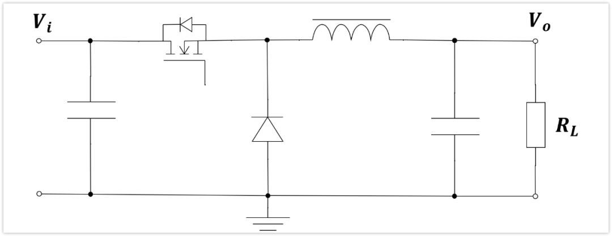

在Buck电路中，输入电流被视为恒定的原因主要与输入电源的特性和电路的工作方式有关。以下是几个关键因素：

1. **长距离传输和寄生电感的影响**：在实际应用中，输入电源可能距离Buck电路较远，导致电源线较长，从而增加了线路的寄生电感。寄生电感会限制电流的变化速率，因为电感对电流的变化有抗拒作用（由电感的伏秒平衡原理可知，电压变化与电流变化率成正比）。因此，长走线和大寄生电感使得输入电源不能快速响应电流的快速变化。
2. **电源的响应时间**：大多数输入电源（如电池或电网电源）的响应时间相对较慢，无法在短时间内提供或吸收大量的电流。这种特性意味着在Buck电路的一个工作周期内，电源无法显著改变其输出电流。
3. **Buck电路的开关频率**：Buck电路通常工作在较高的开关频率（如几十kHz到几百kHz）。在一个开关周期内，由于电源的响应时间远大于开关周期，电源电流的变化非常小，因此可以近似认为输入电流是恒定的。
4. **电容的滤波作用**：在Buck电路的输入端通常会有电容进行滤波，这些电容可以平滑输入电流的快速变化，使得输入电源在电容的辅助下，其电流变化对电路的影响较小。
5. **稳态工作条件**：在稳态工作条件下，Buck电路的输入和输出达到一种平衡状态，此时输入电源提供的电流平均值与负载消耗的电流相匹配，因此平均电流可以被视为恒定。

综上所述，由于电源的物理特性和Buck电路的工作方式，输入电源的电流在Buck电路的一个工作周期内变化不大，因此可以近似看作是恒定的。这种近似有助于简化电路的分析和设计。

## 五、BUCK电路电感电容选型
[手撕Buck！Buck公式推导过程_buck电路输出电压公式-CSDN博客](https://blog.csdn.net/weixin_42005993/article/details/120144144)

电感电流和电容电流幅度变化是一致的。电感电流大于负载电流时给电容充电，反之放电。

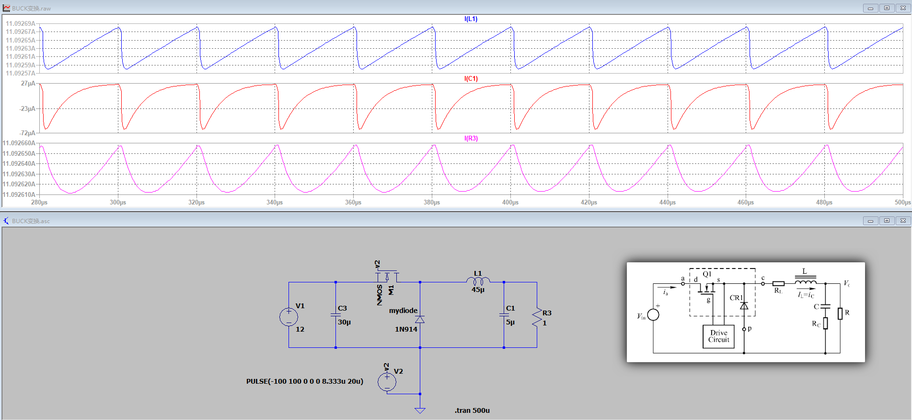

DCDC：降压buck，效率高但声大，强调转换。对效率要求比较高，比如LED照明等

## BUCK电路B站
[电源大师4—电感式开关电源（BUCK 降压电路）工作原理、数据手册、PCB设计_哔哩哔哩_bilibili](https://www.bilibili.com/video/BV1fq4y1N7uJ?spm_id_from=333.788.player.switch&vd_source=ba62f878ab81b77525d122fe32118844)

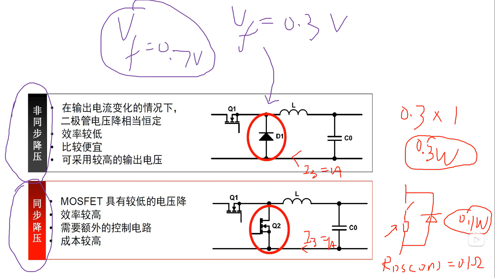

对于同步BUCK电路的设计要求

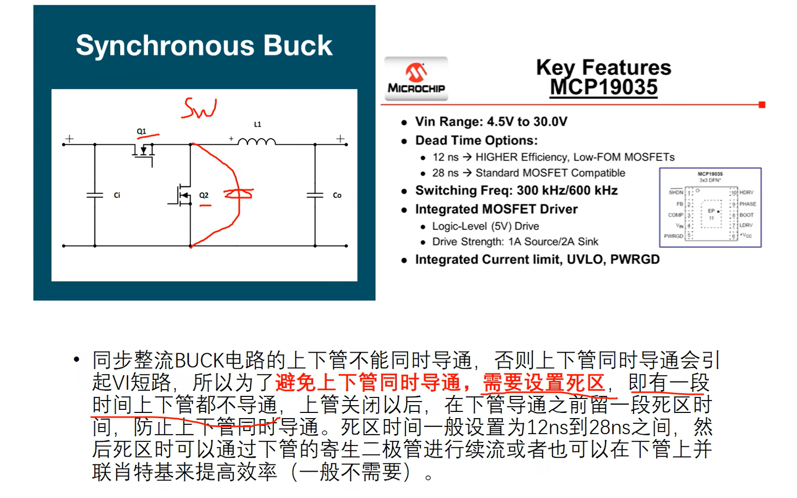

## 六、BUCK电路损耗分析
[同步buck的损耗分析计算-电源网星球号](https://www.dianyuan.com/eestar/article-1241.html)

# BUCK应用电路

## 1、BUCK可用于正电压降压和负电压的升降压
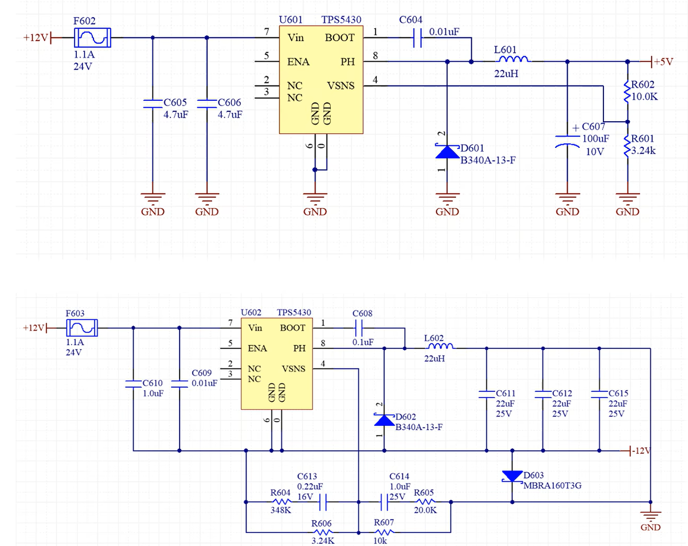

任何BUCK芯片都可用于设计负电压的升降压，和正电压的降压。

### BUCK电路可以做负电压的升降压原理
[用DC-DC 升压降压以及产生负电压的原理及应用 - CNZHIQIANG - 博客园](https://www.cnblogs.com/zhiqiang_zhang/p/14927731.html)

负电压的升降压就是将原本是BUCK电路的改造为了BUCK-BOOST电路

证明：

对于常用BUCK-BOOST电路如图：

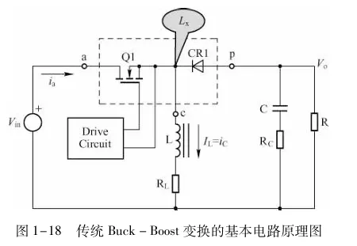

其输入输出公式推导，对电感$L$根据伏秒积平衡可得：

$V_{in}T_{on} +V_oT_{off} = 0$得到：

$V_o = -\frac{V_{in}D}{1-D}$

对于BUCK电路的伏电压改造可以看作如下改变：

| | 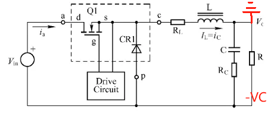 |
| --- | --- |

对上述改造后的BUCK电路进行输入输出公式推导，得到：

$V_{in}T_{on} +V_oT_{off} = 0$

所得到的结果和BUCK-BOOST电路一致。

## 2、通过BUCK电路后接BOOST电路可实现正压的升
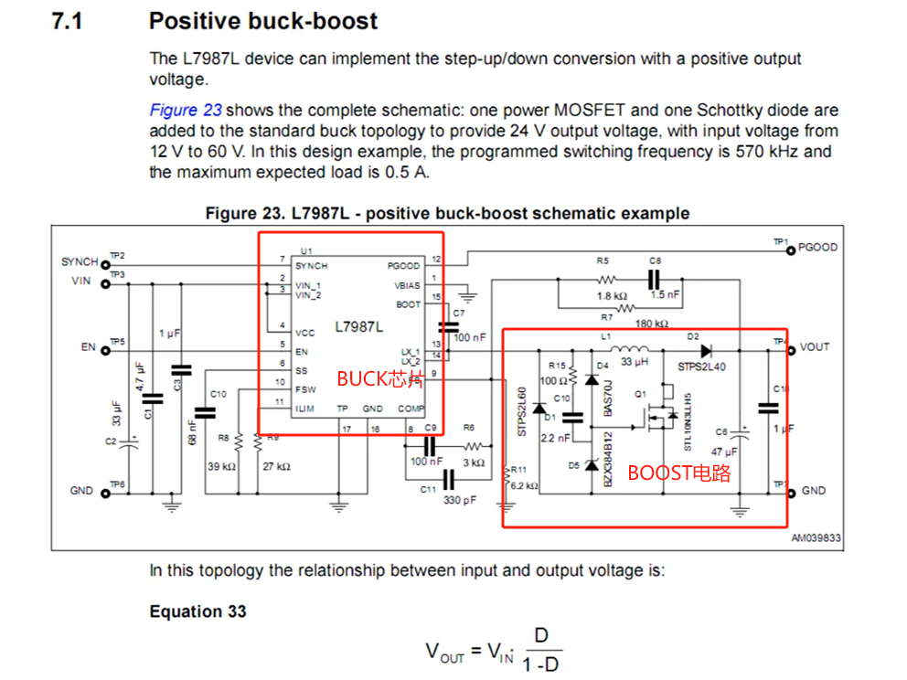

升降压电路

## 3、BUCK电路改ZETA电路

其中电感$L_1,L_2$可以用耦合电感也可以用非耦合电感。ZETA电路用于正电压的升降压。

## 4、BUCK电路芯片封装选择
BUCK电路芯片选择晶圆倒装，不选金线链接。

下面是对金线链接的高频振铃信号原因推导

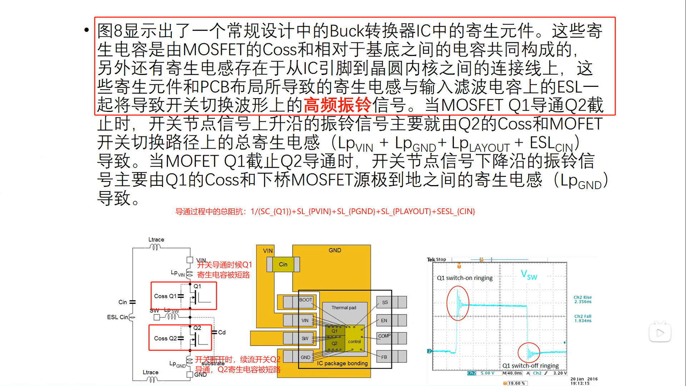

高频振铃信号频率：

$f = \frac{1}{2\pi(L_{P_{VIN}}+L_{P_{GND}}+L_{P_{LAYOUT}}+ESL_{CIN})C_{Q_1}}$

对于其中的$L_{P_{VIN}}+L_{P_{GND}}$不能消除，其他的都可以改善。

而对于晶圆倒装来说，因为$V_{IN}$和$GND$是直接焊接在晶圆上的，所以$L_{P_{VIN}}+L_{P_{GND}}$可以很小很小。

## 5、BUCK芯片参数选型
$V_I$：输入电压

$V_O$：输出电压，输出电压近似的可以等于芯片内部的参考电压数值

$I_O$：输出电流

$F_{SW}$：开关管频率

$EN$：用于芯片开关

$VFB$：对于部分可调电压，FB引脚，用于调节输出电压大小，内部有一个参考电压

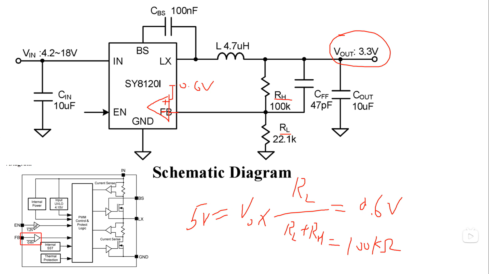

如上图所示即为通过RL和RH调节输出电压。对于RH和RL取值一般为推荐数值附近阻值，太大或者太小不可以。防止芯片工作不正常。

# BUCK电路PCB绘制

[电源大师6——BUCK 降压电路降低EMI与EMC设计，开关电源PCB layout宝典_哔哩哔哩_bilibili](https://www.bilibili.com/video/BV1ef4y1n7x1/?spm_id_from=333.788.player.switch&vd_source=ba62f878ab81b77525d122fe32118844)

### 1、输入滤波电容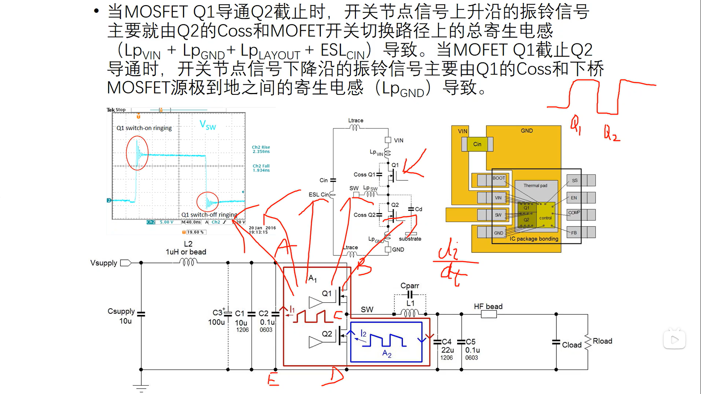
因为含有开关的回路电流不连续所以会不断地向外释放电磁干扰，所以对于输入滤波电容$C_i$需要很靠$V_{IN}$和$GND$。对于电容的选择同样容值耐压越高体积越大，实际容值也越大。例如22uf6.3v对应容值比22uf25v电容的实际容值更小。所以设计电路时可以考虑小电容用0603，大电容用1206来做。

### 2、功率地和小信号地
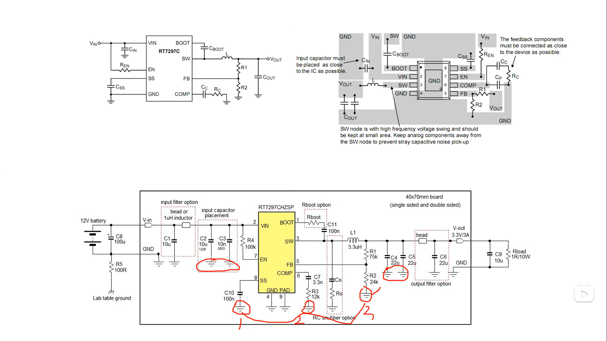

同时对于BUCK电路中的微小信号（控制信号和反馈信号）的地，需要和功率地（大信号，突变信号）采用单点相连。

### 3、输入输出进一步滤波
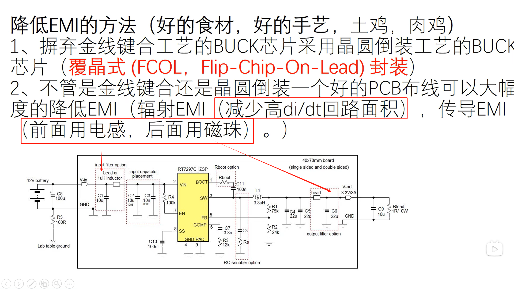

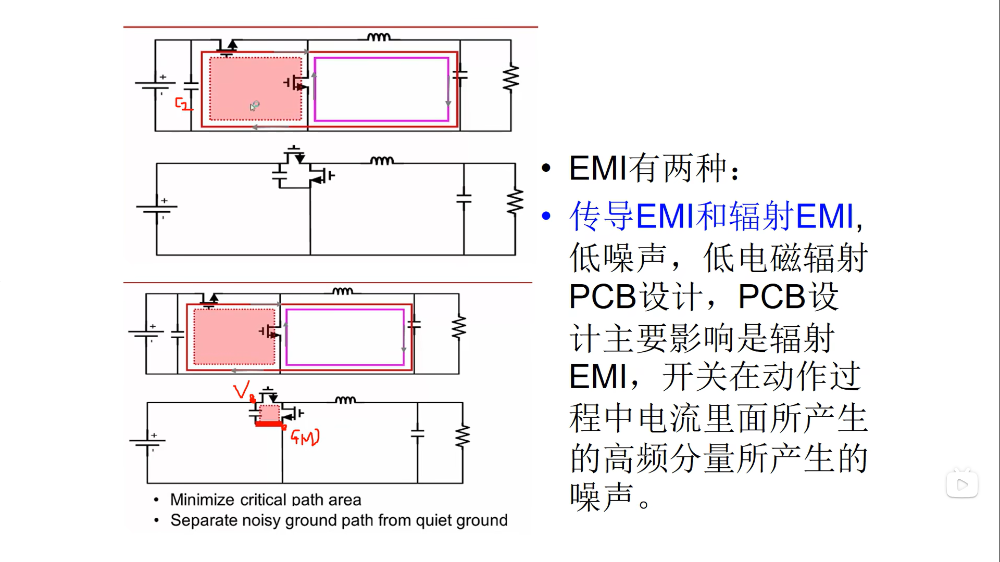

辐射EMI主要就是降低高$\frac{di}{dt}$的回路面积，也就是将输入电感$C_3$尽可能的贴近芯片输入和地，降低回路面积。

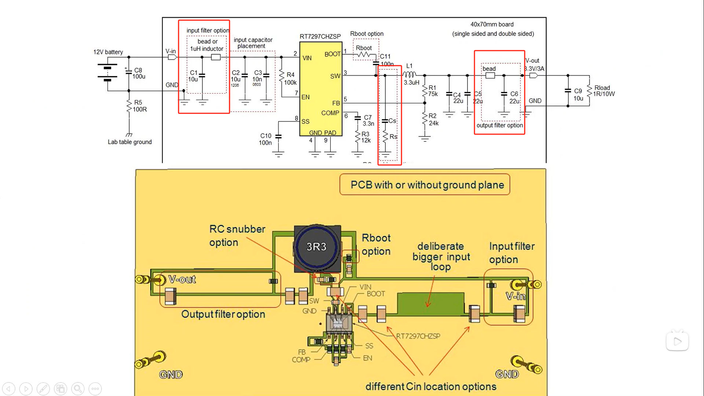

在输入部分添加电感和电容做LC滤波

在输出部分添加磁珠和电容做LC滤波[LC滤波电路分析，LC滤波电路原理及其时间常数的计算 - coolyouguo - 博客园](https://www.cnblogs.com/coolyouguo/p/10530921.html)

在开关输出位置加串联电阻电容做RC吸收电路[开关电源降低振铃现象](https://www.yuque.com/u42203592/pf2qc8/oohedunp9wnh3dxe)

### 4、绘制宝典

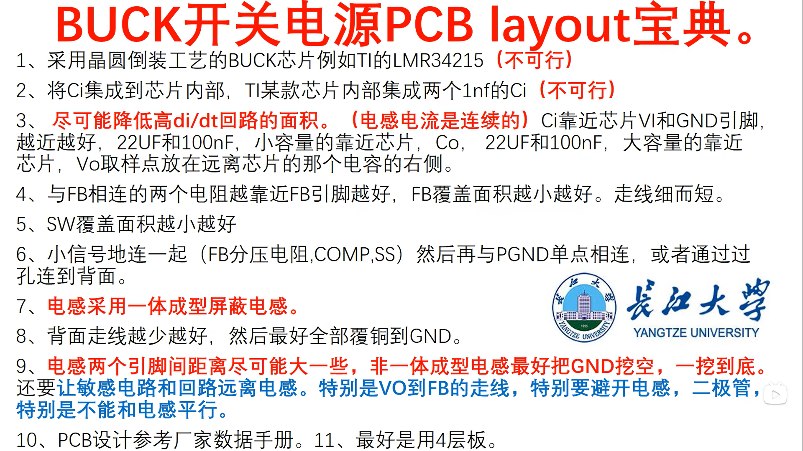

#### 1、采用晶圆倒装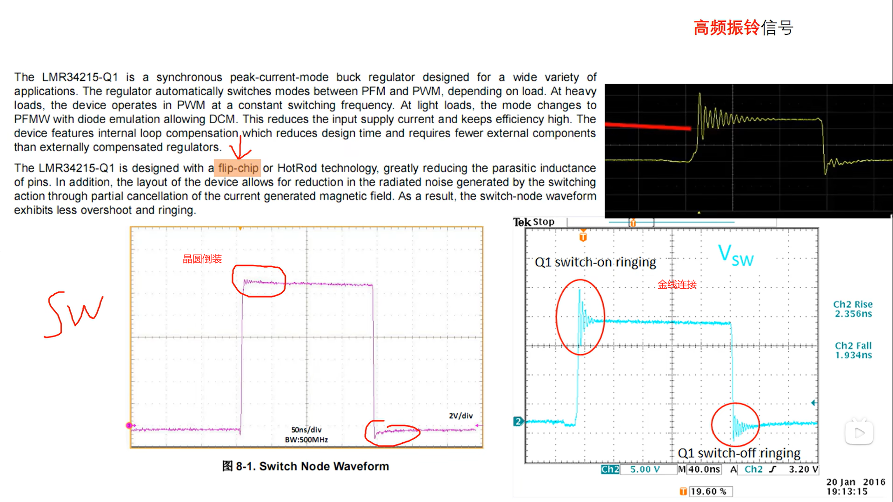
#### 4、FB回路越小越好，走线越细越好
绘制好的电路不要用手去摸可能会导致输出电压异常，对于FB引脚的走线，建议用绝缘处理。

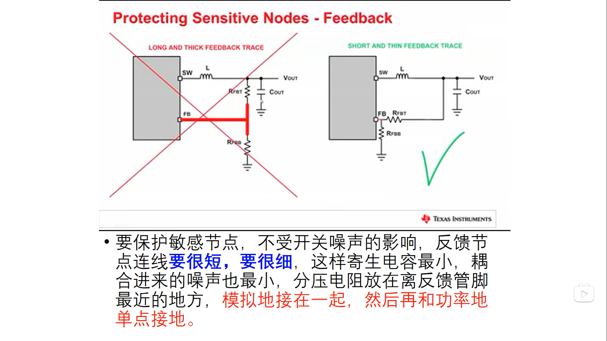

过孔尺寸推荐：内径/外径（mil）

12/24

16/34

28/50

#### 5、SW引脚信号尽量远离周围的所有器件。覆盖面积越小越好
#### 9、电感
对于电感元件最好用一体成型的屏蔽电感。如果没有的话非一体电感，两个引脚尽可能的大，同时电感周围最好把地挖空。

[DC-DC电路中电感的下方该不该挖空_功率电感下方挖空-CSDN博客](https://blog.csdn.net/gonylibechen1/article/details/138560978#:~:text=%E5%A6%82%E6%9E%9C%E9%87%87%E7%94%A8%E7%9A%84%E6%98%AF%E9%9D%9E%E5%B1%8F%E8%94%BD%E7%94%B5%E6%84%9F%EF%BC%8C%E5%85%B6%E6%BC%8F%E7%A3%81%E8%BF%98%E6%98%AF%E8%9B%AE%E5%A4%A7%E7%9A%84%EF%BC%8C%E9%82%A3%E4%B9%88%E7%94%B5%E6%84%9F%E4%B8%8B%E6%96%B9%E4%B8%8D%E6%8C%96%E7%A9%BA%E7%9A%84%E5%BD%B1%E5%93%8D%E8%BF%98%E6%98%AF%E6%AF%94%E8%BE%83%E5%A4%A7%E7%9A%84%EF%BC%9B%E5%A6%82%E6%9E%9C%E6%98%AF%E7%A3%81%E5%B0%81%E8%83%B6%E5%8D%8A%E5%B1%8F%E8%94%BD%E7%94%B5%E6%84%9F%E3%80%81%E7%BB%84%E8%A3%85%E5%BC%8F%E5%85%A8%E5%B1%8F%E8%94%BD%E7%94%B5%E6%84%9F%E6%88%96%E8%80%85%E4%B8%80%E4%BD%93%E6%88%90%E5%9E%8B%E7%94%B5%E6%84%9F%EF%BC%8C%E5%85%B6%E6%BC%8F%E7%A3%81%E5%BE%88%E5%B0%8F%EF%BC%8C%E5%B0%A4%E5%85%B6%E6%98%AF%E4%B8%80%E4%BD%93%E6%88%90%E5%9E%8B%E7%94%B5%E6%84%9F%EF%BC%8C%E5%AE%8C%E5%85%A8%E6%B2%A1%E5%BF%85%E8%A6%81%E8%80%83%E8%99%91%E6%BC%8F%E7%A3%81%E7%9A%84%E5%BD%B1%E5%93%8D%E3%80%82,%E5%A6%82%E6%9E%9C%E9%87%87%E7%94%A8%E7%9A%84%E6%98%AF%E9%9D%9E%E5%B1%8F%E8%94%BD%E7%94%B5%E6%84%9F%EF%BC%8C%E6%81%B0%E5%B7%A7%E5%AF%B9%E7%94%B5%E8%B7%AF%E7%9A%84%E5%99%AA%E5%A3%B0%E8%A6%81%E6%B1%82%E5%8F%88%E5%BE%88%E9%AB%98%EF%BC%8C%E9%82%A3%E4%B9%88%E7%94%B5%E6%84%9F%E4%B8%8B%E6%96%B9%E6%8C%96%E7%A9%BA%E5%B0%B1%E5%8A%BF%E5%9C%A8%E5%BF%85%E8%A1%8C%EF%BC%9B%E5%A6%82%E6%9E%9C%E7%94%B5%E8%B7%AF%E5%AF%B9EMC%E7%9A%84%E8%A6%81%E6%B1%82%E9%AB%98%EF%BC%8C%E5%AF%B9%E5%99%AA%E5%A3%B0%E8%A6%81%E6%B1%82%E4%B8%8D%E9%AB%98%E7%9A%84%E8%AF%9D%EF%BC%8C%E9%82%A3%E4%B9%88%E5%B0%B1%E5%BE%97%E5%8F%A6%E5%81%9A%E6%89%93%E7%AE%97%E3%80%82)

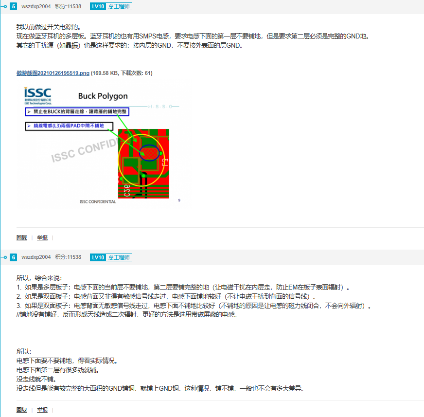

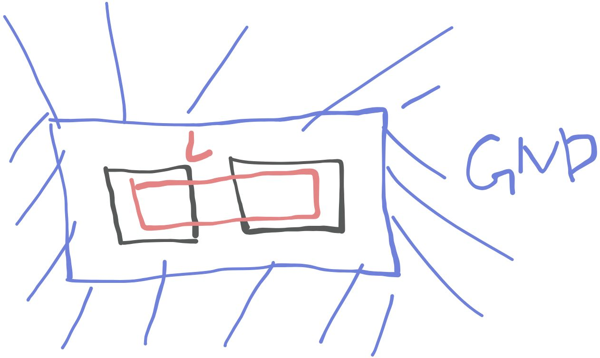

#### 11、最好是用4层或者多层电路板

##### 12、对于非同步整流BUCK电路的续流二极管放置
续流二极管：需采用短而宽的接线方式直接接在IC的GND端子和SW端

[BUCK电路原理及PCB布局与布线注意事项_buck电路pcb布局要注意什么-CSDN博客](https://blog.csdn.net/qq_21794157/article/details/122731827)

例子：

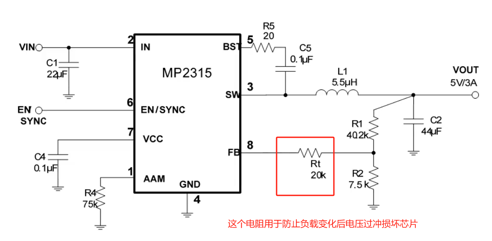

AAM 接一个电阻 接地 轻载的时候 效率高，纹波大   AAM模式

AAM 接一个电阻 接到VCC，轻载的时候 效率低，纹波小   CCM模式（一般用这个）

# TPS5430

## 参数
### 电压
- [ ] 输出电压：最小数值：$1.221A$也是***内部参考电压**
- [ ] 输入电压：$V_{in}-GND=40V$
### 电流
- [ ] 输出电流：额定电流$3A$，峰值电流$4A$
### 输出电感
#### 电感最小取值
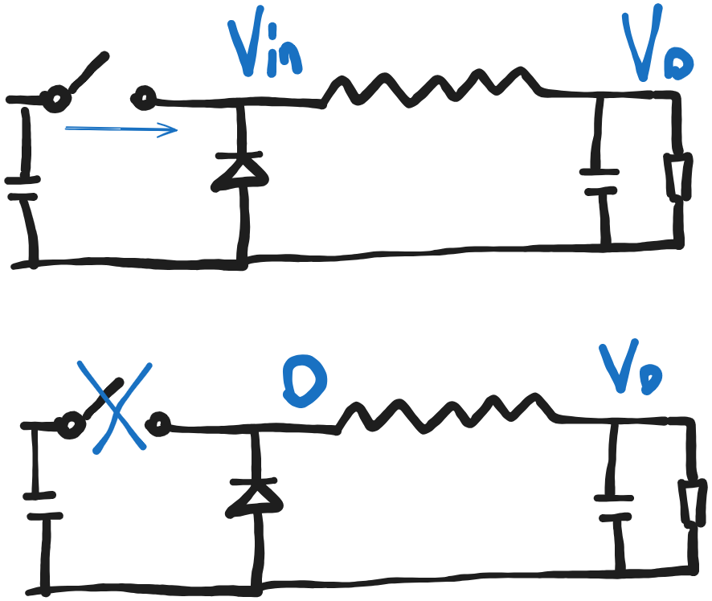

$$(V_{in}-V_{o} ) *T_{on}+  (0-V_o  ) * T_{off}=0 \Longleftrightarrow V_O=V_{in}*D      \tag {1}$$
$$\frac{di}{dt}*L_{MIN}=\frac{\Delta i}{\Delta t}*L_{MIN}=\Delta V \Longleftrightarrow L_{MIN}=\Delta V*\frac{\Delta t}{\Delta i} \tag{2} $$
$$\Delta t=T*D\Longleftrightarrow \frac{V_{oMAX}}{V_{inMAX}}*\frac{1}{f_{sw}} \tag{3} $$
$$\Delta V=V_{inMax}-V_{o} \tag{4}$$
$$\Delta i=K_{IND}*I_{o} \tag{5} $$
$$L_{MIN}=(V_{inMax}-V_{o})*\frac{V_{oMAX}}{V_{inMAX}}*\frac{1}{f_{sw}}*K_{IND}*I_{o}\Longleftrightarrow \frac{V_{oMax}}{V_{inMAX}}*\frac{(V_{inMAX}-V_{o})}{K_{IND}*I_{O}*f_{}} \tag{5} $$
#### 电感峰值电流
对于电感电流包含两部分：***直流部分与三角波交流部分***，因此电感的均方根$I_{LRMS}$为：
$$(I_{LRMS})^2=(I_{Out})^2+(I_{acRMS})^2 \tag{6} $$
$$I_{Out}=I_{o}\tag{7}$$
$I_{acRMS}$为三角波的均方根：

$$\Delta I=\frac{V_{inMAX}-V_{o}}{L*f_{sw}}*D \Longleftrightarrow \frac{V_{inMAX}-V_{o}}{L*f_{sw}}*\frac{V_{o}}{V_{inMAX}}\tag{8}$$
已知三角波的有效值为：$\frac{A}{\sqrt 3}$，其中$A$为峰峰值，又因为$I_{ac}$为无直流偏置三角波，此时幅值变为$\frac{A}{2\sqrt 3}$
因此
$$I_{acRMS}=\frac{\Delta V}{2\sqrt 3} \Longleftrightarrow \frac{V_{inMAX}-V_{o}}{2\sqrt 3* L*f_{sw} * k_v}*\frac{V_{o}}{V_{inMAX}} \tag{9}$$
其中$k_v$为一个经验修正系数，选取***0.8***
可以得到：
$$(I_{LRMS})^2=I_{o}^2  + (\frac{V_{inMAX}-V_{o}}{2\sqrt 3* L*f_{sw} * k_v}*\frac{V_{o}}{V_{inMAX}})^2 \Longleftrightarrow I_{o}^2  + (\frac{V_{inMAX}-V_{o}}{2\sqrt 3* L*f_{sw} * k_v}*\frac{V_{o}}{V_{inMAX}})^2 \tag{10}$$
$$I_{LRMS}=\sqrt{I_{o}^2  + (\frac{V_{inMAX}-V_{o}}{2\sqrt 3* L*f_{sw} * k_v}*\frac{V_{o}}{V_{inMAX}})^2}\tag{11}$$

### 输出电容

### 输入电容

- [ ] 异步BUCK
$$\Delta V=\frac{I_o}{C_i*V_i*f}*(V_o+V_d*\frac{V_i-V_o}{V_i+V_d})*\frac{V_i-V_o}{V_i+V_d}+(I_o+\frac{V_o+V_d}{2*f*L}*\frac{V_i-V_o}{VI+V_d}*ESR \tag{12}$$
- [ ] 同步BUCK
$$\Delta V=\frac{I_o}{C_i*V_i*f}*V_o*\frac{V_i-V_o}{V_i}+(I_o+\frac{V_o}{2*f*L}*\frac{V_i-V_o}{V_i})*ESR \tag{13}$$
**陶瓷电容ESR小，容量小**，Uq对纹波起决定作用，所以输入纹波电压可以近似为Uq，如果我们要限定纹波不能大于△Vi，那么Uq≤△Vi。
**铝电解电容容量大，ESR大**，Uesr对纹波起决定作用，所以输入纹波电压可以近似Uesr，如果我们要限定纹波不能大于△Vi，那么Uesr≤△Vi

## 参考设计
[手撕Buck！Buck公式推导过程_buck电路输出电压公式-CSDN博客](https://blog.csdn.net/weixin_42005993/article/details/120144144)
