# BOOST变换

## 一、BOOST电路工作原理
[手撕Boost！Boost公式推导及实验验证](https://mp.weixin.qq.com/s?__biz=Mzk0NjIxODM3Mg==&mid=2247486612&idx=1&sn=b3d95c6403c31738324e68e71a85268b&chksm=c308387ff47fb169339b09746e293ea8e9ecb8454d6d776e307cb4ebbb2da17f1e32822a3daf&scene=21#wechat_redirect)

[手撕Boost！Boost公式推导及实验验证-CSDN博客](https://blog.csdn.net/weixin_42005993/article/details/119360319)

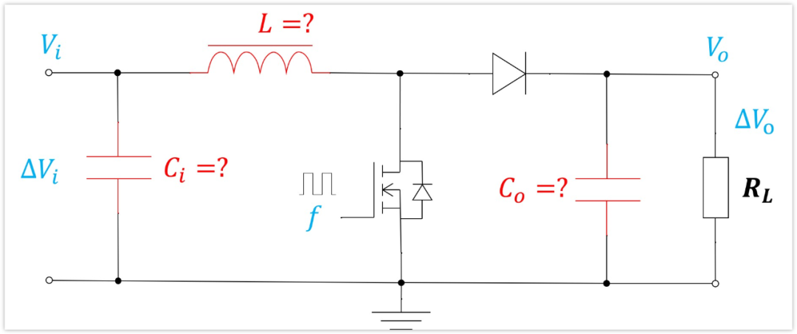

其工作原理为， 当开关Q1导通时，电感Ｌ两端的电压为输入 电压$V_{in}$，电感电流线性增加，电感储能，同时负载由电容Ｃ供电；当开关管Q1关闭后，电感为了阻止电流的变化，电感Ｌ产生左负右正的感应电动势，这个电动势与输入电压$V_{in}$之和使二极管CR1导通给电容和负载供电。  

 Boost变换一般也叫升压变换，电感Ｌ储能，通过Q1的导通与关断，实现升压的目的。 也分为连续模式，临界模式和非连续模式三种工作状态。

电感数值会随着电流数值的增大而急剧减小，所以一般在电感选形时要保证电感的饱和电流要大于电路的峰值电流。否则就会出现，原本电流线性增加的变为急剧增加。

###  $BOOST$变换二极管的选择标准是：
① 开关速度快；

② 足够的反向击穿电压；

③ 额定正向导通电流；

④较低的正向导通压降 （对效率有很大影响）；

⑤ 合适的封装形式。反 向击穿电压应该高于输出电压并留有一定的裕量，正向电流最好为最大电感电流的２倍 以上。  

## 二、输入电容的必要性（BUCK，BOOST原理一致）
线路电感对于Boost变换器的影响主要体现在以下几个方面：

1. **电感电流不能突变**：电感的一个基本特性是它抗拒电流的变化。在Boost变换器中，当开关元件导通时，电流需要迅速增加；当开关元件关断时，电流需要迅速减少。如果线路电感过大，它将限制电流变化的速度，导致电流不能及时响应开关动作，从而影响电路的稳定性和效率。

未添加电容

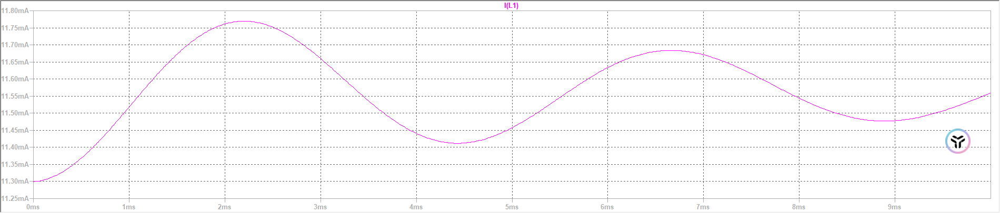

添加电容

2. **电压跌落**：由于电感电流不能突变，当开关元件导通时，如果线路电感过大，电流增加缓慢，可能导致输入电源无法快速提供所需的电流，从而导致电压跌落。

未添加电容

添加电容

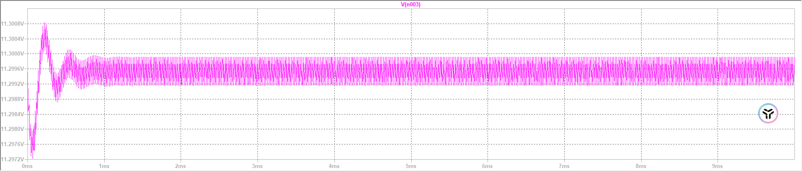

3. **瞬态响应**：线路电感的存在会限制电源对负载变化的瞬态响应能力。当负载突然变化时，如果线路电感过大，电感电流的充放电速度将变慢，导致电路无法快速响应负载变化，从而影响输出电压的稳定性。

为了减少线路电感的影响，Boost变换器的输入端口通常会接一个电容，其作用如下：

1. **提供瞬态电流**：输入电容可以快速提供或吸收电流，以响应开关元件的快速开关动作，减少由于线路电感引起的电流变化延迟。

未添加电容

添加电容

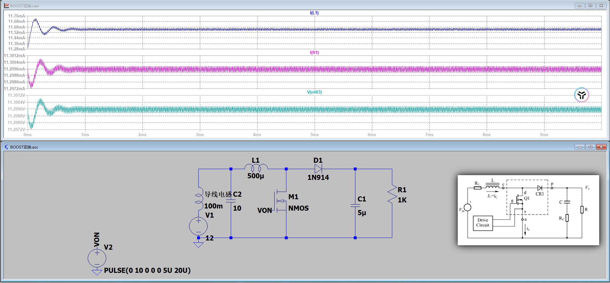

2. **平滑输入电压**：输入电容可以平滑由于开关动作引起的输入电压波动，减少电压跌落，提高电路的稳定性。

用公式证明输入电容的作用：

根据基尔霍夫电流定律（KCL），对于Boost变换器的输入节点，电流的总和为零。设输入电流为$I_{in}$，输入电容的电流为$I_{cin}$，电感电流为$I_L$，则有：

$I_{in}+I_{cin}+I_L=0$

当开关元件导通时，电感电流$I_L$增加，输入电容电流$I_{cin}$为负值，表示电容在放电；

当开关元件关断时，电感电流$I_L$减少，输入电容电流$I_{cin}$为正值，表示电容在充电。

这样，输入电容就在不断地充放电过程中，平衡了电感电流的变化，减少了输入电压的波动。

未添加电容

添加电容

此外，输入电容的充放电过程可以用以下公式表示：

$Q=C \Delta V
$

其中，$Q$是电荷量，$C$是电容值，$\Delta V$是电压变化量。在Boost变换器的一个开关周期内，输入电容需要提供的电荷量等于电感电流变化量，即：

$\frac{dI_{cin}}{dt}T=\Delta I_L$

这里，$\frac{dI_{cin}}{dt}$是输入电容的电流变化率，$T$是开关周期，$\Delta I_L$是电感电流的变化量。这个公式说明了输入电容如何通过其充放电过程来平衡电感电流的变化，从而减少电压跌落。

### 2、输入输出电容纹波计算理解难点
对于输入输出电容纹波计算都是按照同一个公式$\Delta V=U_{q}+U_{ESR}$两部分组成。

#### 2.1、$U_{q}$计算
其中，$U_q$主要表现为电容电荷量变化导致的电压变化，其在计算过程中需要需要关注电容的充放电，要关注波形。其主要是由于电荷量变化导致的纹波变化，其平均值即为输入或者要输出的电压，如，在输入电容处的平均电压就是$V_{in}$，而在输出电容处的平均电压就是想要输出的电压$V_O$。但需要求解的是它上面的纹波最大值是多少。平均值是一个已知量。

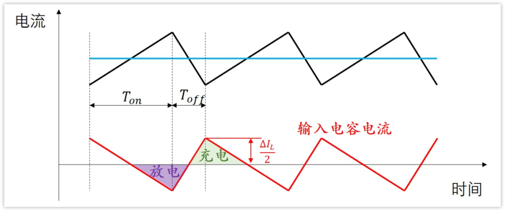

理解时需注意，稳态工作下的BOOST电路电容周期内电容充放电的电量是恒定的。所以仅仅计算充电或者放电的就可以了。

#### 2.2、$U_{ESR}$计算
对于$U_{ESR}$的计算就需要关注整个周期的变化，因为此时的电流变化和开关并不是同步的，和电容的充放电有关系，存在电流的正负方向变化，所以此时需要关注完整电流变化。

根据上面的波形图知道，电容的充电电流最大是$\frac{\Delta I_{L}}{2}$，放电电流最大就是$-\frac{\Delta I_{L}}{2}$，负号表示电流方向，方向的不同，引起的压降的电压也是相反的。

那么ESR引起的总的压降是：

$U_{ESR}=\frac{\Delta I_{L}}{2}*ESR-(\frac{\Delta I_{L}}{2}*ESR)=\Delta I_{L}*ESR$。

### 3、电容选型
根据得到的公式和对于纹波大小的约束，进行电容选型。主要针对于单纯的$C_i$和$ESR$大小进行选择。

实际参考：

**陶瓷电容**ESR小，容量小，Uq对纹波起决定作用，所以可以近似△Vi=Uq

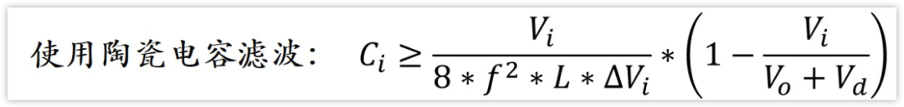

**铝电解电容**容量大，ESR大，Uesr对纹波起决定作用，所以可以近似△Vi=Uesr

对于其中不懂的问题参照引用资料，经典经典经典！

### 4、仿真结果
如果在原理对的情况下，仿真结果有问题，大概率问题在于MOS管和二极管。

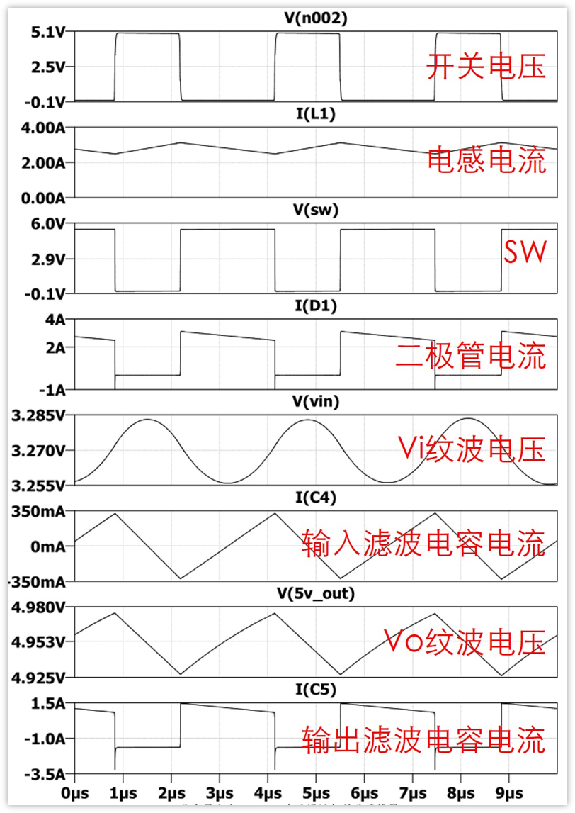

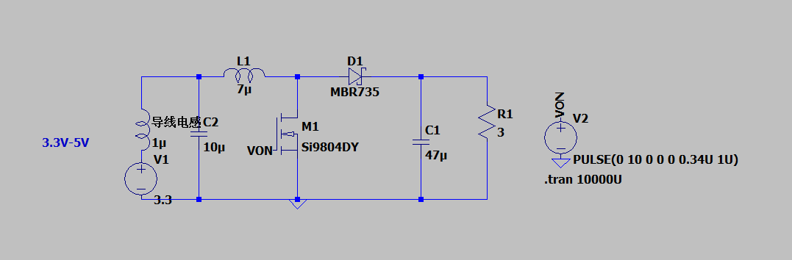

其中存在的毛刺现象，有两个原因：

1、图中二极管的电流和输出滤波电容的电流都有一个向下的尖峰，这个尖峰是因为二极管的反向恢复时间造成的

即二极管电压反向，它不能马上恢复截止功能的，需要时间，这个时间就是反向恢复时间，在这个时间里面，二极管可以通过较大的反向电流，所以就有了较大的反向电流存在。

2、由图可知，输入滤波电容的电流是没有突变的（有拐点，但是是连续的），而输出滤波电容的电流是有突变的（由负突然变为正）。

我们知道电容都是有各种寄生参数的，自然也有寄生电感存在，突变的电流意味着di/dt很大，这必然会在寄生电感上面产生高的电压，也就是图中的毛刺。

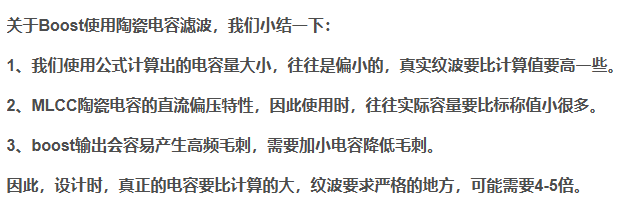

### 5、MOS管尖峰原理、输入纹波和ESR的关系
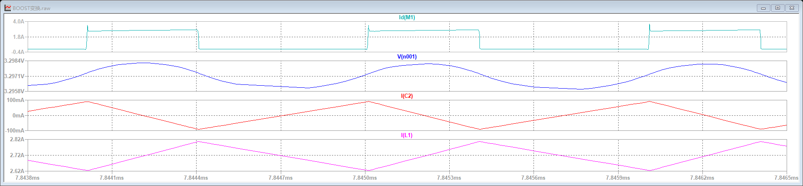

分别是MOS管电流，输入纹波电压，输入电容电流，电感电流。

[mos管开关出现尖峰的原理？](https://www.zhihu.com/question/279783475)

其中MOS管电流在导通瞬间出现一个向上的毛刺，是由于MOS管的寄生电容所导致的$\frac{du(t)}{dt}C=i(t)$,当MOS管开通瞬间，有很大的电压瞬变，从而寄生电容产生很大的位移电流，形成尖峰电流。在MOS管的关断瞬间，通道内电流瞬变，瞬变电流由于寄生电感的存在$\frac{di(t)}{dt}=U(t)$,形成尖峰电压。对于其中，输入电压纹波对于陶瓷电容的ESR添加与否意义不大，数值很小。一个原因是ESR数值本身很小，另外一个原因是ESR的压降计算是按照最大值计算的，这个最大值在电容充放电过程中是最大的，具体就在于开关切换时是最大的。但$U_q$的最大变化量是在电容充放电结束时是最大的，但是此时的电流值为0，ESR没有压降，所以变化并不是很大。

# BOOST电路其他应用

### 一、BOOST电路的改造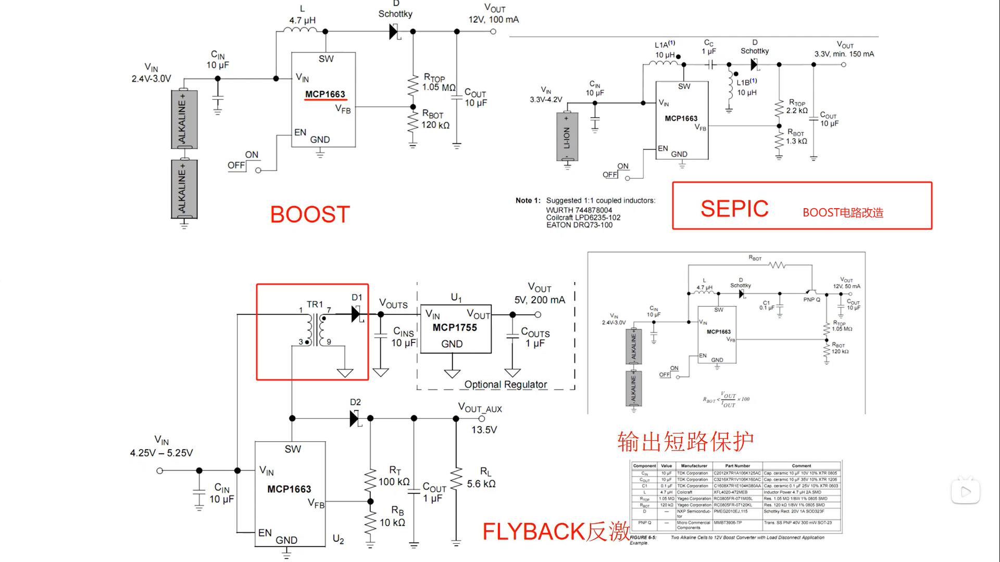
其中FLYBACK反激电路，不可以空载

**1、最小负载要求**

反激拓扑在轻载或空载时，反馈环路可能无法稳定工作。因为反激电路通常采用脉宽调制（PWM）控制输出电压，当负载过轻时，占空比会变得极小，导致控制器进入“打嗝模式”（Burst Mode）或输出电压失调（上升）。假负载提供一个最小电流需求，确保反馈环路正常运作。

**2、防止过压**

在空载时，储存在变压器中的能量无法完全释放到输出端，可能导致输出电压升高，超出设计范围，甚至损坏电容或负载。假负载通过消耗部分能量，稳定输出电压。

**3、改善EMI和噪声**

轻载时，反激电路可能出现不连续导通模式（DCM）的不规则开关行为，增加电磁干扰（EMI）。假负载使电路维持连续导通模式（CCM）或更稳定的DCM运行，减少噪声。  
[反激与LLC电路中假负载的作用及选型分析_反激电源假负载选型-CSDN博客](https://blog.csdn.net/qq_36603424/article/details/146290789#:~:text=%E5%9B%A0%E4%B8%BA%E5%8F%8D%E6%BF%80%E7%94%B5%E8%B7%AF%E9%80%9A%E5%B8%B8%E9%87%87%E7%94%A8%E8%84%89%E5%AE%BD%E8%B0%83%E5%88%B6%EF%BC%88PWM%EF%BC%89%E6%8E%A7%E5%88%B6%E8%BE%93%E5%87%BA%E7%94%B5%E5%8E%8B%EF%BC%8C%E5%BD%93%E8%B4%9F%E8%BD%BD%E8%BF%87%E8%BD%BB%E6%97%B6%EF%BC%8C%E5%8D%A0%E7%A9%BA%E6%AF%94%E4%BC%9A%E5%8F%98%E5%BE%97%E6%9E%81%E5%B0%8F%EF%BC%8C%E5%AF%BC%E8%87%B4%E6%8E%A7%E5%88%B6%E5%99%A8%E8%BF%9B%E5%85%A5%E2%80%9C%E6%89%93%E5%97%9D%E6%A8%A1%E5%BC%8F%E2%80%9D%EF%BC%88Burst%20Mode%EF%BC%89%E6%88%96%E8%BE%93%E5%87%BA%E7%94%B5%E5%8E%8B%E5%A4%B1%E8%B0%83%EF%BC%88%E4%B8%8A%E5%8D%87%EF%BC%89%E3%80%82,%E5%81%87%E8%B4%9F%E8%BD%BD%E6%8F%90%E4%BE%9B%E4%B8%80%E4%B8%AA%E6%9C%80%E5%B0%8F%E7%94%B5%E6%B5%81%E9%9C%80%E6%B1%82%EF%BC%8C%E7%A1%AE%E4%BF%9D%E5%8F%8D%E9%A6%88%E7%8E%AF%E8%B7%AF%E6%AD%A3%E5%B8%B8%E8%BF%90%E4%BD%9C%E3%80%82%20%E5%9C%A8%E7%A9%BA%E8%BD%BD%E6%97%B6%EF%BC%8C%E5%82%A8%E5%AD%98%E5%9C%A8%E5%8F%98%E5%8E%8B%E5%99%A8%E4%B8%AD%E7%9A%84%E8%83%BD%E9%87%8F%E6%97%A0%E6%B3%95%E5%AE%8C%E5%85%A8%E9%87%8A%E6%94%BE%E5%88%B0%E8%BE%93%E5%87%BA%E7%AB%AF%EF%BC%8C%E5%8F%AF%E8%83%BD%E5%AF%BC%E8%87%B4%E8%BE%93%E5%87%BA%E7%94%B5%E5%8E%8B%E5%8D%87%E9%AB%98%EF%BC%8C%E8%B6%85%E5%87%BA%E8%AE%BE%E8%AE%A1%E8%8C%83%E5%9B%B4%EF%BC%8C%E7%94%9A%E8%87%B3%E6%8D%9F%E5%9D%8F%E7%94%B5%E5%AE%B9%E6%88%96%E8%B4%9F%E8%BD%BD%E3%80%82%20%E5%81%87%E8%B4%9F%E8%BD%BD%E9%80%9A%E8%BF%87%E6%B6%88%E8%80%97%E9%83%A8%E5%88%86%E8%83%BD%E9%87%8F%EF%BC%8C%E7%A8%B3%E5%AE%9A%E8%BE%93%E5%87%BA%E7%94%B5%E5%8E%8B%E3%80%82)

#### 1、BOOST防止损坏
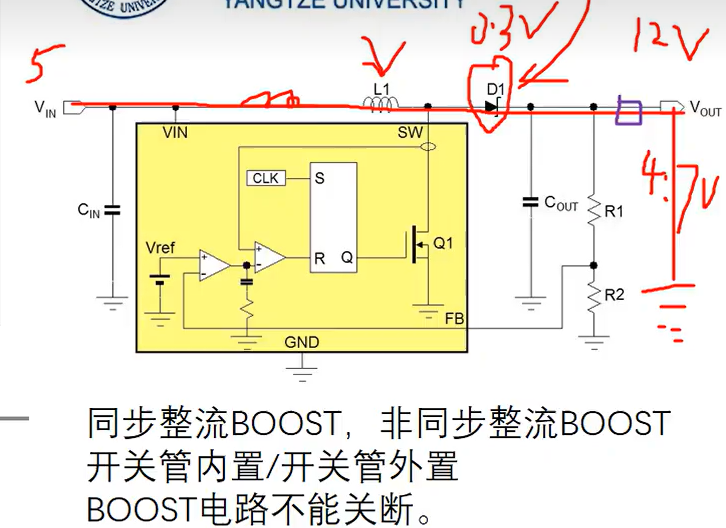

当BOOST电路正常工作时输出为放大电压，否则就是输入电压减去压降。BOOST电路不能短路，出现问题只会烧坏二极管（快速二极管或者肖特基二极管）或者电感。对此可以在输出点口接一个磁珠，当作保险丝，同时还能够和后面的输出电容当LC滤波。

### 二、BOOST芯片选型参数
$V_I$：输入电压

$V_O$：输出电压，输出电压近似的可以等于芯片内部的参考电压数值

$I_O$：输出电流

$F_{SW}$：开关管频率，开关频率越高所需要的电感量就越小，效率有变化，显示逐渐增大，然后逐渐减小。呈现如下图趋势。

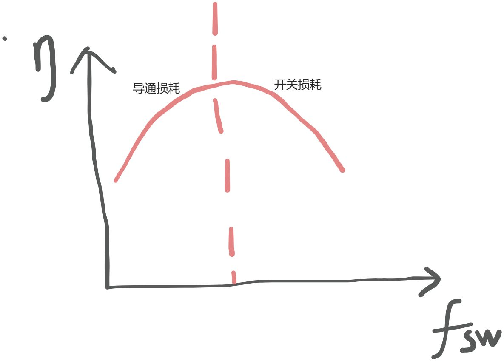

# BOOST电路PCB绘制

### 1、抑制高$\frac{di}{dt}$回路面积最小
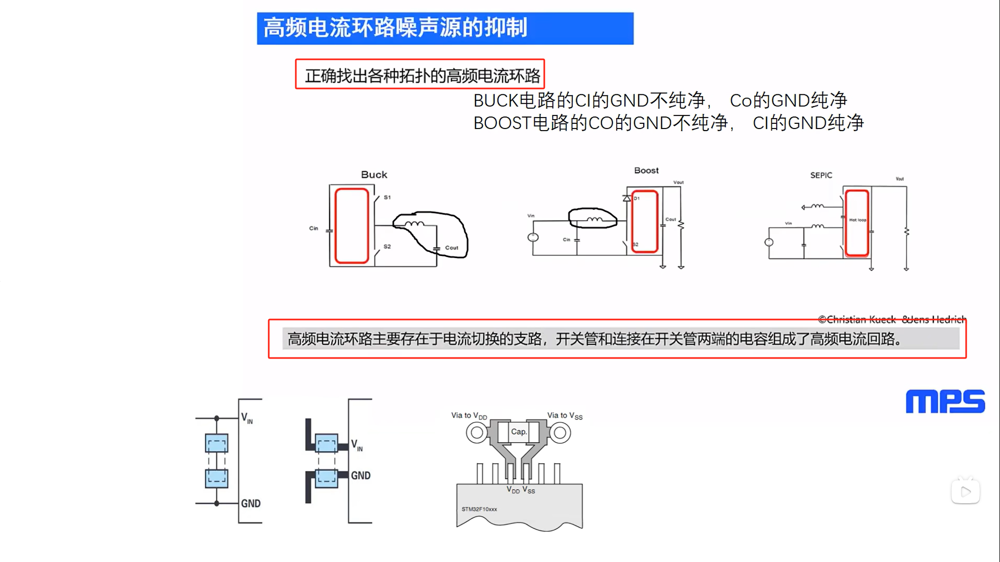

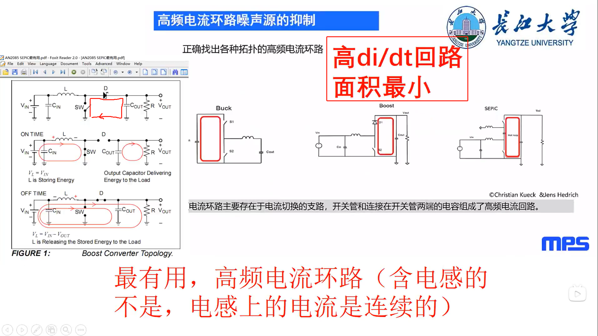

左边图片中第一张图即为高$\frac{di}{dt}$，电感回路不是高$\frac{di}{dt}$因为电感电流是恒定的。

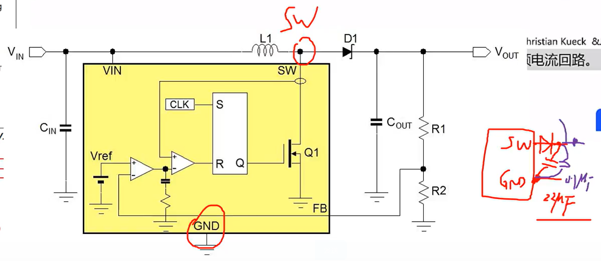

二极管的阳极还有输出滤波电容与SW引脚和GND回路面积要很小。

### 2、PCB绘制宝典
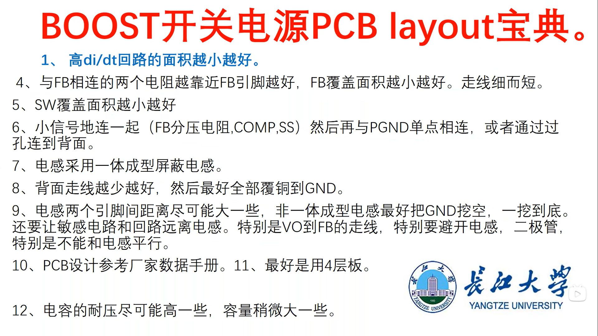

### 3、反馈电阻并前馈电容
[缓启动电源中前馈电容的作用 - 21ic电子网](https://www.21ic.com/a/975432.html)

对于前馈电容的添加看数据手册，如果需要就添加不需要就不加。

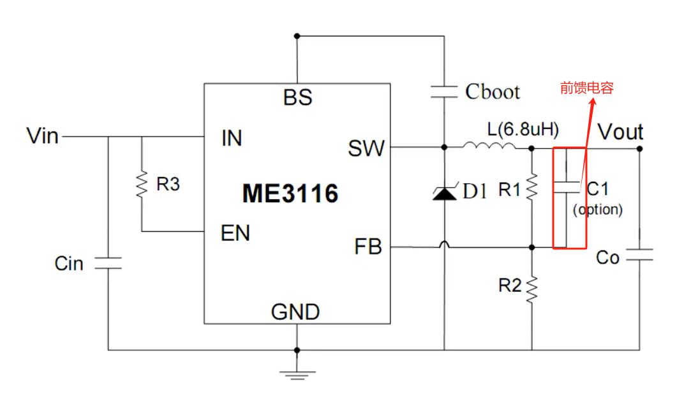

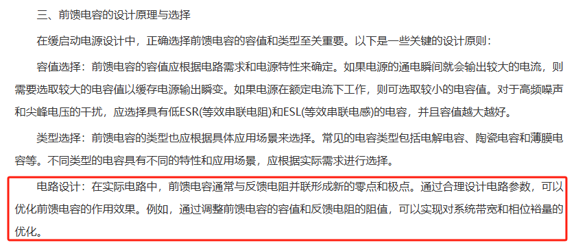

