# BUCK-BOOST变换

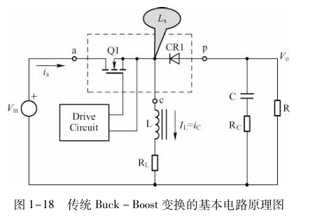

## 1、BUCK-BOOST工作原理
对于BUCK-BOOST变换电路来讲，他集成BUCK和BOOST电路的与一身，集成度更高。但是BUCK-BOOST电路的输出电压极性和输入电压极性相反。

其工作原理为当开关闭合时，电感两端电压近似为电源电压$V_{in}$，由于二极管的反向偏置和左边电压比右边高导致此时没有电流流向右边，此时对电感L进行充电，此时的电感电流为$L_x$。当开关断开后，由于电流的续流作用，他会阻止电流的变化，进而延续电流之前的电流方向，进而，使得电感两端电压极性发生变化：

+ 在Q1断开之前，电感Lx的下端（端c）连接到地，上端（端p）连接到Q1的漏极。此时，电感Lx的下端相对于地是负极，上端是正极。
+ 当Q1断开后，电感Lx的电流方向改变，电流从下端（端c）流出，通过CR1流向上端（端p）。这时，电感Lx的下端相对于地变成了正极，上端变成了负极。

此时电感上端变为了$-V_{O}-V_{d}$（$V_{d}$为二极管导通电压）,此时电感向电容和负载供电。

### 1.1、波形图分析（only analyize DCM）
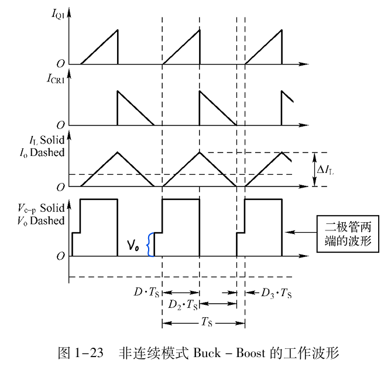

对于以上波形，第一个表现为开关导通时对电感充电时，流经开关的电流，因为电感的对电流的阻碍作用，他是逐渐变化的$\frac{di(t)}{dt}L=u(t)$，电压恒定就是电源电压，电流呈线性变化。第二个波形体现为开关断开电感放电。因为是不连续模式，所以电感电流会存在为零的情况，如第三个波形。

第四个波形，表现为二极管两端电压c点和p点的电压差，当电感开始充电时由于电感上端为$V_{in}$，而二极管正端为输出电压$-V_{o}$（$V_{o}$仅表示标量），负端为$V_{in}$，此时的$V_{c-p}=V_{in}+V_{o}$，当电感开始放电时由于电感的续流作用，此时电流延续之前的方向，电感开始放电，此时电感的接地端变为了正极，接二极管负端为负极，此时的负极电压为$-V_{o}-V_{d}$，此时的二极管两端电压差$V_{c-p}=-V_d$，如果不考虑二极管压降此时$V_{c-p}=0$，当电感放电结束后此时电感电流为0，此时二极管负端相当于接地，电压为0，输出电容开始供电电压为$-V_{o}$，此时，$V_{c-p}=V_{o}$。按照这个顺序循环执行。

## 2、使用BUCK-BOOST线路SEPIC电路
SEPIC和ZETA电路的电感都可以用耦合电感，效率会更高，同时电感量可以只用非耦合电感的一般就可以了

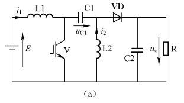

SEPIC和ZETA电路最好用非同步整流。

### Sepic电路工作原理
分析电路中间时段。当开关闭合时，此时形成三个回路，首先是此时$V_{in}$为电感$L_1$充电，而电容$C_1$左正右负，开始为电感$L_2$充电，二极管正端为负电压，二极管截至。此时电容$C_2$为负载供电，保持电压为$V_O$。

当开关打开时：由于电感的续流特性导致电感电流会保持之前的方向，此时电感$L_1$出现感应电动势$\frac{di(t)}{dt}L=V_L$，电动势方向与开关闭合式相反，为左负右正。此时电感左端为电源电压$V_{in}$，那么右端电压为

$\frac{di(t)}{dt}L+V_{in}=V_L+V_{in}$，电感开始放电。而电容左端电压之前为0，右端为某一个[值](3、BUCK-BOOST变换.md#twM43)$V_{c}$（之后会推导），由于电容两端电压差不会突变，此时左端电压抬高，变为$V_c+V_L+V_{in}$，而二极管右端电压为$V_O$，二极管导通电压为$V_d$，可以得到：$V_O+V_d=V_c$，此时，电感$L_1$为电容$C_1$充电，并且同时为$C_2$和负载供电。因为，开关断开，电感$L_2$的续流作用，产生一个上正下负的感应电动势，也为$C_2$和负载供电，电容$C_2$此时充电。

### 2.1、开关导通时电容$C_1$右端电压$V_c=-V_{in}$
证明$V_C=V_{in}$(忽略二极管导通压降):

重点：分析问题，从电感入手

电感$L_1$:

根据电感$L_1$在开关打开和关闭伏秒积平衡，得到：

$V_{in}T_{on}+(V_{in}-(V_O+(0-V_c)))T_{off}=0$

仅考虑CCM模式：

$T_{on}+T_{off}=T$

$T_{on}=DT,T_{off}=(1-D)T$

将上述$T_{on},T_{off}$分别代入$L_1$伏秒积平衡式子得到：

$V_{in}=(V_O-V_C)(1-D)$

电感$L_2$:

根据电感$L_1$在开关打开和关闭伏秒积平衡，得到：

$V_CT_{on}+V_OT_{off}=0$

分别代入$T_{on},T_{off}$，得到：

$V_O=\frac{-V_cD}{1-D}$

将上述式子，代入到$L_1$得到的最终式子里得到：

$V_{in}=-V_c$

证毕！

这个意思是$-V_c$是指二极管两端电压，也就是左边减去右边。

### 2.2、开关打开后，电容$C_1$右端电压
通过上面推算，当开关打开后，电感$L_1$因为续流有感应电动势$V_{L_1}=\frac{\Delta i_{{L_1}T_{off}}}{T_{off}}L_1$，感应电动势为左负右正，电感$L_1$左端电压为$V_{in}$，电感$L_1$右端电压为$V_{L_1}+V_{in}$，同理电感$L_2$也有感应电动势为上正下负，感应电动势为$V_{L_2}=\frac{\Delta i_{{L_2}T_{off}}}{Toff}L_2$。因为电感的感应电动势导致电容$C_1$左端电压由0，突变为$V_{L_1}+V_{in}$，因为电容两端电压差不能突变，所以此时电容$C_1$右端电压变为$-V_{in}+V_{L_1}+V_{in}=V_{L_1}$。

**推断两个电感的感应电动势是否相等？**

首先，对于电感值得选择，常常选择$L_1=L_2$，两个电感的关断时间是一样的。此时进需要考虑$\Delta i_{{L_1}T_{off}}?=\Delta i_{{L_2}T_{off}}$,当开关关断时，电源电压$V_{in}$给电感$L_1$充电，此时的$\Delta i_{{L_1}T_{on}}=\frac{V_{in}T_{on}}{L_1}$，对于电感$L_2$来说，当开关导通时，由电容$C_1$为其充电，又因为电容两端电压为$0-(-V_{in})=V_{in}$，此时电感$L_2$的电流变化为$\Delta i_{L_2T_{on}}=\frac{V_{in}T_{on}}{L_2}$，因为$L_1=L_2$，所以可以得到

$\Delta i_{L_1T_{on}}=\Delta i_{L_2T_{on}}$

而根据稳态状态下电感伏秒积平衡得到：

$\Delta i_{L_1T_{on}}=\Delta i_{{L_1}T_{off}}$，$\Delta i_{L_2T_{on}}=\Delta i_{{L_2}T_{off}}$

进而得到：$\Delta i_{{L_1}T_{off}}=\Delta i_{{L_2}T_{off}}$

证明得到：$V_{L_1}=V_{L_2}$，也符合实际应用情况。

根据电流关系和实际情况也可以知道

$V_{L_1}=V_{L_1}=V_d+V_O$

### 2.1、理解难点
1、为什么$L_1$会为后续的电容和负载供电？

[电容的“通交流、阻直流”，把它一次讲清楚_可通交流-CSDN博客](https://blog.csdn.net/hqchip/article/details/128079285)

因为当电容$C_2$在开关导通时，放电完成，其中的电荷量累计为0，当开关断开后，电容左端接正极，此时右边极板会吸引负电荷累计，进而引起电流的的产生，电流和点和运动方向相反，此时这个电流为后续电容和负载供电。

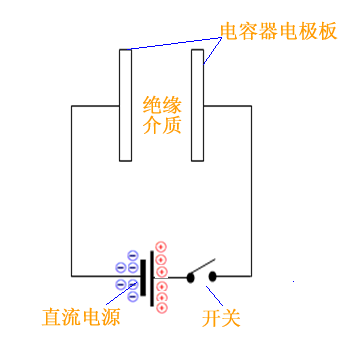

2、为什么二极管在开关断开后一定会导通呢？左边电压为什么一定比右边的高呢？

对于原理上来将，如果左端比右端低，此时，二极管不会导通，其电感$L_1，L_2$的能量就不能被释放。另外对于功能来说，左端一定要比右端高，右端才能有电压。

理解上述所说后，可以看如下文章：

[SEPIC电路理论浅析](https://zhuanlan.zhihu.com/p/340069041)

# BUCK-BOOST应用电路

### 一、两开关管BUCK-BOOST电路

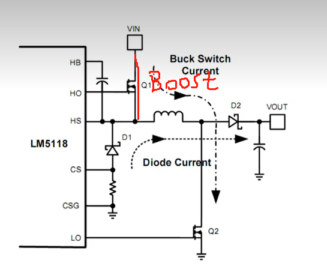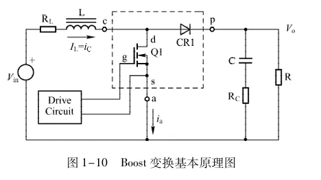

当Q1一直闭合时Q2的通断就构成了BOOST电路。

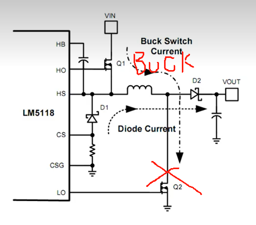

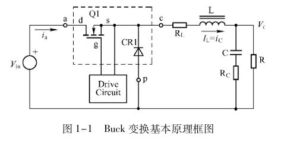

当Q2一直断开时Q1的通断就构成了BOOST电路。

### 二、四开关管
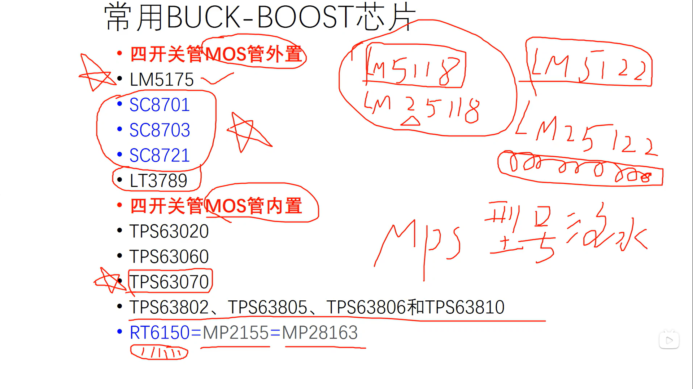

四开关管可以用用于数字电源设计。

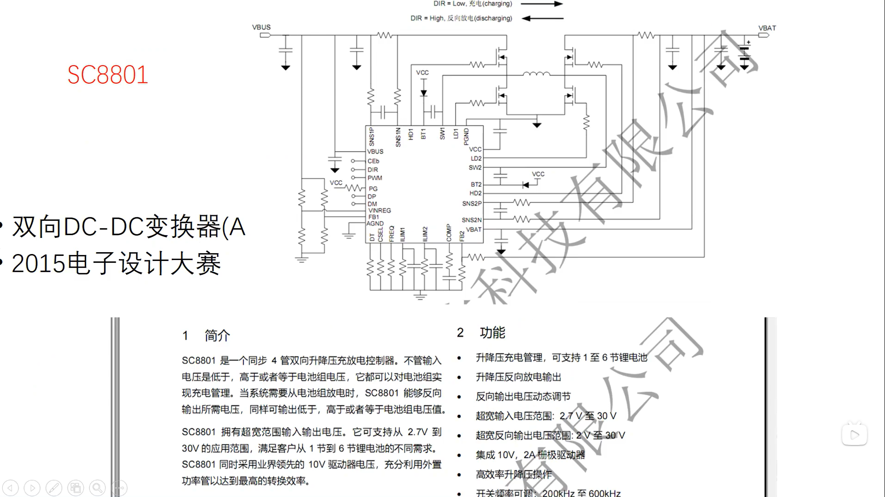

### 三、BUCK-BOOST电路电感选取
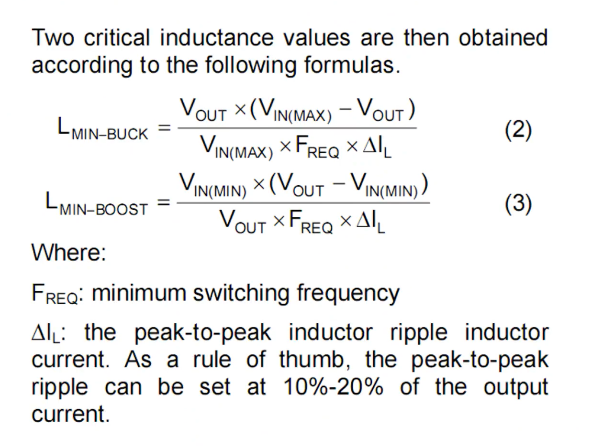

### 四、FLYBACK电路
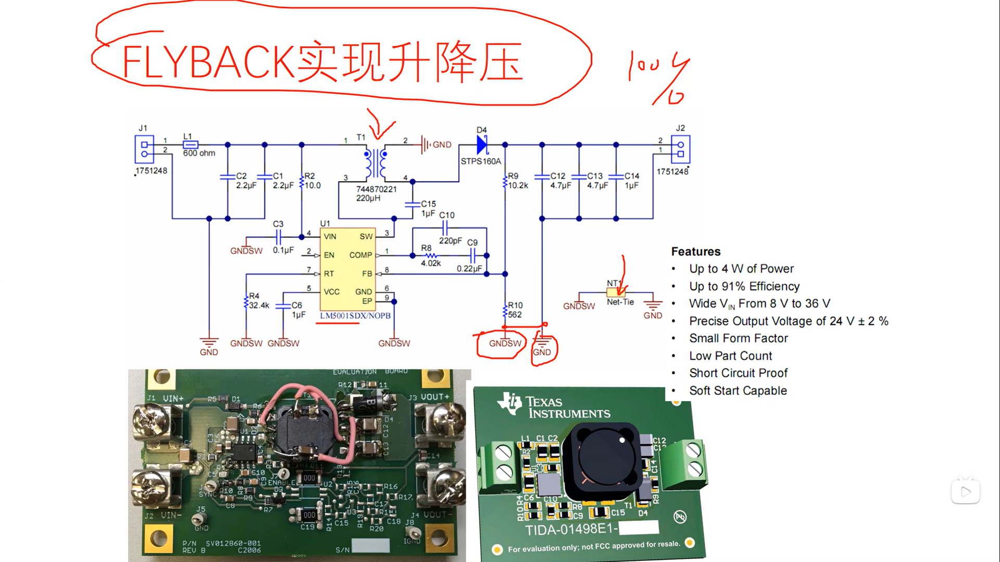

# BUCK-BOOST电路PCB绘制

### 一、SEPIC电路PCB绘制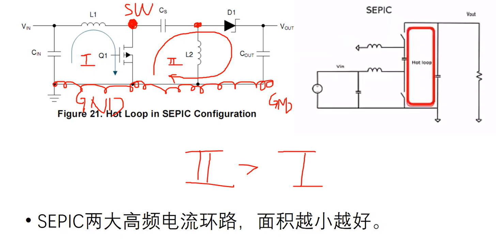

