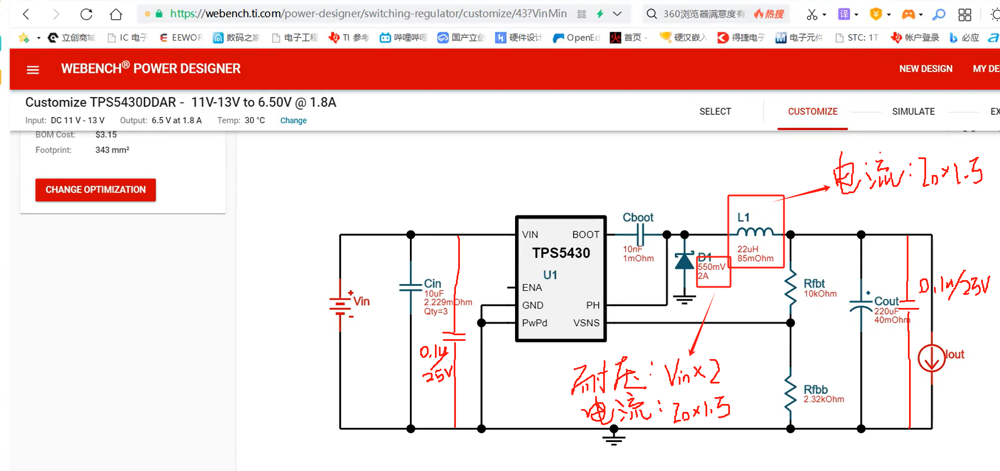
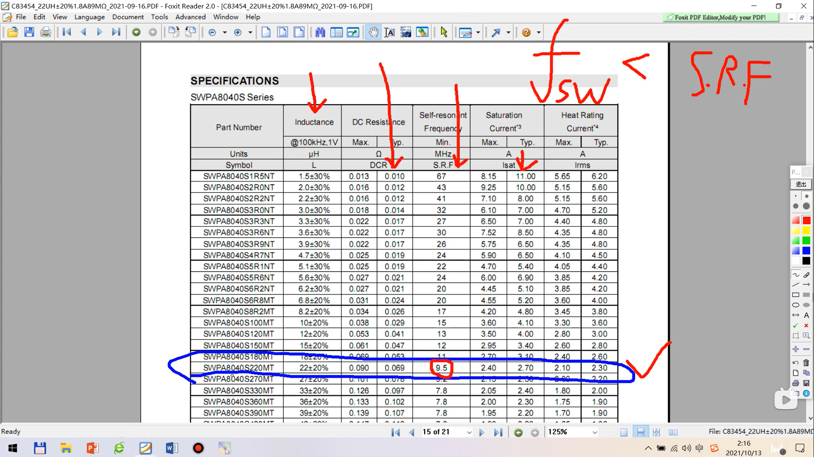
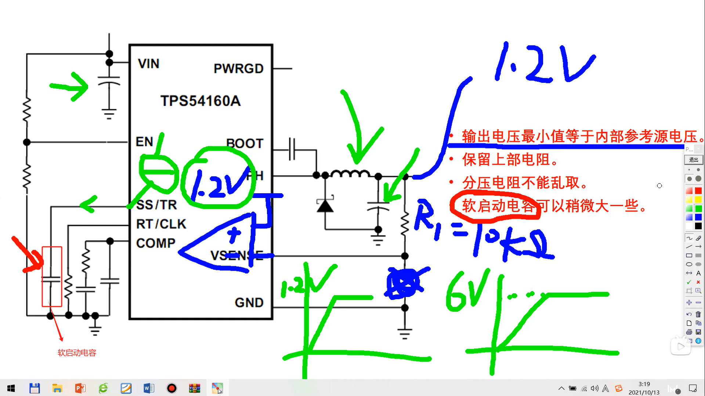

[电源大师12—BUCK降压电路 BOOST升压电路，电感电容参数计算，前馈电容Cff计算，负载瞬变产生的电压过冲。TPS55340 TPS54560_哔哩哔哩_bilibili](https://www.bilibili.com/video/BV1cr4y1m7Qi?spm_id_from=333.788.player.switch&vd_source=ba62f878ab81b77525d122fe32118844)

### 一、参数计算

电流限制选取输出电流的的1.5倍，耐压电压为2倍，输入耐压即为输入电压的2倍，输出耐压即为输出电压的2倍。

### 二、电容计算

电感DCR越小越好，电感内阻。同时电感SRF为自身谐振频率，要求开关管频率必须小于电感谐振频率。饱和电流为电路电流的1.5倍。

### 三、对于其它厂商芯片参数计算
升压用TPS55340，降压用TPS54560

计算出来的输出电容，输入电容，还有电感，可以参考使用。

### 四、软启动电容

当芯片开启后，首页是芯片内部电流源给软启动电容充电，当电容充满后，芯片内部参考电压也就达到标准数值，然后芯片开始工作。

