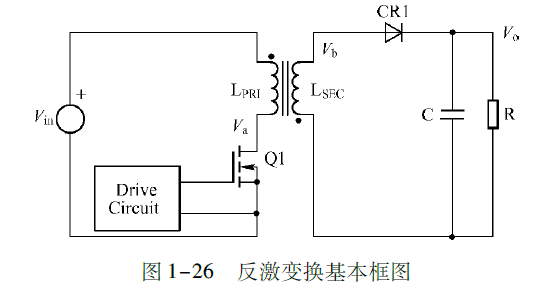

# 反激变换FLYBACK

反激电源适用于**≤200W**的输出功率（家用电器、充电器等），更高功率（如300W以上）需优化磁芯和散热设计。

[反激拓扑1—反激电路的由来](https://www.eet-china.com/mp/a296579.html)

### 1、反激拓扑结构与输出公式推导

如图为反激电路拓扑结构，假设变压器变比为：$n$

推导输入输出等式，分析电感对电感运用伏秒积平衡得到：

$V_{in}T_{on} - \frac{di}{dt}L_m T_{off} = 0$

其中$T_{on} = T*D$D为占空比，$T_{off}$为开关开启时间。$\frac{di}{dt}L_m$为变压器原边电压，得到：

$V_o = n*\frac{di}{dt}L_m$

将$V_o$代入伏秒积平衡等式得到：

$V_o = \frac{V_{in}*n * D}{1-D}$

### 2、工作原理
反激变换为BUCK-BOOST电路改造而来

其中做原理为：

当开关开通时也就是处于$T_{on}$阶段时，此时开$Q_1$导通，输入电压$V_{in}$加在变压器初级线圈，此时同名端“.”相对于异名端为正，此时初级线圈上正下负，初级为充电，而次级为放电下正上负，二极管CR1反向截至。初级电流线性上升（线性电感），变压器作为电感运行：

$V_{in} = L_m \frac{di}{dt} = N_p \frac{d \Phi}{dt} = N_P*A_e \frac{dB}{dt}$

其中$V_{in}$为输入电压，$L_m$为初级线圈的电感值，$N_P$为变压器初级线圈匝数，$A_e$为变压器磁芯横截面积。

当开关打开时也就是处于$T_{off}$阶段时间时，此时由于副边电感的续流作用，感应出下负上正，此时二极管CR1正向导通得到，对负载进行供电和对输出电感进行充电。

### 3、反激式变换器设计过程与计算
#### 步骤1: 设计输入
设计输入或由最终应用确定，或由设计人员来选择。这些参数包括但不限于：输入和输出电压、功率、纹波系数和操作模式。表1罗列了本文所讨论电路的设计输入。

| 设计输入 | 值 |
| --- | --- |
| 输入电压 (VIN) | 11.3V-12.7V |
| 输出电压 (VOUT) | 300V |
| 输出电流 (IOUT) | 0.1A |
| 操作模式 | DCM |
| 纹波系数(KFR) | 1 |
| 最大占空比(DMAX) | 0.5 |
| 开关频率 (fSW) | 160kHz |
| 预估效率(η) | 80% |

非连续导通模式 (DCM)具有较高的稳定性和效率，我们为此应用选择了该模式。这意味着该解决方案的纹波系数为1。

其最大占空比固定为50%，以最大限度地减少应力并均衡利用MOSFET和二极管。开关频率则选择为160kHz。

为使计算更加实际，变换器的估算效率也被定义。尽管该估值相对较低（约80%），但却是低功率反激式变换器的常见效率值。

根据所有这些输入，设计人员必须选择满足所有初始要求的控制器IC。本例采用了MPS的[MP6004](https://www.monolithicpower.cn/cn/mp6004.html)。MP6004是一款仅支持DCM模式的反激式控制器。它还提供原边调节功能，可减少外部组件的数量。

#### 步骤2: 最大原边电感计算及选择
第一个设计计算用于找到最大原边电感值。有许多不同的设计方法可以用于计算该值，但本例中的变换器始终运行在DCM模式，因此我们采用如下的公式 来计算原边电感值(LP)：

已经知道操作模式是DCM，所以每次原边电感存储能量都耗尽得到：

$I_{peak} = \frac{V_{in} \times D T_{sw}}{L_p}$

$W = \frac{1}{2} \times L_p\times I_{pk}^2$

得到：

$W = \frac{1}{2} \frac{(V_{in}\times DT_{sw})^2}{L_p}$

对于输出测来说：

$P_o = \frac{W\times \eta}{T_{sw} }$

两边推导相等得到：

$\frac{P_oT_{sw}}{\eta} = \frac{1}{2} \frac{(V_{in}\times DT_{sw})^2}{L_p}$

得到：

$L_p = \frac{(V_{in}\times D)^2T_{sw} \times \eta}{2\times K_{FR} \times P_o} = \frac{(V_{in}\times D)^2 \times \eta}{2\times f_{sw}K_{FR} \times P_o}$

最坏情况发生在变换器以最小输入电压（VIN）和最大占空比（D）且全功率工作时。将设计输入代入公式，可以得到最大电感器限值。

接下来计算所需的匝数比$n_{s1}$。我们仍使用最小$V_{in}$和最大$D$以得到最坏情况下的值，同时增加二极管的正向压降以使计算更加精确。用等式来估算$n_{s1}$：[BCM来设计DCM变压器变比](https://www.yuque.com/u42203592/pf2qc8/yxpncgwrllaw52wg)

$V_o = \frac{V_{in} * D}{n_{s1}(1-D)}$

定义D为0.5：

$n_{s1} = \frac{V_{in}D_{max}}{(V_o+V_d)(1-D_{max})}$

#### 步骤3: MOSFET计算
下一步是为应用选择合适的MOSFET。为此，我们需要计算开关必须承受的最大电流和电压。首先利用公式来计算最大电压：

$V_{dsMax} = V_{inMax} + \frac{V_{in} * D_{max}}{(1-D_{max})}$

注意，$V_{dsMax}$上增加了1.5倍数的安全裕度，以确保变换器的安全运行。然后我们利用公式来估算最大电流：

第一部分是功率项：

$I_{avg} =\frac{I_{peak}\times T_{sw}D}{2\times T_{sw}} = \frac{I_{peak}\times D}{2}$

$P_{in} = V_{in}\times I_{avg} =V_{in}\times \frac{I_{peak}\times D}{2}$

$\frac{I_{peak}}{2} = \frac{P_{in}}{V_{in} \times D}$

第二部分是电感伏秒项：

$V_{in} = \frac{di}{dt}L_p$

$I_{peak} = \frac{V_{in} T_{sw}D_{max}}{L_p}$

$\frac{I_{peak}}{2} = \frac{V_{in} D_{max}}{2L_pf_{sw}}$

$I_{peak} = \frac{P_{in}}{V_{in} \times D} + \frac{V_{in} D_{max}}{2L_pf_{sw}}$

$I_{peak}$增加了1.5倍数的安全裕度。

#### 步骤4: 整流二极管计算
该步骤用于评估整流二极管。与MOSFET一样，其目的是确保整流二极管能够处理它可能遇到的最大电压和电流。 首先利用公式来计算二极管能承受的最大电压：

$V_{mosPeak} = V_{out}+\frac{V_{inMax}}{n_{s1}}$

通过增加1.5倍数的安全裕度，得到最大反向电压。

#### 步骤5: 输出电容器计算
我们用一个估值来确定输出电容的值，即忽略电路的二阶方面，如寄生分量和输出串扰。利用公式来估算电容的电压值，纹波为$\Delta V  = V_{oNom}\times\%1$，并且当工作在DCM模式时，$T_{off}$时是输出电容输出电流是$I_o$

$\Delta V = \frac{I_o\times T_{sw} D}{C} = \frac{I_o\times D}{f_{sw}\times C}$

$C = \frac{I_o\times D}{f_{sw}\times \Delta V}$

接下来，选择一个电容值以得出最佳纹波电压。

#### 步骤6：反激变压器的设计和计算
下一步是变压器的设计。变压器选型需要做出许多设计决策，例如磁芯材料和磁芯形状的选择。每种选择都有其特定的优势，在本例中，我们选用了常见的双E形铁氧体磁芯（见图3）。PQ3535/PC44

图 3：变压器双E型磁芯和变压器主要构成

用于计算变压器面积的方法称为AP法。它将变压器的总面积定义为绕组窗口面积与磁芯横截面面积的乘积，所有变压器的磁通量都汇集于这些位置（见图 4）。

##### 1、磁芯相关参数
根据功率与电压等级经验选用PQ3230设计LLC谐振电感，其磁芯也是PC44：

$A_{e1} = 161mm^2$

$V_{1e} = 11970mm^3$

$L_{e1} = 74.6mm$

$A_{w1} = 149.6mm^2$

##### 2、磁芯计算
电感**磁通守恒定律**公式$LI = NBS$[三、变压器磁平衡公式与电感磁通守恒定律](https://www.yuque.com/u42203592/pf2qc8/uupgt3thz19i5ssb)

定义电感工作最大磁感应强度为：

$B_{max1} = 0.12T$

计算原边电感绕组的匝数：

$n_s = \frac{L_pI_{peak}}{B_{max1}A_{e1}}$

计算输出最大所需磁感应强度：

$B_{xMax} = \frac{L_p \left( 1.5I_{peak} \right)}{n_s A_{e1}}$

其中电流应力选用1.5

##### 3、原边电感绕组计算
设原边电流密度为$I_{sDen} = 4\times10^6 A$

$NT_s = \frac{I_{peak}}{I_{sDen}\times \frac{\pi d^2}{4}}$

即采用0.1mm*50的多股励磁线绕制。

##### 4、副边电感绕制匝数
设原边电流密度为$I_{pDen} = 4\times10^6 A$

$n_{s1} = \frac{n_s}{n_p}$

$n_p = \frac{n_s}{n_{s1}}$

$NT_p = \frac{I_{o}}{I_{pDen}\times \frac{\pi d^2}{4}}$

计算窗口占用率：

$\lambda_{w1} = \frac{ \frac{\pi(0.1mm)^2}{4}*(NTs*n_s+NT_p*n_p )}{A_{w1}}$

窗口占用率在0.1到0.3之间较好。

##### 5、损耗计算
电感损耗包括磁芯损耗何电感绕组损耗两部分。

#### 步骤7: 缓冲器设计和计算RCD吸收电路
设计流程的最后一步是找到合适的缓冲器值。缓冲电路有助于减轻开关节点的电压尖峰，这些尖峰是由于变压器漏电感和电路中杂散电容之间的振铃而导致。如果没有缓冲器，电压尖峰会增大噪声，甚至会导致MOSFET击穿。图5显示了带缓冲电路的反激式变换器。

对于RCD吸收电路要求，对于RC的选择，不能太大也不能太小，其中就涉及RC的选型，要保证即二极管的阴极电压只有在尖峰超过设计要求时才会导通，放置吸收原边钳位电压，同时，对于RC下吸收这边也不能吸收速度太慢，太慢过冲的尖峰电压就有可能损坏MOS管。

所以计算如下：

在选择完需要使用的MOS管后，取0.8倍的峰值电压作为设计上限：

$V_{sn} = V_{mos}\%80 - V_{inMax}$

其中要求:

$V_{mos}\%80>=V_{inMax} + V_{cp}$

如果不满足就是选型有问题。

得到$V_{sn}$，$V_{sn}$即为用于设计的电压。

同时由于使用的变压器原副边是有漏感的，漏感一般为原边电感的1%~5%，所以

#### 最后设计
在计算出变换器的所有组件值后，[MP6004](https://www.monolithicpower.cn/cn/mp6004.html)稳压器就可以与其外部组件配对，构建出一个全功能反激式DC/DC变换器。

注意，该电路包括了前面已提到的元件，如原边电感器(LP),辅助电感器 (LP2),输出电容器（由C2A, C2B, 和 C2C并联组成，以提高频率响应）,整流二极管(D1), 和缓冲电路。

图6显示了电路的最终设计以及新的组件，例如[MP6004](https://www.monolithicpower.cn/cn/mp6004.html)原边控制器。该控制器包含MOSFET开关及其所有相关电路，还包括一些用于噪声过滤的附加组件。

图6: 最终设计电路原理图

#### 结论
本文采用MPS的[MP6004](https://www.monolithicpower.cn/cn/mp6004.html)演示了如何通过八个简单的步骤设计一个反激式变换器。尽管在设计准备好实施之前还有很多因素需要考虑，例如通过EMC 测试、控制回路设计和元件选型，但建立一个清晰的计算和选型方法非常重要。

许多设计决策都将对系统的整体行为产生重大影响，因此建立输入设计参数是关键的第一步。这些参数设置了变换器设计的约束条件，其余步骤都将根据这些规格来选择值。

# BCM来设计DCM变压器变比

在 DCM（不连续导通模式）反激电源设计中，用临界模式（BCM，Boundary Conduction Mode，边界导通模式，即电感电流刚好在开关周期结束时降为零的状态）求解变压器变比，主要基于以下关键原因：

### 1. 伏秒平衡的普适性与临界状态的“桥梁”作用
反激变压器的**伏秒平衡**是核心规律：变压器原边绕组的“伏 - 秒积”（电压×导通时间），必须与副边绕组的“伏 - 秒积”（电压×导通时间）相等（能量守恒的体现）。

+ 临界模式（BCM）是 **DCM 和 CCM（连续导通模式）的“边界”**：此时电感电流在一个开关周期结束时恰好降为零，既满足“断续”的 DCM 特征（电流有降为零的阶段），又能利用“临界状态下占空比与电压的明确数学关系”来推导变比。
+ DCM 下，电感电流的“断续时间”不固定，若直接针对 DCM 推导，会引入“电流为零的时间”这一额外变量，使公式复杂且不易直接用于设计。而临界模式下，“电流刚好降为零”的条件让伏秒平衡的公式更简洁，可作为推导 DCM 变比的**基础参照**。

### 2. 设计的“保守性”与可靠性
反激电源设计时，通常希望变压器工作在 **“最恶劣但仍可控”的工况** 下（以保证全输入电压范围、全负载范围内的可靠性）。

+ 临界模式对应 **“最大占空比 ****(**** D_{\text{max}} ****)****”和“最小输入电压 ****(**** V_{\text{in(min)}} ****)****”的组合**（这是反激电源中“原边储能需求最大”的工况）。
+ 以临界模式推导变比，能确保：当输入电压最低、负载最重时，变压器仍能通过“临界状态”实现能量传递；而当输入电压更高或负载更轻时，系统会自然进入 DCM（因为此时原边储能足够，电感电流会提前降为零，进入断续）。

### 3. 简化设计与工程实用性
工程设计追求 **“简单、可重复、易计算”**：

+ 临界模式的变比公式（如你提供的 ( n = \frac{V_{\text{in(min)}} \cdot D_{\text{max}}}{(1 - D_{\text{max}}) \cdot (V_o + V_D)} )）仅涉及“最低输入电压、最大占空比、输出电压、二极管压降”等**明确且易获取的参数**，无需考虑 DCM 中“电流断续时间”这类模糊变量。
+ 基于临界模式的变比设计后，实际 DCM 工况下，变压器的变比仍能满足“伏秒平衡”（因为 DCM 是临界模式的“延伸”——断续时间的存在不破坏能量守恒，只是让副边导通时间更短）。

简言之，用临界模式求解 DCM 反激变压器变比，是**利用临界状态的简洁性和保守性**，为 DCM 设计提供“可靠、易计算”的基础，同时保证全工况下的能量传递与系统稳定。

