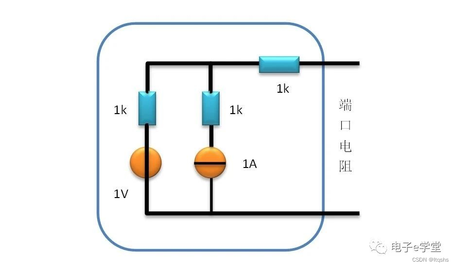
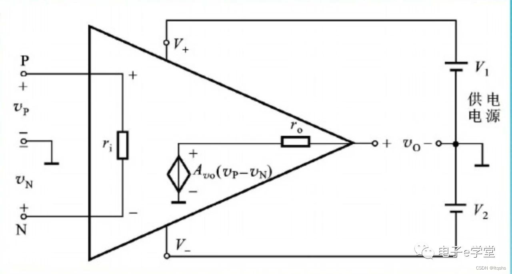
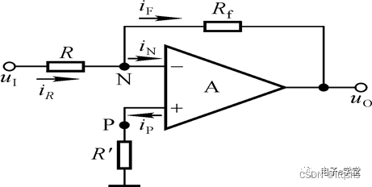
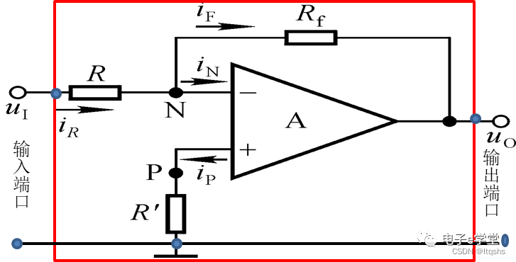
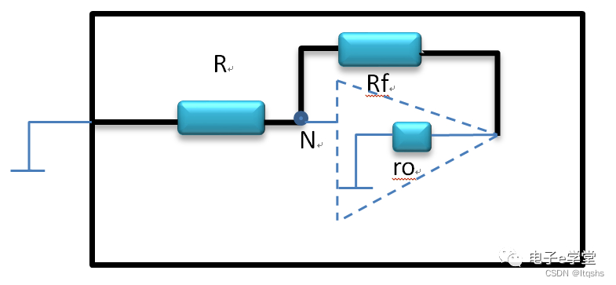
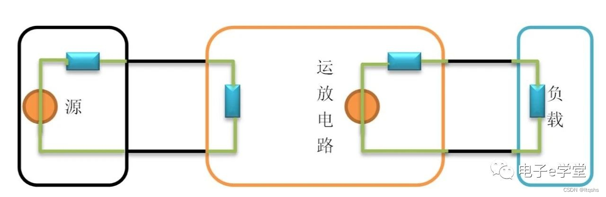

## 运放电路中各种电阻的计算

在学习运算放大器电路的时候，经常需要计算电路的:

-   输入阻抗Ri，
    
-   输出阻抗Ro，
    
-   同相端对地等效电阻RP,
    
-   反相端对地等效电阻RN，
    

这些参数很重要，在学习运放相关电路的时候经常要用到，如果不理解的话，对于后面运放电路的理解就困难重重，那今天就一次性把它说清楚。

### 预备知识

#### 端口等效电阻计算（电源置零法）

因为理想电压源内阻为0，而理想电流源内阻无穷大，计算电路等效电阻时,就按这两个条件将电压源置短路，无穷大内阻以开路看待。  
例如下面这道题，求端口电阻，将电压源短路、电流源断路，那么，端口电阻R=1K+1K=2K.  

#### 运算放大器等效电路模型

运算放大器的等效电路模型其实是一个二端口电路，这个二端口电路有1个输入端口和1个输出端口，输入端口内部等效成一个大电阻，输出端口等效成一个受控电压源和一个电阻串联。  

运算放大器传输特性为：$Vo=AVo（VP-VN）$。

本质上就是对输入端的电压差值进行放大，因为AVo这个放大系数一般比较大。

对于一个理想的运算放大器而言，

-   输入电阻ri≈无穷大
    
-   输出电阻ro≈0
    
-   AVo≈无穷大
    

注意：运放等效模型里面的ri和ro为运放的固有的本征参数，和我们后面要说的运放电路的输入电阻Ri和输出电阻Ro不是一回事。

运放这种电路模型的提出，应该是模拟电子历史上的里程碑事件了，但是单纯一个运放，如果没有外围电路，用处就很少，我们一般都是搭配外围电路去进行使用。

#### 根据模型解释虚短和虚断特性

从模型我们也可以看出，由于输入电阻无穷大，那自然可以认为从同相输入端P和反相输入端N流入的电流Ip=In=0，所以认为输入端对电流来说是断路的。（虚断）

还是从模型来看，虽然输入电阻很大，但毕竟N端与P端还是连着的，只是这条通路上没有电流，既然没有电流流过这个大电阻，那自然不会在电阻上产生压降，因此UN=Up，对电压来说就是短路的状态。（虚短）

### 电阻计算

有了前面的基础，下面来处理各种电阻的计算，以实例说明。  
下面这个电路是反相放大器。

传输关系：Uo=-(Rf/R)Ui

这个电路的输入电阻Ri，是指对电源Ui来说的，因此从Ui后面的电路都应该算作端口内部的电路，就是说我们要把电路框成下面这个样子。

##### 输入电阻Ri=R，

因为Up=0，由运放的虚短特性，UN=0，即N点为0电位点，输入端对地去看，就只有一个电阻，即为R。

##### 输出电阻Ro=ro，

即为运放内部的输出阻抗，因为利用电源置零的方法，我们暂且将运放模型内部的受控电压源置零，也就是短路替代，那从输出端口看进去，应该是Rf与ro并联，但是由于ro很小，Rf很大，电阻并联由小的决定，所输出电阻近乎等于运放内部输出电阻ro。

##### 同相端对地电阻RP=R’,

这个很直观，P点对地电阻就是R’，因为运放的同相输入端可以认为是断开的。

##### 反相端对地电阻RN=R//Rf,

同样是求端口等效电阻，从N点对地看进去，由电源置零法，输入电压源ui置零，对地短路，模型内部的电压源对地短路，得到Rf与ro串联后再和R并联，由于ro太小了，所以忽略不计，最终RN=R//Rf。

### 一个基本原则

一个电路的系统里面一定有源、有负载，我们一定是希望源的能量尽可能多的消耗在负载上，而不是消耗在源本身上，就像我们用的手电筒一样，希望电池的能量用来给灯泡发光，而不希望电池自身发热消耗能量。  
所以，如果将源电路等效成电压源与电阻串联的形式，源电路里面的输出等效电阻一定要尽可能的小，因为输出电阻和后面的负载电阻是串联分压的关系，内部电阻小了，才能将更多的能量传递给负载。  
同样，对于负载电路而言，我们希望它的输入电阻大一点，这样才能从源电路里面吸取更多的能量。  

### 结 语

回过头来再看，上面分析的反相放大器，输入电阻为R，由于运放电路中，电阻不宜使用太大的阻值，Rf不能太大，要想实现较高的放大倍数，只能将输入电阻R值调低，而这与我们希望输入电阻越大越好的原则相悖，所以这是反相放大器的一个缺点。

参考原文：[《运放电路中各种电阻的计算》](https://mp.weixin.qq.com/s/dSdK80Eqr5vGfV3EV7x-6Q)