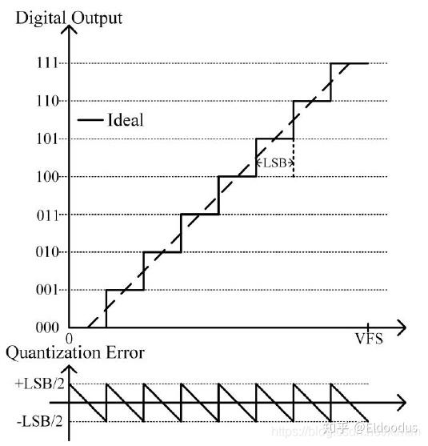

# ADC精度计算公式详解

## 1. 分辨率与有效位数

### 1.1 分辨率

分辨率是指ADC能够分辨的最小输入信号变化，通常用位数（bit）表示。例如，一个24位ADC的分辨率为2^24，理论上能够分辨出满量程的1/16,777,216。

### 1.2 有效位数（ENOB）

有效位数（Effective Number of Bits, ENOB）是衡量ADC在考虑噪声和失真后的实际性能指标。ENOB通常低于标称分辨率。

## 2. 计算公式

### 2.1 理想ADC的信噪比（SNR）

对于理想ADC，其信噪比（SNR）由量化噪声决定，计算公式为：

$SNR = 6.02 \times N + 1.76 \text{ dB}$

其中，N为ADC的位数。

### 2.2 实际ADC的有效位数（ENOB）计算

实际ADC的ENOB可以通过测量得到的信噪比（SNR）或信纳比（SINAD）计算。公式如下：

$ENOB = \frac{SINAD - 1.76}{6.02}$  

其中，SINAD（Signal-to-Noise and Distortion Ratio）是信号与噪声和失真之比，单位为dB。

## 3. 关键参数说明

### 3.1 信纳比（SINAD）

SINAD是衡量ADC动态性能的重要参数，它考虑了噪声和失真。计算公式为：

$SINAD = 20 \log_{10} \left( \frac{V_{signal}}{V_{noise} + V_{distortion}} \right)$

### 3.2 量化噪声

量化噪声是由于模拟信号数字化过程中的舍入误差引起的。理想ADC的量化噪声功率为：

$P_q = \frac{LSB^2}{12}$

其中，LSB为最低有效位对应的电压值。

## 4. 计算示例

以AD7767为例，其标称位数为24位，但实际ENOB会受到噪声和失真的影响。根据数据手册，在不同输出数据速率下的ENOB如下：

- 128 kSPS时，SNR为108.5 dB，ENOB ≈ 17.7位
- 64 kSPS时，SNR为111.5 dB，ENOB ≈ 18.2位
- 32 kSPS时，SNR为113.5 dB，ENOB ≈ 18.6位

## 5. 影响ENOB的因素

- **噪声**：包括热噪声、闪烁噪声等。
- **失真**：包括谐波失真、互调失真等。
- **时钟抖动**：采样时钟的不稳定性会引入额外的噪声。
- **电源噪声**：电源纹波和噪声会影响ADC的性能。

## 6. 总结

ADC的精度不仅取决于分辨率，还受到噪声和失真的影响。通过ENOB可以更准确地评估ADC的实际性能。在设计高精度数据采集系统时，需要综合考虑这些因素，并采取相应的措施（如滤波、屏蔽、优化布局布线等）来提升系统性能。

# 计算公式推导

### **一、ENOB公式的核心表达式**

ADC有效位数的标准计算公式为：  
$\boxed{\text{ENOB} = \frac{\text{SINAD} - 1.76}{6.02}}$
其中：

- **SINAD**（Signal-to-Noise and Distortion Ratio）是信号与噪声及失真之比（单位：dB）。
- **1.76 dB** 和 **6.02 dB** 为理论常数。

---

### **二、公式推导：从量化噪声到理想ADC模型**

#### **1. 理想ADC的量化噪声模型**
[Open: file-20251220214807034.png](0000assets/13、ADC有效精度计算/file-20251224155926595.jpg)

- **量化误差**：当ADC将模拟信号离散化为数字码时，会引入量化误差 ( $e_q$ )。假设误差在量化间隔内均匀分布
	$\Delta = \frac{V_{FS}}{2^N-1}$其中 ($\Delta$) 为最小量化电平（LSB对应的电压）
	其概率密度函数为：  
    $p(e_q) = \frac{1}{\Delta} \quad (-\frac{\Delta}{2} \leq e_q \leq \frac{\Delta}{2})$
- **量化噪声功率**：  
    量化误差的方差（即噪声功率）为：  
    $$\sigma_q2 = \int_{-\Delta/2}^{\Delta/2} e_q2 \cdot p(e_q)  de_q = \frac{\Delta ^2}{12}$$

#### **2. 理想ADC的信噪比（SNR）**

- **满量程正弦信号功率**：  
    设ADC满量程电压为 ($V_{FS}$)，输入正弦信号幅度为 ($V_{FS}/2$)，其功率为：  
    $$P_{\text{signal}} = \frac{(V_{FS}/2)^2}{2} = \frac{V_{FS}^2}{8}$$
- **信噪比（SNR）**：  
    $$\text{SNR}_{\text{ideal}} = 10 \log_{10} \left( \frac{P_{\text{signal}}}{\sigma_q^2} \right) = 10 \log_{10} \left( \frac{V_{FS}^2 / 8}{\Delta^2 / 12} \right)=10log_{10}\frac{V_{FS}^2*3}{\Delta^2*2}$$代入 $(\Delta = V_{FS} / 2^N)$（(N)为ADC位数），化简得：  
    $$\text{SNR}_{\text{ideal}} = 10 \log_{10} \left( \frac{3}{2} \cdot 2^{2N} \right) = 6.02N + 1.76 \ \text{dB}$$

---

### **三、实际ADC的有效位数（ENOB）定义**

实际ADC存在额外噪声（热噪声、时钟抖动等）和非线性失真（谐波），其性能由 **SINAD** 综合表征：$\text{SINAD} = 10 \log_{10} \left( \frac{P_{\text{signal}}}{P_{\text{noise}} + P_{\text{distortion}}} \right)$

**ENOB的本质**：  
将实际ADC的SINAD与理想ADC的SNR公式反向映射，得到等效位数：  
$\text{SINAD} = 6.02 \times \text{ENOB} + 1.76$
解出ENOB：  
$\boxed{\text{ENOB} = \frac{\text{SINAD} - 1.76}{6.02}}$

---

### **四、关键常数（1.76和6.02）的物理意义**

|          |                                  |                    |
| -------- | -------------------------------- | ------------------ |
| 常数       | 来源公式                             | 物理含义               |
| **6.02** | $20 \log_{10}(2) \approx 6.02$   | 位数每增加1位，SNR提高约6 dB |
| **1.76** | $10 \log_{10}(1.5) \approx 1.76$ | 理想正弦信号与量化噪声的功率比修正项 |

---

### **五、实际案例：AD7767的ENOB计算**

以AD7767（128 kSPS模式）为例：

- **实测SINAD** = 108.5 dB（含噪声和失真）
- **计算ENOB**：  
    $\text{ENOB} = \frac{108.5 - 1.76}{6.02} \approx 17.7 \ \text{位}$  
    **结果解读**：  
    尽管AD7767标称24位分辨率，因实际噪声和失真影响，其有效精度仅相当于17.7位理想ADC。

---

### **六、公式的适用条件与局限性**

1. **前提假设**：

- 输入信号为满量程正弦波。
- 量化误差为均匀分布的白噪声（实际ADC可能偏离此假设）。

2. **局限性**：

- 未包含ADC的增益误差、偏移误差等静态参数影响。
- 高频时时钟抖动导致的噪声可能主导，需另行建模。

---

### **总结**

ENOB公式 **$(\text{ENOB} = \frac{\text{SINAD} - 1.76}{6.02})$** 源于理想ADC的量化噪声模型，通过将实际ADC的性能映射到理想模型，量化其有效精度。此公式是评估ADC动态性能的核心工具，但需结合具体应用场景（如信号频率、带宽）综合分析。***需要注意用功率时和用幅度时前面有10倍和20倍的区别***。