一提到[开关电源环路补偿](https://zhida.zhihu.com/search?content_id=249565904&content_type=Article&match_order=1&q=%E5%BC%80%E5%85%B3%E7%94%B5%E6%BA%90%E7%8E%AF%E8%B7%AF%E8%A1%A5%E5%81%BF&zhida_source=entity)，就不得不提出I型、II型和III型补偿网络。通常来说，上述补偿网络是由[无源网络](https://zhida.zhihu.com/search?content_id=249565904&content_type=Article&match_order=1&q=%E6%97%A0%E6%BA%90%E7%BD%91%E7%BB%9C&zhida_source=entity)和[运算放大器](https://zhida.zhihu.com/search?content_id=249565904&content_type=Article&match_order=1&q=%E8%BF%90%E7%AE%97%E6%94%BE%E5%A4%A7%E5%99%A8&zhida_source=entity)组合起来的有源滤波器。

## 1、补偿网络求取传函的通用方法

提到环路补偿，就不得不提到传递函数的求取。如下图所示为补偿网络的典型电路图。

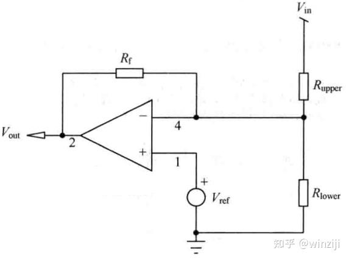

图1 用于补偿网络的典型电路图

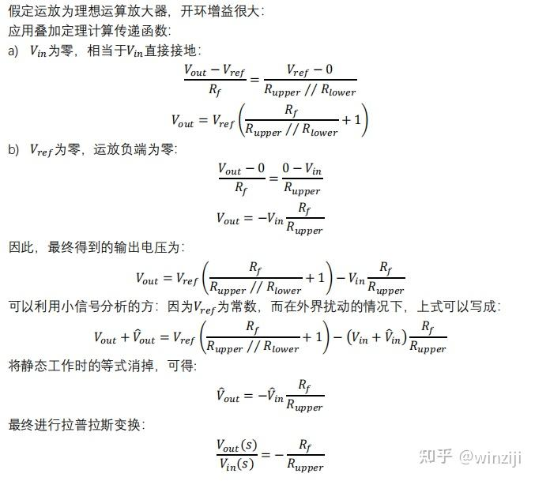

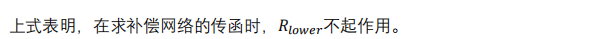

  

## 2.  I型补偿网络

I型补偿网络，也叫做单极点补偿网络。电路图如下：

I型补偿网络的电路图

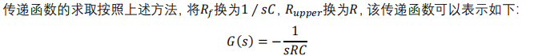

## 3、II型补偿网络

对于II型补偿网络补偿网络，可能会麻烦一些。它包含退变的II-a和II-b补偿网络。

### 3.1 II型补偿网络

II型补偿网络，也被称为单极点-单零点补偿网络。电路图如下：

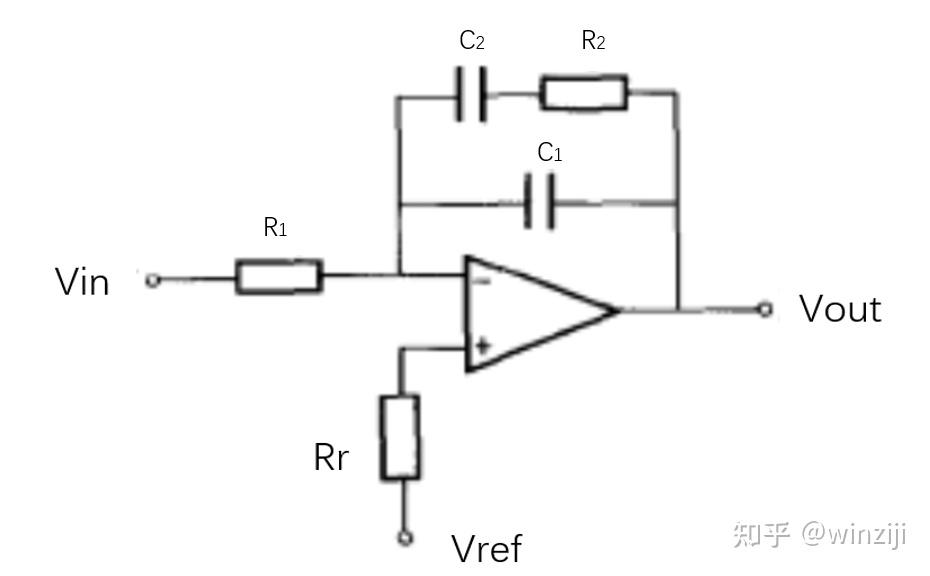

II型补偿网络的电路图

  

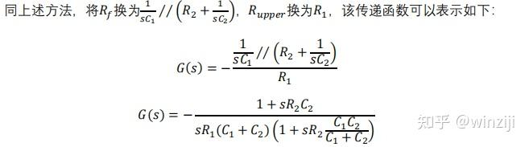

### 3.2 II-a型补偿网络

II-a型补偿网络，也被称为PI补偿网络。电路图如下：

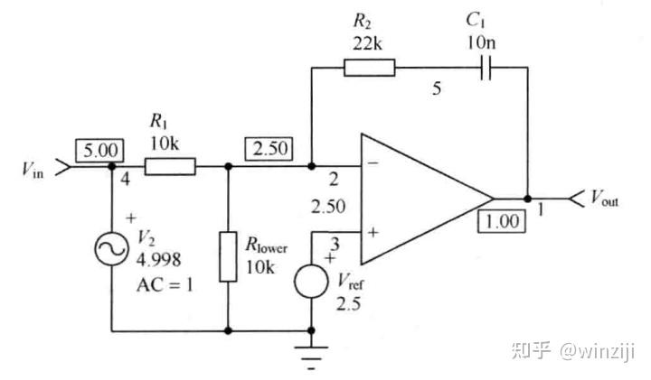

II-a型补偿网络的电路图

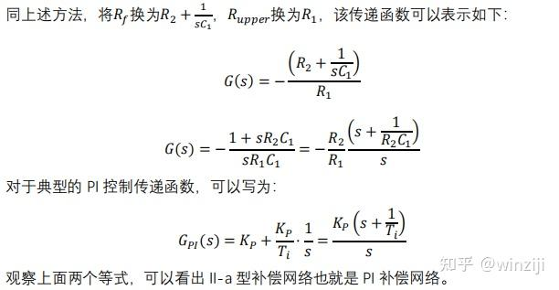

  

### 3.3 II-b型补偿网络

II-b型补偿网络，也被称为带宽增益受限的单极点补偿网络。电路图如下：

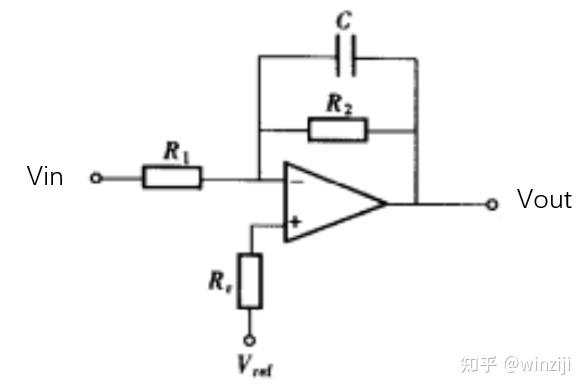

II-b型补偿网络的电路图

  

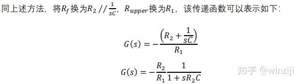

## 4、III型补偿网络

III型补偿网络，也被称为双极点-双零点补偿网络。电路图如下：

III型补偿网络的电路图

  

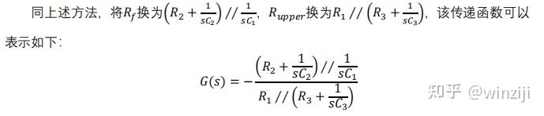

## 5、总结

本文介绍了I型、II型和III型补偿网络传递函数的计算方法。

首先，大家肯定会问，为什么不像其他书籍给出各个补偿网络传递函数的[伯德图](https://zhida.zhihu.com/search?content_id=249565904&content_type=Article&match_order=1&q=%E4%BC%AF%E5%BE%B7%E5%9B%BE&zhida_source=entity)，给出幅频曲线和相位曲线？这个很简单，只要我们使用Mathcad或者Matlab工具画出就好了。就拿我来说，我看了那么多本书籍，至今对各个补偿网络的伯德图也记不清。

其次，给出补偿网络在开关电源中的应用的例子。

II-b型补偿网络在电流控制模式[CCM flyback](https://zhida.zhihu.com/search?content_id=249565904&content_type=Article&match_order=1&q=CCM+flyback&zhida_source=entity)应用的例子，控制芯片为UC2842。红色方框为运放的外围电路。

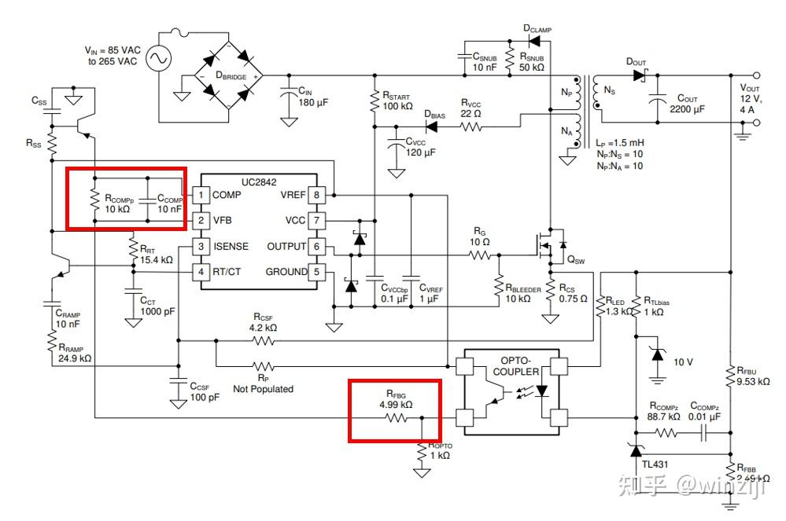

III型补偿网络在[LLC变换器](https://zhida.zhihu.com/search?content_id=249565904&content_type=Article&match_order=1&q=LLC%E5%8F%98%E6%8D%A2%E5%99%A8&zhida_source=entity)中应用的例子，控制芯片为UCC25600。红色方框为运放的外围电路。

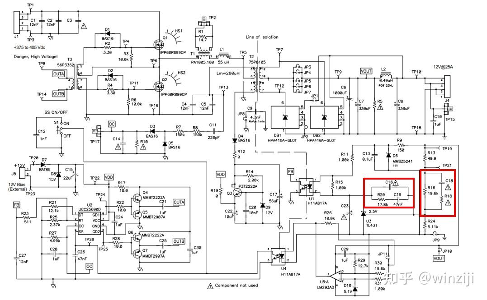

