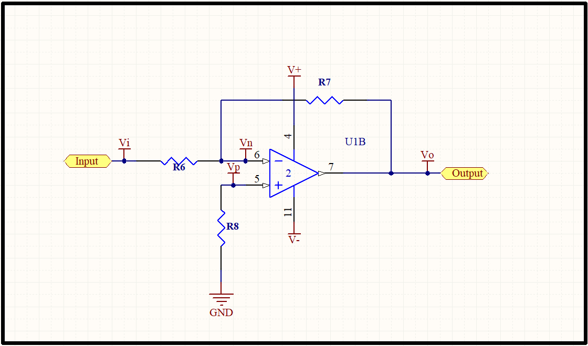
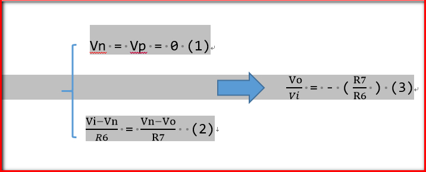
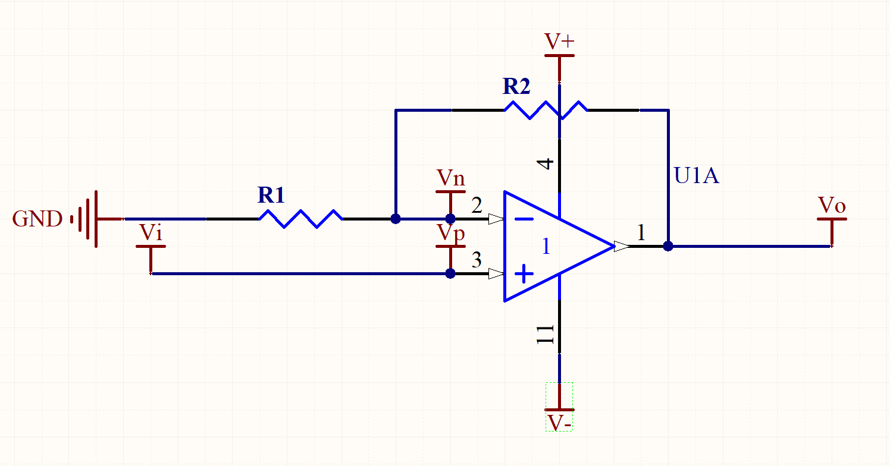
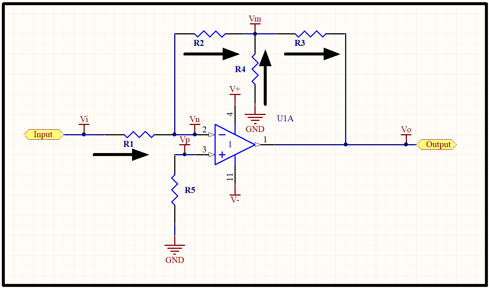

### 1\. 反相放大电路

我们一般的放大电路，经常采用同相或者反相放大电路来实现。如下图，给出的是一个反相放大电路。理论上，放大倍数取决于下图 R6，R7的比值，而与运放本身的参数没有关系。当放大倍数不太大的时候，我们可以选择简单的同相、反相放大电路来实现。但是当放大电路的电压增益比较大的时候，因为存在运放的输入电阻，输出电阻，电阻温漂等问题，简单的放大电路就存在一些问题了，这时候需要调整放大电路的结构，平衡运放自身与放大电路的设计以达到更高的增益倍数。

如上图，运放的同相位端通过下拉电阻接地，Vp = 0V,因为反向端和同向端虚短，所以 Vn = 0V。反向输入端输入电阻很高，虚断，几乎没有电流注入和流出。我们可以把 R6 和 R7 看成是串联关系。

放大倍数计算公式如下图：

  
**优点：**

两个输入端电位始终近似为零（同相端接地，反相端虚地），只有差模信号，抗干扰能力强；

**缺点：**

输入阻抗很小，等于信号到输入端的串联电阻的阻值。

### 2\. 同相放大电路

下图为同相放大电路，输出信号与输入信号是同相，因为反相输入端未接地，同相放大存在共模信号。

  
放大倍数计算公式如下，放大倍数总是大于 1。

  
**优点：**

输入阻抗和运放的输入阻抗相等，接近无穷大

**缺点：**

**同相、反相放大器对比：**

| 同相                                   | 反相                                                                         |
| ------------------------------------ | -------------------------------------------------------------------------- |
| 输入阻抗和运放的输入阻抗相等，接近无穷大，输入电阻取值大小不影响输入阻抗 | 输入阻抗等于信号到输入端的串联电阻的阻值                                                       |
| 输入信号范围受运放的共模输入电压范围的限制，               | 不存在共模输入电压范围的限制。如果要求输入阻抗不高，对相位无要求，首选反相放大，因为反相放大只存在差模信号，抗干扰能力强，可以得到更大的输入信号范围 |

**注：**

在设计中要求放大倍数相同的情况下尽量选择数值小的电阻配合，可以减小输入偏置电流的影响和分布电容的影响，设计系统功耗方面，也应该考虑电阻的影响。

### 3\. T 形网络

对于放大电路来说，温度漂移所引起的误差是其静态误差的主要来源。减少温度漂移误差的主要方法，除了选择失调漂移较小的运放以外，选用稳定性高的电阻也非常重要。但是阻值在 1MΩ 以上的电阻，稳定性都较差。出于减少温度漂移引起的静态误差的考虑，希望放大电路中选用阻值较小的电阻来实现较高的增益。

  
下图为 T 形网络放大倍数计算：

T 型网络常用于微弱信号的放大，在小信号的放大的时候，可以很好的满足稳定性和放大倍数的要求。

