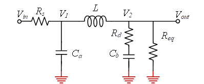

## 1 Π 型滤波器电路模型
典型 Π 型 LC 滤波器结构如图所示，由输入旁路电容 ($C_1$)、串联电感 (L) 以及输出旁路电容 ($C_2$) 构成。考虑电源及负载的非理想特性，在建模时引入输入源阻抗 ($R_s$) 和负载等效阻抗 ($R_{eq}$)。

```plain
Vs ── Rs ──●──── L ────●── Vo
           |             |
          C1            C2
           |             |
          GND           GND
```

其中：
+ ($R_s$)：输入源等效阻抗
+ ($R_{eq}$)：输出端等效负载阻抗
+ ($C_1, C_2, L$)：Π 型滤波核心元件

分析对象为**小信号交流纹波**，采用拉普拉斯域建模。

---

## 2 系统建模与节点方程建立
在 (s) 域中，各元件阻抗表示为：

$[Z_{C1}=\frac{1}{sC_1}, Z_{C2}=\frac{1}{sC_2}, Z_L=sL]$

设$R_{eq}=0$求解节点KCl得到：
+ 节点电压 ($V_1$)：电感左端、电容 ($C_1$) 上端
+ 节点电压 ($V_2$)：输出端、电容 ($C_2$) 上端

### （1）节点 ($V_1$) 的 KCL 方程
$\left[\frac{V_1 - V_s}{R_s}+ sC_1 V_1+ \frac{V_1 - V_2}{sL}= 0\tag{X-1}\right]$

### （2）节点 ($V_2$) 的 KCL 方程
$\left[\frac{V_2 - V_1}{sL}+ sC_2 V_2+ \frac{V_2}{R_{eq}}= 0\tag{X-2}\right]$

---

## 3 传递函数推导
将式（X-1）、（X-2）联立求解，消去中间变量 (V_1)，可得输出电压与输入电压之间的传递函数：

$$\left[\frac{V2}{Vs}=\frac{1}{1+ s\Big[R_s(C_1+C_2)+\frac{L}{R_{eq}}\Big]+ s^2\Big[L(C_1+C_2)+R_sR_{eq}C_1C_2\Big]+ s^3\Big[R_sLC_1C_2\Big]}\right]$$

由此可见，**完整 Π 型滤波器在考虑输入与输出阻抗时为三阶系统**。

---

## 4 振铃机理分析
在实际电源系统中，Π 型滤波器的振荡表现为输出纹波的振铃现象，其本质并非系统不稳定，而是**欠阻尼二阶模态被激发**。

从能量交换角度看，振铃主要由输出侧的电感 (L) 与电容 (C_2) 形成的谐振回路引起，而输入电容 (C_1) 多数情况下被源阻抗钳制，对振荡模态贡献较小。

因此，可将系统的主导动态近似为如下二阶模型：

$[s^2+s\left(\frac{1}{R_{eq}C_2}+ \frac{R_s}{L}\right)+\frac{1}{LC_2}= 0]$


## 5 阻尼比与振荡判据
将上述方程与标准二阶系统形式对比：

$[s2 + 2\zeta\omega_n s + \omega_n2 = 0]$

可得：

### 固有角频率
$\omega_n = \frac{1}{\sqrt{LC_2}}$

### 阻尼比
$\zeta=\frac{1}{2}\left(\frac{1}{R_{eq}}\sqrt{\frac{L}{C_2}}+R_s\sqrt{\frac{C_2}{L}}\right)$

据此可得振荡判据：

+ $( \zeta \ge 1 )$：过阻尼或临界阻尼，无振铃
+ $( 0.5 \le \zeta < 1 )$：轻微振铃，可接受
+ $( \zeta < 0.5 )$：明显振铃，应采取阻尼措施


## 6 避免振荡的工程措施
### （1）输出电容串联阻尼电阻
在 ($C_2$) 串联阻尼电阻 ($R_d$)，可有效抑制 LC 振荡，其临界阻尼近似条件为：

$R_d \approx 2\sqrt{\frac{L}{C_2}}$

该方法不影响直流工作点，阻尼效果明确。


### （2）利用电容 ESR 提供阻尼
在实际设计中，电容的等效串联电阻（ESR）可作为天然阻尼源，因此常采用陶瓷电容与电解电容并联的方式，在保证低纹波的同时抑制振铃。


### （3）RC 阻尼支路（Snubber）
在输出端并联 RC 阻尼网络，使其拐点频率接近系统固有频率，从而吸收谐振能量。

## 7 小结
Π 型 LC 滤波器在考虑输入和输出阻抗时，本质上为**三阶系统**，但其振铃特性主要由输出侧$L-C_2$构成的二阶模态决定。通过合理引入阻尼，可有效抑制振铃，提高电源系统的动态性能和稳定性。


## 8 Π型滤波计计算
对于电容$C_1,C_2,L$的计算如下：
### （1）精确计算
- 电感计算方式：
	$$L>\frac{V_{ripple}}{f_r\cdot0.3I_L}$$
其中$V_{ripple}$为电感两端电压变化，$f_r$为纹波频率，$I_L$为负载电流
- 电容$C_2$计算：
$$C_2>\frac{0.3I_L}{f_r\cdot\Delta V_0}$$
