# 推挽电路

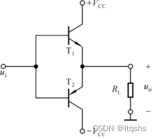
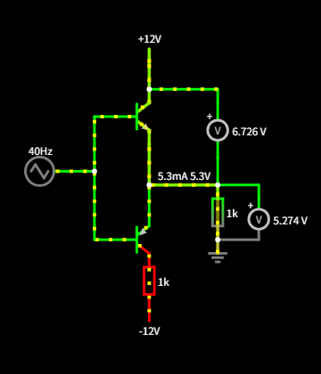

常见推挽输出电路，其特点为结构简单，每次只有一个管子工作。其工作模式分为两种也就是功率放大和开关模式。对于不同的工作模式也有不同的需求。

推挽电路中的三极管既可以作为**开关器件**使用，也可以用于**功率放大**，具体取决于电路的设计目标和应用场景。以下是两者的详细区分和设计要点：

---

### **1. 作为开关器件（开关模式）**
#### **应用场景**：
+ **开关电源（如DC-DC转换器）**：高频切换，控制能量传输。
+ **电机驱动（H桥电路）**：快速导通/关断以驱动电机正反转。
+ **数字电路输出级（图腾柱驱动）**：驱动大电容负载（如MOSFET栅极）。

#### **工作特点**：
+ **工作在饱和区与截止区**： 
    - 三极管在导通时完全饱和（饱和压降低，如0.2V），关断时完全截止。
    - 目的：最小化导通损耗（Ploss=VCE(sat)×ICP_{\text{loss}} = V_{\text{CE(sat)}} \times I_CPloss=VCE(sat)×IC），提高效率。
+ **高频切换**： 
    - 开关频率可达kHz至MHz（如开关电源中），需要快速切换器件（如MOSFET）。
+ **死区时间控制**： 
    - 必须避免上下管同时导通（短路风险），需加入死区时间电路或驱动逻辑。

**说明**：输入PWM信号控制Q1和Q2交替导通，输出高频方波驱动负载（如变压器或电机）。

---

### **2. 用于功率放大（线性模式）**
#### **应用场景**：
+ **音频功率放大器（Class AB）**：放大模拟信号，驱动扬声器。
+ **射频功率放大**：放大高频信号（如通信设备）。
+ **线性稳压电源**：调节输出电压。

#### **工作特点**：
+ **工作在线性区（放大区）**： 
    - 三极管根据输入信号连续调节导通程度（非完全导通/关断）。
    - 输出波形与输入信号成比例放大。
+ **低失真设计**： 
    - 需设置静态偏置电流（Class AB模式），消除交越失真。[功率放大推挽电路死区时间补偿](https://www.yuque.com/u42203592/pf2qc8/do5m3e4txkizxp8h)
    - 通过负反馈（如运放反馈环路）进一步降低失真。
+ **效率与散热的权衡**： 
    - 线性模式下效率较低（典型值30-60%），需注意散热设计。

**说明**：D1和D2提供约1.2V偏置电压，使Q1和Q2在静态时微导通（Class AB模式），放大音频信号的正负半周。

---

### **3. 关键设计差异对比**
| **参数** | **开关模式** | **功率放大模式** |
| --- | --- | --- |
| **工作状态** | 饱和区/截止区（数字切换） | 线性区（模拟放大） |
| **效率** | 高（>80%，如开关电源） | 较低（30-60%） |
| **热损耗** | 低（仅导通/关断损耗） | 高（Pdiss=VCE×ICP_{\text{diss}} = V_{CE} \times I_CPdiss=VCE×IC） |
| **信号类型** | 方波、PWM | 模拟信号（正弦波、音频等） |
| **偏置要求** | 无需静态偏置 | 需静态偏置（Class AB） |
| **典型器件** | MOSFET（如IRF540N） | 双极晶体管（如2N3055） |

---

### **4. 如何选择三极管的功能？**
#### **根据应用需求决定**：
1. **选择开关模式**：
    - 需求高频、高效率（如电源、电机驱动）。
    - 使用MOSFET（低导通电阻、快速切换）。
    - 注意死区时间和驱动电压（如用IR2110驱动芯片）。
2. **选择功率放大模式**：
    - 需求高保真、线性放大（如音频放大器）。
    - 使用双极晶体管（线性特性好）或LDMOS（射频应用）。
    - 需设计偏置电路和散热系统。

#### **设计要点**：
+ **开关模式**： 
    - 优化栅极/基极驱动电流，确保快速切换。
    - 计算导通损耗和开关损耗，选择合适散热器。
+ **功率放大模式**： 
    - 通过仿真（如LTspice）调整偏置点，避免交越失真。
    - 加入温度补偿（如热敏电阻）防止热失控。

---

### **5. 实际案例说明**
#### **案例1：开关电源中的推挽电路（开关模式）**
+ **目标**：将12V DC转换为24V DC。
+ **器件选择**：N沟道MOSFET（如IRF3205）和P沟道MOSFET（如IRF4905）。
+ **关键设计**： 
    - PWM控制器（如SG3525）生成互补驱动信号。
    - 死区时间设置为100ns，防止共通导通。
    - 输出经高频变压器升压后整流滤波。

#### **案例2：音频放大器中的推挽电路（功率放大）**
+ **目标**：驱动8Ω扬声器，输出10W功率。
+ **器件选择**：互补三极管TIP41C（NPN）和TIP42C（PNP）。
+ **关键设计**： 
    - 偏置电路：2个二极管（1N4148）串联提供1.2V偏置。
    - 负反馈：从输出到输入级加入反馈电阻，降低失真（THD <0.1%）。
    - 散热器：TO-220封装，热阻需低于5°C/W。

---

### **6. 总结**
推挽电路中的三极管既可以是**高效开关**，也可以是**线性功率放大器**，二者的核心区别在于工作状态（饱和/截止 vs. 线性区）和设计目标（效率 vs. 保真）。实际设计中需根据应用需求选择器件类型、偏置方式和驱动电路，同时兼顾散热和可靠性。

# 功率放大推挽电路死区时间补偿

## 一、交越失真
由于晶体管的门限电压不为零，比如一般的硅三极管，NPN型在0.7V以上才导通，这样在0~0.7就存在死区，不能完全模拟出输入信号[波形](http://baike.so.com/doc/5815512-6028325.html)，PNP型小于-0.7V才导通，比如当输入的交流的正弦波时，在-0.7~0.7之间两个管子都不能导通，输出波形对输入波形来说这就存在失真，即为交越失真。

克服交越失真的措施是:避开[死区电压](http://baike.so.com/doc/520244-550819.html)区，使每一晶体管处于微导通状态，一旦加入输入信号，使其马上进入线性工作区

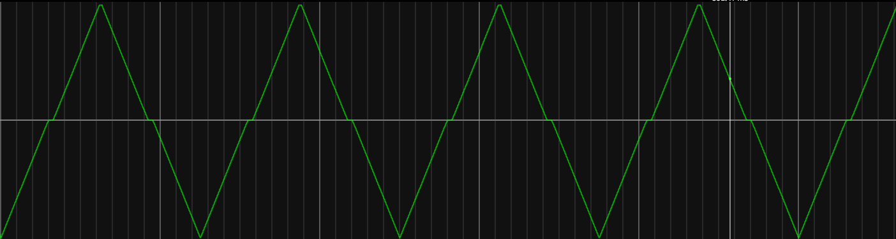

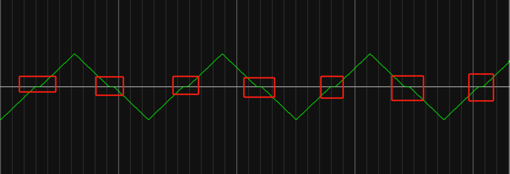

## 二、交越失真补偿方法
### (1)利用二极管和电阻的压降产生偏置电压
[推挽电路二极管是怎么消除交越失真的 很多人想不通_哔哩哔哩_bilibili](https://www.bilibili.com/video/BV1Pz4y1A7rq/?spm_id_from=333.337.search-card.all.click&vd_source=ba62f878ab81b77525d122fe32118844)

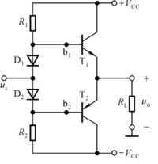
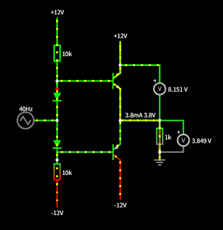

仿真软件：[Circuitjs web 在线电路模拟器](https://cc.xiaogd.net/)

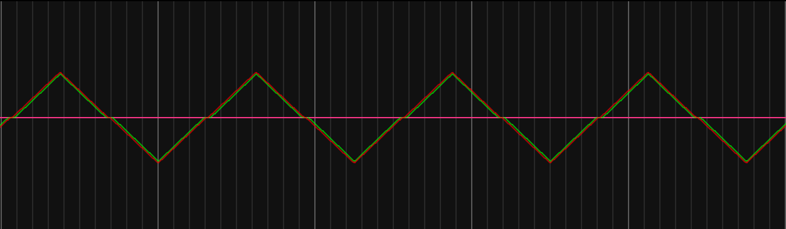

通过设置对称二极管和电阻电路，来实现静态电压的调节，其中，电阻主要用于保护电路，但是电阻阻值不宜过大。电阻的阻值需满足以下要求：

#### 1、确保二极管正向导通：
  
电阻的阻值应足够小，使得流经二极管的电流足够大，以保证二极管稳定工作在正向导通状态。若阻值过大，二极管可能因电流不足而无法维持所需压降，导致偏置电压不足，无法消除交越失真。

#### 2、压降分配：
  
在二极管与电阻串联的结构中，总偏置电压为二极管压降$ (V_D) $与电阻压降$ (I \cdot R) $之和。电阻的阻值应设计为：  
$R = \frac{V_{\text{bias}} - n V_D}{I}$  
其中，$ n $为二极管数量，$ I $为流经支路的电流。需确保电阻的压降较小（如$ I \cdot R \ll n V_D $），使总偏置电压主要由二极管提供，从而保持稳定性。

#### 3、避免过大电流：
  
电阻的阻值不能过小，否则会导致电流过大，增加功耗或损坏元件。通常需根据电源电压和二极管的额定电流选择电阻，例如：  
$R = \frac{V_{\text{CC}} - n V_D}{I_{\text{nominal}}}$  
其中，$ I_{\text{nominal}} $为二极管正常工作的推荐电流（如1~5mA）。

#### 4、温度稳定性：
  
二极管的压降具有负温度系数，而电阻的压降与温度相关（取决于材料）。需合理选择阻值，使总偏置电压的温度变化最小。例如，并联电阻时，阻值应远大于二极管的动态电阻$ (R \gg r_d) $，以抑制电流分流对压降的影响。

#### 5、总结：
  
电阻的阻值需在以下范围内折中：  

+ 下限：保证二极管导通足够电流（如1mA以上），维持稳定压降。  
+ 上限：避免电流过大导致功耗或热问题。  
典型设计中，阻值通常为几百欧姆至几千欧姆，具体取决于电源电压和二极管特性。例如，若电源电压为15V，使用两个二极管（总压降1.4V），要求偏置电流为2mA，则电阻阻值为：  
$R = \frac{15V - 1.4V}{2\text{mA}} = 6.8\text{kΩ}$  
此阻值既能确保二极管正常导通，又能限制电流在合理范围内，从而实现稳定的偏置电压，有效消除交越失真。

#### 6、缺点
由于电路在工作过程中功率损耗主要用于发热，又因为三极管的导通压降会因为温度的升高而降低，使得温度进一步的升高，进而不断地累计。最终会导致三级管被击穿。

所以做出如下改进，防止热击穿，如下图所示，在负载电流很小的时候，这是一个很常用的电路。

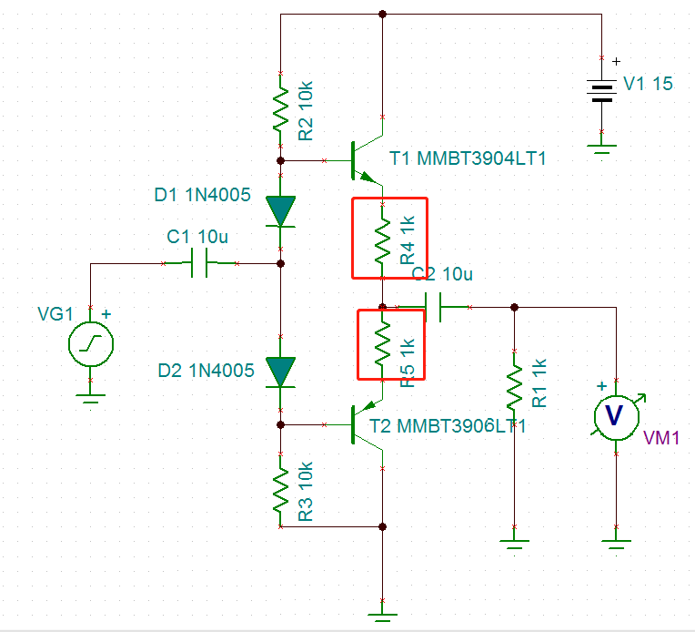

**电路因温度变化产生的电压差仅由电阻吸收。所以根本没有解决静态电流随温度变化的问题。**  
这里的两个电阻不是像下图所示那样选择1k,实际使用0.5Ω左右即可，毕竟温度变化导致的电压变化不会很大，这里只是做个方案分析才用的1k.  
 

### (2)利用UBE扩大电路产生偏置电压（抑制静态电流随温度的变动）[Vbe倍增电路设计_哔哩哔哩_bilibili](https://www.bilibili.com/video/BV19f421v7p6/?spm_id_from=333.337.search-card.all.click&vd_source=ba62f878ab81b77525d122fe32118844)
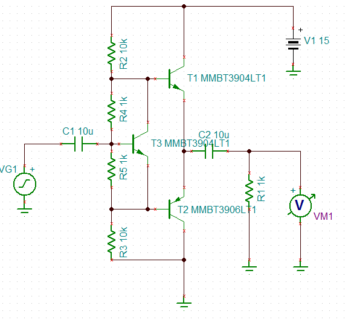

利用$UBE$扩大电路产生偏置电压也是运用对$NPN$和$PNP$两个三极管添加偏置电压，再利用叠加原理实现输出。

再去除输入的情况下，T3三极管的基极电压为0，可以将调节$R_4，R_5$ 来实现$U_{CE3} =U_{BE1}+U_{BE2}$ 

仿真

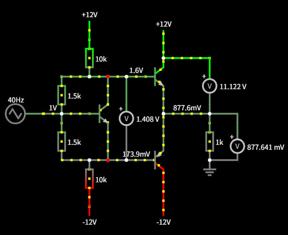

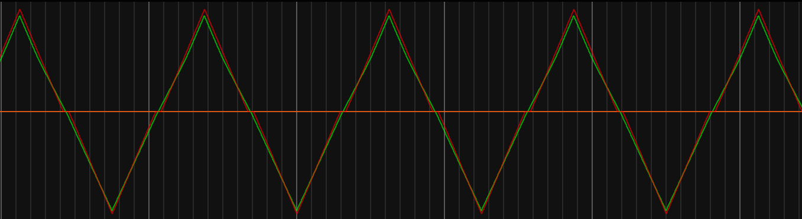

$ UBE $倍增电路要求调节二极管要推挽电路部分进行热耦合。这样才能有效的一直温度变化。所以在电路布局时需要将调节三极管和推挽部分靠得很近。

在UBE倍增电路设计中，三极管和电阻的选取需遵循以下核心规则，以确保电路的温度稳定性和工作点准确性：

---

### **一、三极管选取规则**
1. **VBE特性匹配**  
选择与主功率管工艺相同的三极管（如均采用Si或Ge管），确保两者的VBE温度系数（约-2mV/℃）一致，实现温度补偿。
2. **电流放大系数（β）要求**  
β值应较高（建议>100），以减小基极电流对分压网络的影响。例如，2N3904（β≈100~300）或BC547为常用选择。
3. **热耦合设计**  
需将UBE倍增管与功率管安装在同一散热器上，直接热耦合，确保两者温度同步变化，增强补偿效果。

---

### **二、电阻选取规则**
1. **分压比计算**  
根据目标偏置电压确定电阻比值：  
$R_2 / R_1 = (V_{out}/V_{BE}) - 1$  
例如，若需输出2倍VBE（约1.2V），取$( R_2 = R_1 )$。
2. **阻值范围优化**  
    - **下限**：避免阻值过小导致静态电流过大（典型值：$( R_1 + R_2 > 1\text{kΩ} )$）。  
    - **上限**：阻值过大易受漏电流干扰，建议$( R_1 < 10\text{kΩ} )$。
3. **温度系数匹配**  
选用低温漂电阻（如金属膜电阻），避免电阻温漂破坏VBE的补偿效果。

---

### **三、设计实例**
**场景**：为AB类功放提供2.4V偏置电压（假设VBE=0.6V）  

1. 计算分压比：$( R_2/R_1 = (2.4/0.6) -1 = 3 )$，即$( R_2 = 3R_1 )$。  
2. 取$( R_1=1\text{kΩ} )$，则$( R_2=3\text{kΩ} )$。  
3. 验证静态电流：$( I = V_{BE}/R_1 = 0.6\text{V}/1\text{kΩ}=0.6\text{mA} )$，功耗合理。  
4. 选管：2N3904（β≈200），与功率管TIP31C共散热器。

---

### **四、关键注意事项**
+ **动态阻抗**：通过并联电容（10~100nF）降低高频阻抗，避免自激振荡。  
+ **工艺一致性**：避免混合使用不同厂商的三极管，防止VBE离散性导致补偿失效。  
+ **可调设计**：在R2位置串联可调电阻（如500Ω电位器），便于微调偏置电压。

通过上述规则，可设计出温度稳定性高、工作点精确的UBE倍增电路，有效抑制交越失真并提升功放效率。

### (3)三者对比
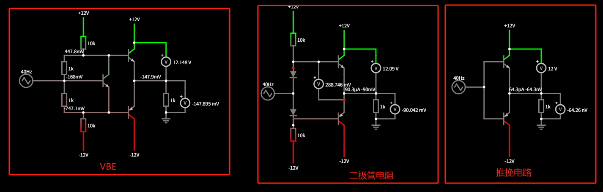

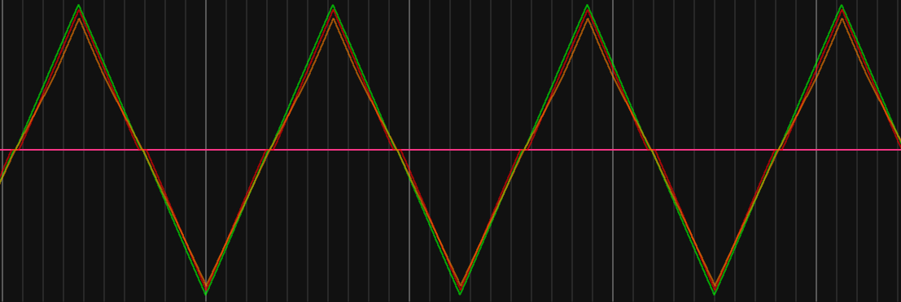

波形高低依次为二极管，推挽电路，VBE。对于利用电阻上的压降产生偏置电压这种方法不进行比较。

# A类，B类，AB类，D类音频放大器的区别

[A类，B类，AB类，D类音频放大器的区别 - liushao - 博客园](https://www.cnblogs.com/liushao/p/17218760.html)

根据放大电路的导电方式不同，_音频功放电路_按照模拟和数字两种类型进行分类，

模拟音频功放通常有A类，B类，AB类， G类，H类 TD功放，

数字电路功放分为D类，T类。

下文对以上的功放电路做详细的介绍和分析。

### 1. A类功放(又称甲类功放)
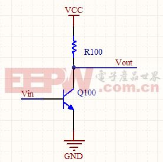

 A类功放如上图所示，在信号的整个周期内都不会出现电流截止(即停止输出)的一类放大器。但是A类放大器工作时会产生高热，效率很低。尽管A类功放有以上的弊端，但固有的优点是不存在交越失真，并且内部原理存在着一些先天优势，是重播音乐的理想选择，它能提供非常平滑的音质，音色圆润温暖，高频透明开扬，中频饱满通透的优点。单端放大器都是甲类工作方式，推挽放大器可以是甲类，也可以是乙类或甲乙类。

### 2.B类功放(又称乙类功放)
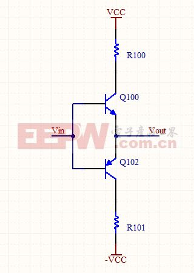

 B类功放是指正弦信号的正负两个半周分别由推挽输出级的两个晶体管轮流放大输出的一类放大器，每一晶体管的导电时间为信号的半个周期，通常会产生我们所说的交越失真。通过模拟电路的调整可以将该失真尽量的减小甚至消失。B类放大器的效率明显高于A类功放。

### 3.AB类功放(又称甲乙类)
　　AB类功放界于甲类和乙类之间，推挽放大的每一个晶体管导通时间大于信号的半个周期而小于一个周期。因此AB类功放有效解决了乙类放大器的交越失真问题，效率又比甲类放大器高，因此获得了极为广泛的应用。

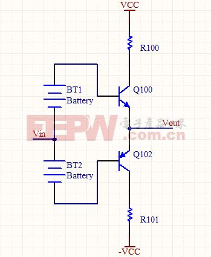   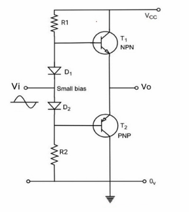

 如上右图，AB类放大器[电路设计](https://www.elecfans.com/v/tag/167/)考虑了两个[晶体管](https://www.elecfans.com/v/tag/5363/)T1和T2。晶体管T1为NPN型，晶体管T2为PNP型。两个正向偏置[二极管](https://www.elecfans.com/tags/%E4%BA%8C%E6%9E%81%E7%AE%A1/)D1和D2串联连接，以控制VBE(发射极-基极电压)由于温度变化引起的变化，如下面电路图所示。电阻R1与D1串联，电阻R2与D2串联。

      考虑T1是NPN晶体管，T2是此放大器配置的PNP晶体管，以获得具有给定输入信号的正负半周期组合的完整输出信号。在这种配置中，由于输入信号在过渡期间同时由T1和T2晶体管导通，可以消除交叉失真。

      因此在没有输入交流信号的情况下，晶体管可以导通。通过使用二极管D1和D2施加小的偏置电压，可以观察到工作点高于截止区域。这里输出信号的幅度和相位是相同的。因此AB类放大器也被称为线性放大器。

AB类放大器详细了解，请点击下面链接

[https://www.elecfans.com/analog/202208271885324.html](https://www.elecfans.com/analog/202208271885324.html)

### 4.D类功放(又称丁类功放)
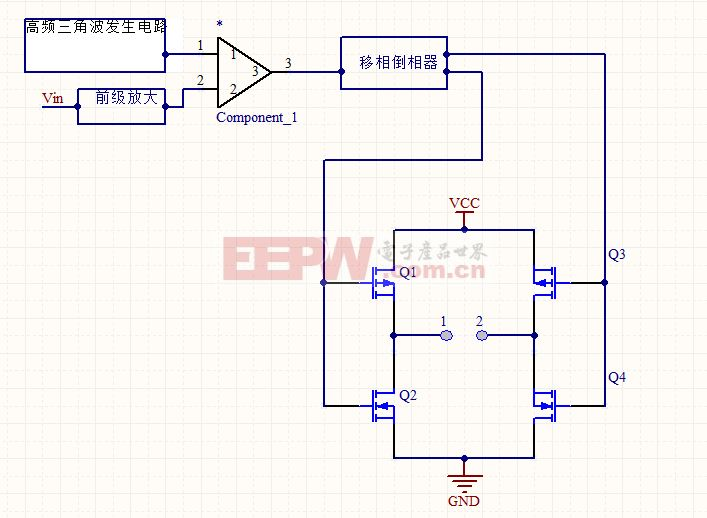

D类功放也称数字式放大器，利用极高频率的转换开关电路来放大音频信号，

具体工作原理如下：D类功放采用异步调制的方式，在音频信号周期发生变化时，高频载波信号仍然保持不变，因此，在音频频率比较低的时候，PWM的载波个数仍然较高，因此对抑制高频载波和减少失真非常有利，而载波的变频带原理音频信号频率，因此也不存在与基波之间的相互干扰问题。许多功率高达1000W的丁类放大器，体积只不过像VHS录像带那么大。这类放大器不适宜于用作宽频带的放大器，但在有源超低音音箱中有较多的应用。

### 5、T类功放
　　该类功放的原理与D类功放的原理相同，但是信号部分采用DDP技术(核心是小信号的适应算法和预测算法)。工作原理如下：音频信号进入扬声器的电流全部经过DDP进行运算处理后控制大功率高频晶体管的导通或者关闭，从而达到音频信号的高保真线性放大。该类功放具有效率高、失真小，音质可以与AB类功放媲美的一类功放。

 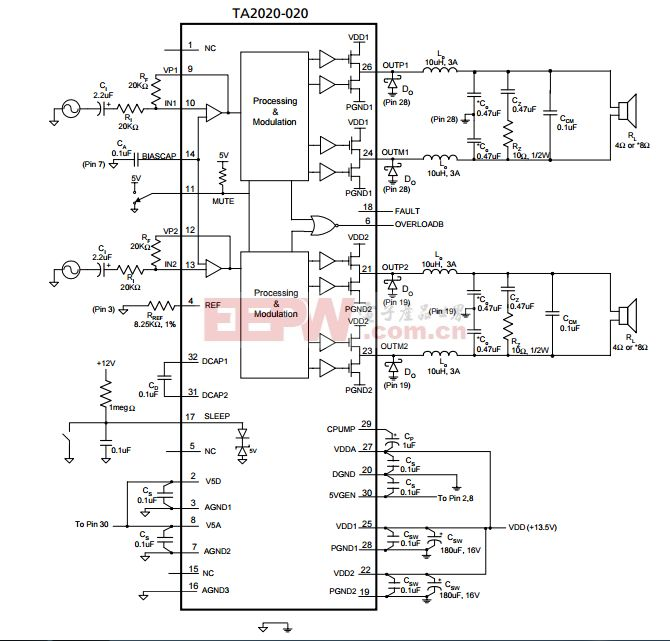

# 仿真验证

仿真软件：[Circuitjs web 在线电路模拟器](https://cc.xiaogd.net/)

仿真文件：
[推挽输出.txt](0000assets/4、推挽电路/file-20251224155834271.txt)

[114.txt](0000assets/4、推挽电路/file-20251224155834270.txt)

[交越失真消除电路.txt](0000assets/4、推挽电路/file-20251224155834272.txt)

