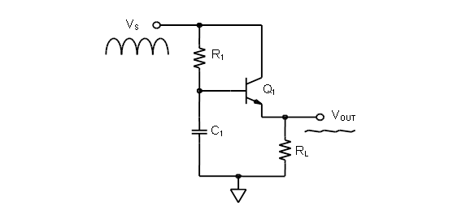
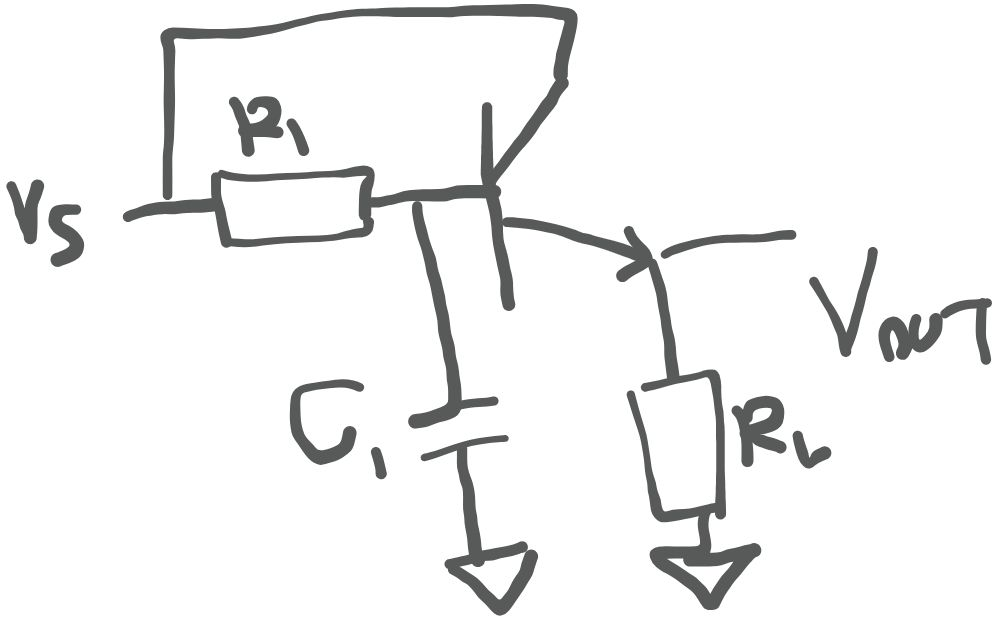
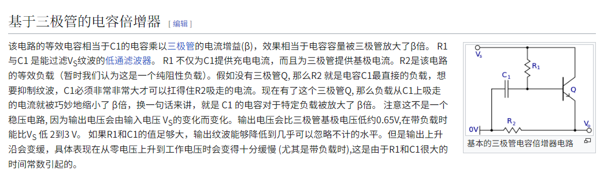
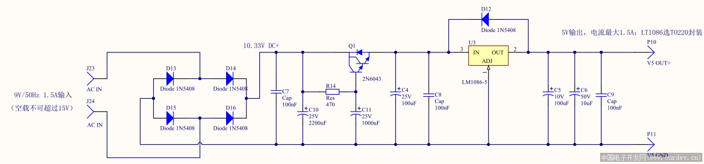

# 电容倍增器电路

### 三极管对应的电容倍增电路
[神奇的电容倍增器，HIFI发烧友必备 三极管+电容 达林顿管+电容 2N2222+2N2907+电容 TIP31+TIP32+电容 TIP41+TIP42_哔哩哔哩_bilibili](https://www.bilibili.com/video/BV1Pg411w7hu/?spm_id_from=333.337.search-card.all.click&vd_source=ba62f878ab81b77525d122fe32118844)

其可以等效为一个RC滤波电路和一个射级跟随器件

[RC低通滤波器截止频率公式推导_rc低通滤波电路-CSDN博客](https://blog.csdn.net/zwc475793240/article/details/122432824)[射极跟随器-射极跟随器原理-射极跟随器分类-射极跟随器的应用-什么是射极跟随器-百科-CK365测控网](http://www.ck365.cn/baike/1/1484.html?WebShieldDRSessionVerify=defqFFQxC7ls6ndfSJOU)。其等效电容可以表示为$ \beta C_1 $。

[Chapter 16: Advanced Amplifier topics: [Analog Devices Wiki]](https://wiki.analog.com/university/courses/electronics/text/chapter-16)

[晶体管驱动的电容倍增器：原理与应用-CSDN博客](https://blog.csdn.net/m0_46152804/article/details/123616907)

[神奇的电容倍增器，HIFI发烧友必备 三极管+电容 达林顿管+电容 2N2222+2N2907+电容 TIP31+TIP32+电容 TIP41+TIP42_哔哩哔哩_bilibili](https://www.bilibili.com/video/BV1Pg411w7hu/?spm_id_from=333.337.search-card.all.click&vd_source=ba62f878ab81b77525d122fe32118844)

[电容倍增器计算器](https://calculatorshub.net/zh-CN/%E7%94%B5%E5%8A%A8/%E7%94%B5%E5%AE%B9%E5%80%8D%E5%A2%9E%E5%99%A8%E8%AE%A1%E7%AE%97%E5%99%A8/)

# 米勒效应

### 米勒效应

[米勒效应,mos管的米勒效应图文解析](http://www.ejiguan.cn/2024/changjianwtjd_0529/7867.html)

[三极管放大器之米勒效应介绍](http://www.ejiguan.cn/2021/changjianwtjd_0805/3936.html)

[米勒效应详解-CSDN博客](https://blog.csdn.net/cherylzzx/article/details/103554651#:~:text=%E5%85%B7%E4%BD%93%E6%93%8D%E4%BD%9C%E6%96%B9%E6%B3%95%E6%98%AF%E5%9C%A8%E9%97%A8%E6%9E%81%E4%B8%8E%E5%B0%84%E6%9E%81%E4%B9%8B%E9%97%B4%E5%A2%9E%E5%8A%A0%20%E4%B8%89%E7%BA%A7%E7%AE%A1%EF%BC%8C%E5%BD%93VGE%E7%94%B5%E5%8E%8B%E8%BE%BE%E5%88%B0%E6%9F%90%E4%B8%AA%E5%80%BC%E6%97%B6%EF%BC%8C%E9%97%A8%E6%9E%81%E4%B8%8E%E5%B0%84%E6%9E%81%E7%9A%84%E7%9F%AD%E8%B7%AF%E5%BC%80%E5%85%B3%20%28%E4%B8%89%E7%BA%A7%E7%AE%A1%29%E5%B0%86%E8%A2%AB%E8%A7%A6%E5%8F%91%E3%80%82%20%E8%BF%99%E6%A0%B7%E6%B5%81%E7%BB%8F%E7%B1%B3%E5%8B%92%E7%94%B5%E5%AE%B9%E7%9A%84%E7%94%B5%E6%B5%81%E5%B0%86%E8%A2%AB%E5%A2%9E%E5%8A%A0%E7%9A%84,%E4%B8%89%E6%9E%81%E7%AE%A1%20%E6%88%AA%E6%96%AD%E8%80%8C%E4%B8%8D%E4%BC%9A%E6%B5%81%E5%90%91VOUT%EF%BC%8C%E8%BF%99%E7%A7%8D%E6%8A%80%E6%9C%AF%E8%A2%AB%E7%A7%B0%E4%B8%BA%E6%9C%89%E6%BA%90%E7%B1%B3%E5%8B%92%E9%92%B3%E4%BD%8D%E6%8A%80%E6%9C%AF%E3%80%82%20%E7%8E%B0%E5%A6%82%E4%BB%8A%EF%BC%8C%E5%9B%9B%E7%A7%8D%E6%96%B9%E6%B3%95%E9%83%BD%E6%98%AF%E4%BA%92%E7%9B%B8%E7%BB%93%E5%90%88%E6%9D%A5%E5%AE%9E%E7%8E%B0%E6%9C%80%E9%AB%98%E6%80%A7%E4%BB%B7%E6%AF%94%E5%9C%B0%E5%87%8F%E7%BC%93%E7%B1%B3%E5%8B%92%E6%95%88%E5%BA%94%E7%9A%84%E3%80%82%20%E5%BD%93%E7%84%B6%EF%BC%8C%E5%8A%9F%E7%8E%87%E5%8D%8A%E5%AF%BC%E4%BD%93%E4%B8%AD%E5%8F%AF%E8%83%BD%E7%B1%B3%E5%8B%92%E6%95%88%E5%BA%94%E4%B8%8D%E5%BA%94%E8%AF%A5%E5%AD%98%E5%9C%A8%EF%BC%8C%E4%BD%86%E6%98%AF%E5%9C%A8%E4%B8%80%E4%BA%9B%E5%BA%94%E7%94%A8%E4%B8%AD%EF%BC%8C%E7%B1%B3%E5%8B%92%E6%95%88%E5%BA%94%E4%B9%9F%E6%98%AF%E6%9C%89%E5%A5%BD%E5%A4%84%E7%9A%84%EF%BC%8C%E6%AF%94%E5%A6%82%E5%88%B6%E4%BD%9C%E9%A2%91%E7%8E%87%E8%A1%A5%E5%81%BF%E7%94%B5%E5%AE%B9%EF%BC%8C%E6%88%96%E8%80%85%E6%98%AF%E5%8F%AF%E6%8E%A7%E7%9A%84%E7%94%B5%E5%AE%B9%E7%AD%89%E3%80%82)

[Mos管米勒平台讲解](https://zhuanlan.zhihu.com/p/715687347)

### 米勒平台讲解
在 MOSFET 导通过程中，**Vds（漏源极电压）下降的根本原因是 MOSFET 内部沟道电阻的减小**。这个过程伴随着 MOSFET 工作状态的变化（从截止区到饱和区，再到线性区）以及外部负载特性。具体分析如下：

1. **初始状态 (截止区)：**
    - 在导通前（t0 之前），MOSFET 处于关断状态（Vgs < Vth）。
    - 此时，漏极和源极之间**没有导电沟道**形成，相当于一个断开的开关。
    - **外部电源电压 (Vdd) 几乎全部加在 MOSFET 的漏源两端。** 因此，Vds ≈ Vdd（高电平）。
2. **开始导通 (进入饱和区/恒流区)：**
    - 栅极驱动电压 Vgs 开始上升（t1 之后）。
    - 当 Vgs > Vth（t2 时刻）时，MOSFET 开始导通，在栅极下方的硅表面形成**导电沟道**（N沟道是电子沟道，P沟道是空穴沟道）。
    - 此时，虽然沟道形成，但**沟道很窄，电阻很大**。同时，漏极电压 Vd 仍然很高（接近 Vdd）。由于沟道靠近漏极端夹断（Vgd = Vgs - Vds < Vth），MOSFET **进入饱和区（或恒流区）**。
    - **在饱和区，漏极电流 ID 主要由 Vgs 控制 (ID ≈ k * (Vgs - Vth)²)，对 Vds 变化不敏感。** 只要 Vds > (Vgs - Vth)，ID 就基本保持恒定（由此时的 Vgs 决定）。
    - 由于 ID 开始流动，根据**负载特性（通常是电阻或电感）**：
        * **阻性负载：** 电流 ID 流过负载电阻 (Rload)，在 Rload 上产生压降 (ID * Rload)。根据基尔霍夫电压定律 (KVL)，Vds = Vdd - (ID * Rload)。随着 ID 增大，ID * Rload 增大，**Vds 必然下降**。
        * **感性负载：** 电流 ID 开始建立，但电感电流不能突变。此时，**电感两端会产生感应电压 (L * di/dt)，其极性是阻止电流增加的**。这个感应电压会**帮助拉低 MOSFET 漏极的电压 Vds**。Vds = Vdd - (L * di/dt)。只要 di/dt > 0 (电流在增加)，Vds 就会小于 Vdd。
3. **米勒平台阶段 (饱和区持续，Vds 快速下降)：**
    - 在 t3 时刻，Vgs 达到米勒平台电压 Vp，ID 达到由 Vp 决定的最大值（对于当前的 Vgs）。
    - **关键点：** 此时 MOSFET **仍在饱和区**。驱动电流几乎全部被 Cgd 吸收，用于改变 Vgd (支撑 Vds 下降)。
    - **Vds 下降的原因：**
        * **内部沟道电阻持续减小：** 虽然 Vgs 被钉在 Vp 附近基本不变，但 **Vds 的下降本身会使得沟道夹断区缩短**，沟道的有效电阻会继续减小。
        * **外部负载特性：**
            + **阻性负载：** ID 已达到最大值（由 Vp 决定）并**保持不变**。根据 Vds = Vdd - (ID * Rload)，由于 ID 恒定且 Rload 恒定，**Vds 必须下降**。在这个阶段，Vds 的下降主要是为了满足欧姆定律 (V = I * R)，因为电流 ID 已经被 MOSFET 在饱和区限制住（由 Vgs=Vp 决定），而负载电阻 Rload 上的压降必须等于 Vdd - Vds。
            + **感性负载：** ID 仍在以一定的速率 (di/dt) 增加（由 Vp 决定）。根据 Vds = Vdd - (L * di/dt)，**Vds 下降的程度取决于 di/dt**。di/dt 越大，Vds 下降得越快。在米勒平台期间，di/dt 由 Vp 决定并相对稳定。
        * **正反馈效应：** 轻微的 Vds 下降 -> 沟道夹断区缩短 -> 沟道电阻减小 -> 在相同 ID 下（饱和区电流恒定），需要维持该电流所需的沟道电场强度可以略低 -> 这允许 Vds 进一步下降。这个效应加速了 Vds 在饱和区内的下降过程。
4. **退出米勒平台 (进入线性区/欧姆区，Vds 降至最低)：**
    - 当 Vds 下降到足够低，使得 Vgd = Vgs - Vds > Vth（即 Vds < Vgs - Vth）时，漏极端不再出现夹断。
    - MOSFET **退出饱和区，进入线性区（欧姆区）**。
    - 在线性区，MOSFET 表现得像一个**电阻 (Rds(on))**，ID 同时受 Vgs 和 Vds 影响。此时 Vds 已经很低。
    - 驱动电流不再被 Cgd 大量吸收，可以继续给 Cgs 充电，Vgs 从 Vp 上升到最终驱动电压。
    - 随着 Vgs 上升，沟道电阻 Rds(on) 进一步减小。
    - **Vds 最终降至最小值：** Vds ≈ ID * Rds(on)。此时，大部分电源电压 Vdd 都降落在负载上。

**总结：**

Vds 在 MOSFET 导通过程中下降的核心驱动力是**内部导电沟道的形成和沟道电阻的持续减小**。在米勒平台期间（饱和区），Vds 的快速下降主要是为了：

1. **满足外部负载的电压-电流关系 (欧姆定律或电感特性)。**
2. **适应 MOSFET 在饱和区电流恒定 (由 Vgs 钉住) 时，沟道电阻仍在减小的物理现实。**
3. **沟道夹断区缩短带来的正反馈效应加速了这个下降过程。**

米勒效应通过“锁定”Vgs 凸显并延长了这个 Vds 快速下降的阶段，但下降的根本原因在于 MOSFET 沟道导通能力的增强（电阻减小）和外部负载的特性。

### 米勒效应应用
[两级运放的 Gm 前馈补偿方法介绍 – Analog-Life](https://www.analog-life.com/2023/10/introduction-to-the-gm-feedforward-compensation-method-for-two-stage-op-amps/)

主要作用是讲两个极点的距离推远。

[MOSFET（二）：米勒效应-CSDN博客](https://blog.csdn.net/VampireWolf/article/details/113241620)

米勒平台虽然在高频开关状态会严重增加的开通损耗，但是在电源缓启动中有很大的用处。通过上图可以看到， 管两端电压  的下降区间，大部分都在米勒平台之间完成，如果增加  管的米勒电容 ，可以达到延长  的下降时间，也就可以利用  管做开关，做电源的缓启动，在热拔插、独立模块供电、大功率设备上电，都有很好的益处。

### 米勒电容预防
米勒电容除了会导致开关损耗，同时还有可能导致寄生导通。

可采用低米勒电容器件，或者加大电流。或者选择带有米勒钳位驱动芯片。

[功率半导体器件中的米勒效应(Miller Effect)_米勒钳位-CSDN博客](https://blog.csdn.net/u013024788/article/details/128719287#:~:text=%E4%B8%80%E8%88%AC%E6%9C%89%E5%9B%9B%E7%A7%8D%E6%96%B9%E6%B3%95%EF%BC%9A%20%E2%91%A0%E9%80%89%E6%8B%A9%E5%90%88%E9%80%82%E7%9A%84%E9%97%A8%E6%9E%81%E9%A9%B1%E5%8A%A8%E7%94%B5%E9%98%BBRG%20%E2%91%A1%E5%9C%A8%E9%97%A8%E6%9E%81G%E5%92%8C%E5%B0%84%E6%9E%81E%E4%B9%8B%E9%97%B4%E5%A2%9E%E5%8A%A0%E7%94%B5%E5%AE%B9%20%E2%91%A2%E9%87%87%E7%94%A8%E8%B4%9F%E5%8E%8B%E9%A9%B1%E5%8A%A8,%E2%91%A3%E9%97%A8%E6%9E%81%E6%9C%89%E6%BA%90%E9%92%B3%E4%BD%8D%20%E4%B8%8B%E9%9D%A2%E6%98%AF%E4%B8%8A%E9%9D%A2%E5%9B%9B%E7%A7%8D%E6%96%B9%E6%B3%95%E7%9A%84%E7%AE%80%E5%8D%95%E4%BB%8B%E7%BB%8D%EF%BC%9A%20%E2%91%A0%E9%80%89%E6%8B%A9%E5%90%88%E9%80%82%E7%9A%84%E9%97%A8%E6%9E%81%E9%A9%B1%E5%8A%A8%E7%94%B5%E9%98%BBRG%20%E9%87%87%E7%94%A8%E4%BA%86%E7%8B%AC%E7%AB%8B%E7%9A%84%E9%97%A8%E6%9E%81%E5%BC%80%E9%80%9A%E5%92%8C%E5%85%B3%E6%96%AD%E7%94%B5%E9%98%BB%EF%BC%8C%E9%97%A8%E6%9E%81%E5%AF%BC%E9%80%9A%E7%94%B5%E9%98%BBRGON%E5%BD%B1%E5%93%8DIGBT%E5%AF%BC%E9%80%9A%E6%9C%9F%E9%97%B4%E7%9A%84%E9%97%A8%E6%9E%81%E5%85%85%E7%94%B5%E7%94%B5%E5%8E%8B%E5%92%8C%E7%94%B5%E6%B5%81%EF%BC%9B%E5%A2%9E%E5%A4%A7%E8%BF%99%E4%B8%AA%E7%94%B5%E9%98%BB%E5%B0%86%E5%87%8F%E5%B0%8F%E9%97%A8%E6%9E%81%E5%85%85%E7%94%B5%E7%9A%84%E7%94%B5%E5%8E%8B%E5%92%8C%E7%94%B5%E6%B5%81%EF%BC%8C%E4%BD%86%E4%BC%9A%E5%A2%9E%E5%8A%A0%E5%BC%80%E9%80%9A%E6%8D%9F%E8%80%97%E3%80%82%20%E5%AF%84%E7%94%9F%E7%B1%B3%E5%8B%92%E7%94%B5%E5%AE%B9%E5%BC%95%E8%B5%B7%E7%9A%84%E5%AF%BC%E9%80%9A%E9%80%9A%E8%BF%87%E5%87%8F%E5%B0%8F%E5%85%B3%E6%96%AD%E7%94%B5%E9%98%BBRGOFF%E5%8F%AF%E4%BB%A5%E6%9C%89%E6%95%88%E6%8A%91%E5%88%B6%E3%80%82)

[MOS管米勒平台形成原理及改善](https://zhuanlan.zhihu.com/p/18807878613#:~:text=7%E3%80%81%20ZVS%20%E9%9B%B6%E7%94%B5%E5%8E%8B%E5%BC%80%E5%85%B3%E6%8A%80%E6%9C%AF%20%E6%98%AF%E5%8F%AF%E4%BB%A5%E6%B6%88%E9%99%A4%E7%B1%B3%E5%8B%92%E6%95%88%E5%BA%94%E7%9A%84%EF%BC%8C%E5%8D%B3%E5%9C%A8Vds%E4%B8%BA0%E6%97%B6%E5%BC%80%E5%90%AF%E6%B2%9F%E9%81%93%E3%80%82%208%E3%80%81%E9%87%87%E7%94%A8%E6%9B%B4%E5%BF%AB%E7%9A%84%E9%A9%B1%E5%8A%A8%E7%94%B5%E8%B7%AF%EF%BC%9A%E5%8F%AF%E4%BB%A5%E6%8F%90%E9%AB%98MOS%E7%AE%A1%E7%9A%84%E5%BC%80%E5%85%B3%E9%80%9F%E5%BA%A6%EF%BC%8C%E4%BB%8E%E8%80%8C%E5%87%8F%E5%B0%8F%E7%B1%B3%E5%8B%92%E5%B9%B3%E5%8F%B0%E7%9A%84%E5%BD%B1%E5%93%8D%E3%80%82%20%E5%B8%B8%E7%94%A8%E7%9A%84%E9%A9%B1%E5%8A%A8%E7%94%B5%E8%B7%AF%E5%8C%85%E6%8B%AC,%E5%85%B1%E6%BA%90%E6%9E%81%E9%A9%B1%E5%8A%A8%E7%94%B5%E8%B7%AF%20%E3%80%81%20%E5%85%B1%E6%BC%8F%E6%9E%81%E9%A9%B1%E5%8A%A8%E7%94%B5%E8%B7%AF%20%E5%92%8C%20%E5%85%B1%E9%9B%86%E6%9E%81%E9%A9%B1%E5%8A%A8%E7%94%B5%E8%B7%AF%20%E7%AD%89%E3%80%82%209%E3%80%81%E4%BD%BF%E7%94%A8%E5%B8%A6%E7%B1%B3%E5%8B%92%E9%92%B3%E4%BD%8D%E7%9A%84%E9%A9%B1%E5%8A%A8%E8%8A%AF%E7%89%87%E3%80%82)

[米勒电容、米勒效应和器件与系统设计对策](https://zhuanlan.zhihu.com/p/611993328)

[米勒钳位.txt](0000assets/5、电容倍增器电路/file-20251224155839398.txt)

