[一文讲透“有源滤波器”是如何设计的呢？](https://zhuanlan.zhihu.com/p/1922820367526887844)

[有源滤波电路设计_有源带通滤波器电路设计-CSDN博客](https://blog.csdn.net/qq_41873236/article/details/123097110)

## 滤波器分类
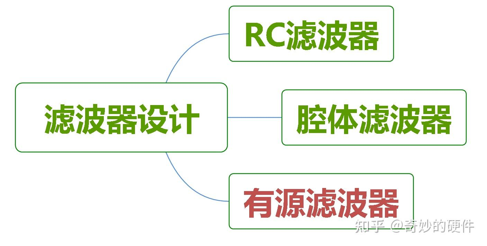

> 说到滤波器，大家肯定首先想到的是**RC滤波**，**微带滤波**，**腔体(介质)滤波**器等。“[有源滤波器](https://zhida.zhihu.com/search?content_id=259706930&content_type=Article&match_order=1&q=%E6%9C%89%E6%BA%90%E6%BB%A4%E6%B3%A2%E5%99%A8&zhida_source=entity)”总是显得非常模糊且神秘。  
>

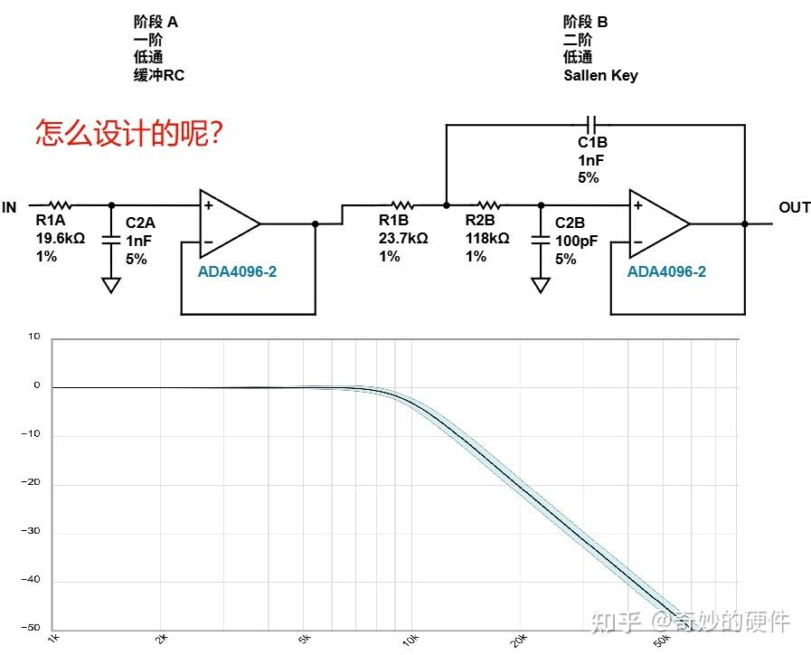

今天我们来就来讲一讲“**有源滤波器**”的**原理**和**设计方法**。仿真不同的**典型拓扑**：[Sallen-key](https://zhida.zhihu.com/search?content_id=259706930&content_type=Article&match_order=1&q=Sallen-key&zhida_source=entity)**和****Multiple Feedback**，解开它的神秘面纱！

## 三种“滤波器”对比
在此之前先简单对比以一下其他两个类型的滤波器

> （一）**RC滤波器**：现在已经有非常成熟的**小工具**计算，如果你需要我把链接附在下面：  
>

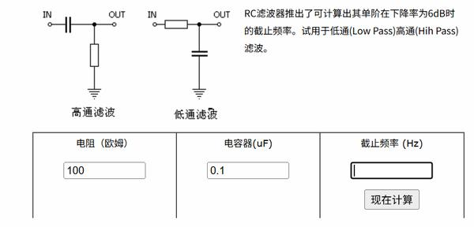

RC滤波器工具

（小工具链接：[https://www.mwrf.net/tool/rf/2012/8212.html](https://link.zhihu.com/?target=https%3A//www.mwrf.net/tool/rf/2012/8212.html)）

它的推导也十分简单，就是简验的[分压定理](https://zhida.zhihu.com/search?content_id=259706930&content_type=Article&match_order=1&q=%E5%88%86%E5%8E%8B%E5%AE%9A%E7%90%86&zhida_source=entity)，此处不做推导。(如果需要人多，可打“**RC低通推导**”在评论区,我再手搓一遍)

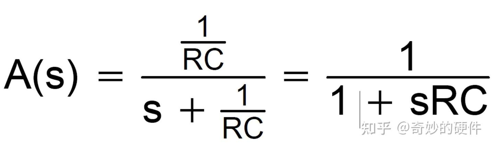

传递函数

这个是S域变换后的传递函数，其中S＝_ｊｗ_

> （二）**腔体滤波器**： 这是一个单独的行业分支，有比较高的门槛，包括需要很深的**腔体理论**，**结构设计**以及**可靠性**试验。  
>

腔体滤波器

腔体滤波器的仿真,生产都需要大量人力，时间成本，价格一般比较**昂贵**。但好在性能非常优良且稳定**(插损小,抑制强,稳定可靠**)，在卫星，基站等产品上用的非常广泛

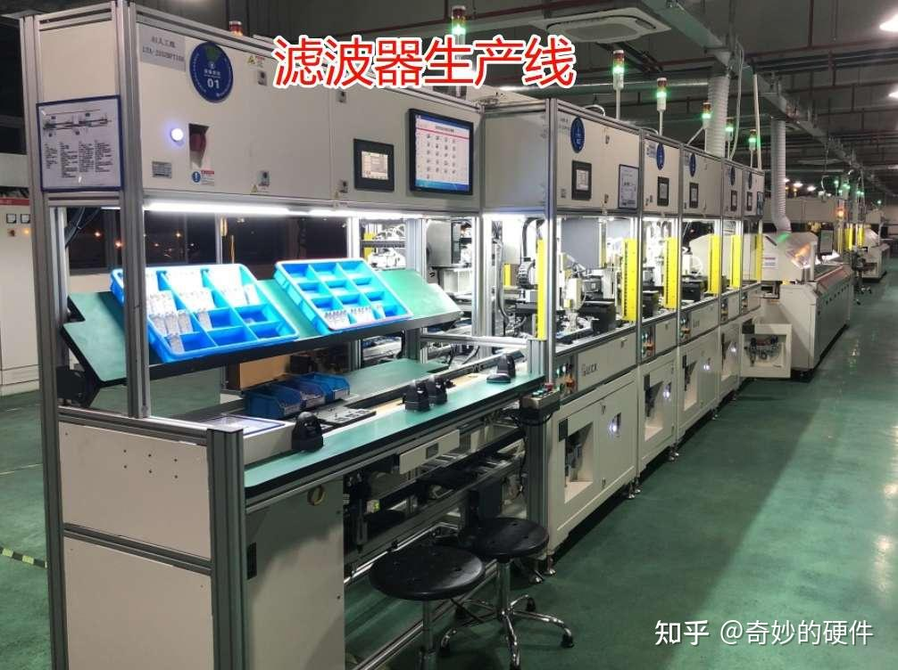

生产车间

最近的新技术“**金属腔体免调螺滤波器** ”成为行业热点，大家感兴趣自搜

> （三）**有源滤波器**： 是基于**[运算放大器](https://zhida.zhihu.com/search?content_id=259706930&content_type=Article&match_order=1&q=%E8%BF%90%E7%AE%97%E6%94%BE%E5%A4%A7%E5%99%A8&zhida_source=entity)为核心**的**滤波电路**。有另外一套分析方法，具有仿真迭代速度快，价格便宜等优点。一般适用场景是**低频**（１ＭＨｚ以下）如“**锁相环**”电路,**电源**电路,“**仪器仪表**”电路等  
>

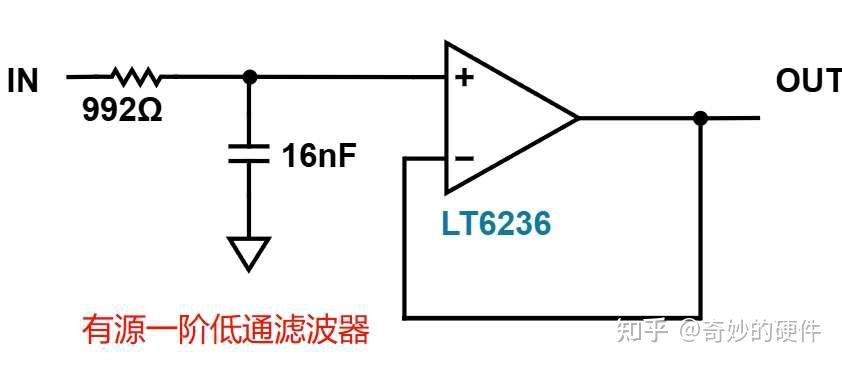

有源滤波器的传递函数，是根据无源RC滤波器的传递函数而来。如果是多级级联，传递函数也是一个道理。

## “有源滤波器”的设计分析
### （一）：一阶“RC+运放”分析
> 接下来直接上**干货**，还是上面滤波电路，我们把它**剖开分析**：  
>

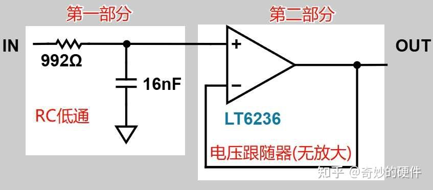

把它分成“第一部分”和“第二部分”。

**第一部分**：是一个标准的**RC低通**滤波器。

**第二部分**：是一个电压跟随器（无放大作用），起到**隔离**作用,并增强**带负载能力**

针对第一部分的标准RC波器来说，它的截止频率公式是：，如下图所示。截止频率为10K赫兹

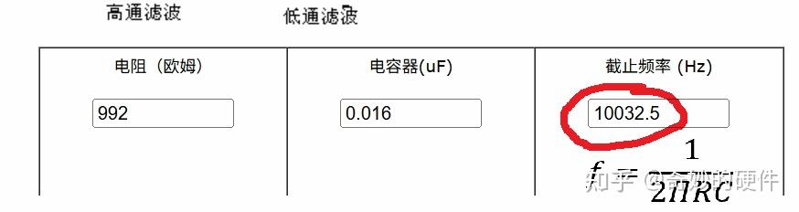

再加上运算放大器的**负反馈**一部分。两者的输出曲线其实并没有太大的变化(从截止频率来看)

> 那**有源运放**还有没有**意义**呢？我们接着看它的**痛点问题**！  
>

### 痛点一：滤波曲线不陡峭！
十倍频程的频率变化，抑制仅下降了20dB，意味着即便在远端，可能也没有较好的滤波抑制效果，**近端滤波效果更差**。

### 痛点二：负载调制问题！
> **RC滤波器**：后面**接负载**往往具有不确定性。如果是一个具有频响特性的器件(阻抗随频率变化)，它的阻抗可能会影响RC滤波器的滤波效果。  
>

**典型的可能**：导致截止频率发生变化，甚至波形发生变化等。而加了运放之后，就有较好的隔离效果。这在工程应用中非常实用

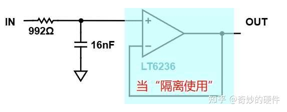

### 其他痛点问题
> **具有增益效果**：既然加了运放，当然可以设计成带有增益的输出结果。这样可使滤波器的**差损得到补偿**  
>

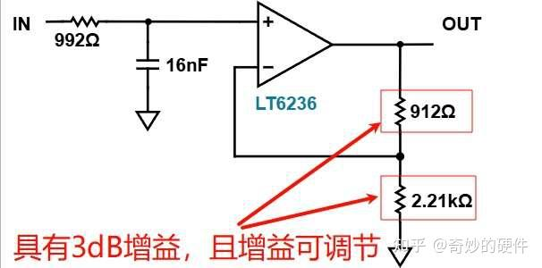

**总结：**

| 对比项 | 无源RC滤波 | 一阶有源RC |
| --- | --- | --- |
| 滤波曲线 | ❌抑制曲线不陡峭（-20dB/十倍频程） | ✅可级联实现高阶滤波，设计灵活 |
| 隔离效果 | ❌无隔离功能，可能受到后级的负载调制影响 | ✅运放高输入阻抗+低输出阻抗实现隔离；✅带载能力强 |
| 增益输出 | ❌无增益，信号只能衰减输出 | ✅可设计增益（1～1000倍），同时保持滤波特性 |

### （二）：二阶“RC+运放”分析
> 如果我们的输入端再接一组RC，变成两组RC。此时就变成了一个简单的**二阶RC有源滤波器**，如下图所示：  
>

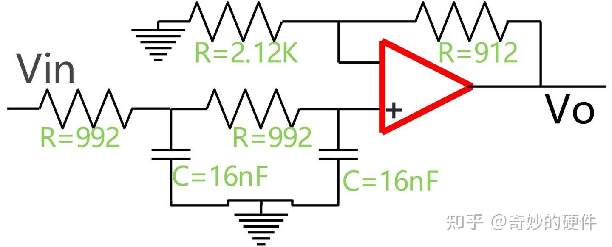

为了方便我们的仿真和计算。我们将此处电阻取值统一为**R=992**，电容取值统一为**C=16nF**；此外，为了能保证该有源增益输出，我们设计了分压电阻2.12K和912Ω，理论计算增益的计算结果如下：

**Gain=(1+912/2120)=1.43(倍)**

> （由于前面还有RC器件，增益会有些许偏差） 为了进一步做验证，我们用仿真软件**搭建电路**：  
>

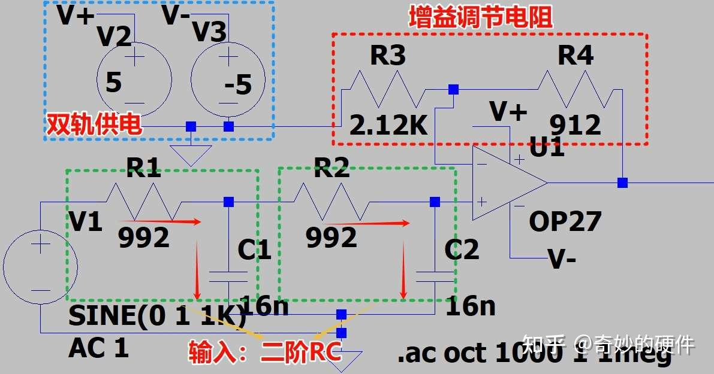

> **电路简介：可分为三部分.**  
(1)输入的二阶无源RC电路。 (2)增益可调节电阻；  
(3)运算放大器op27--双轨供电  
>

**输入前仿真结果：**

先看输入前的一阶和二阶RC无源部分：

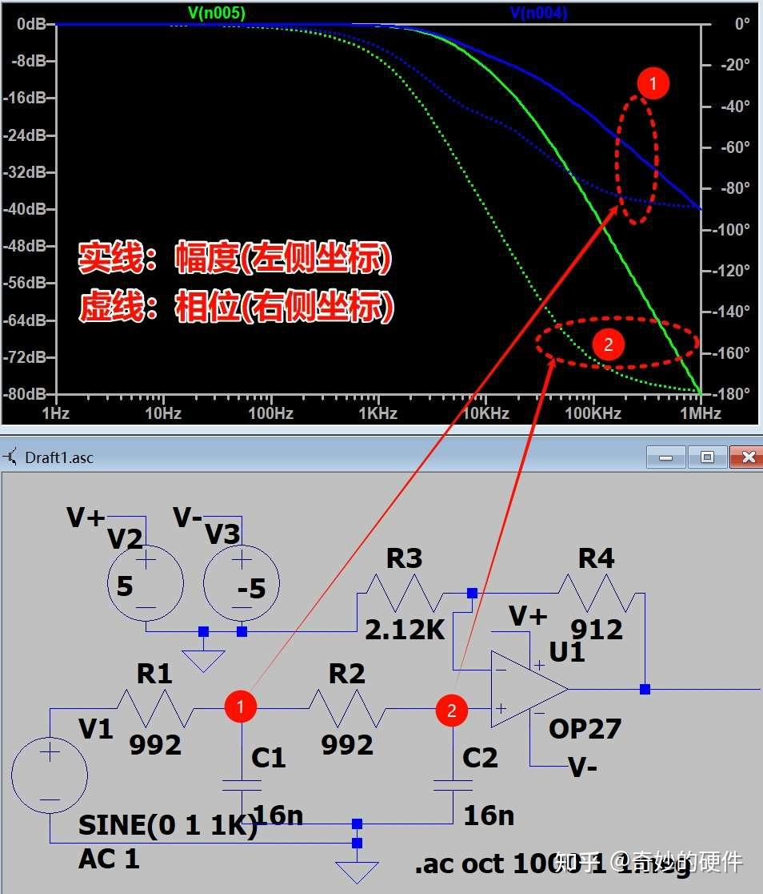

> **位置1**和**位置2**分别是1阶和2阶的RC无源滤波仿真结果。我把曲线放到一起，可以明显看到二阶的无源滤波曲线更加陡峭，滤波效果更好。  
>

**整体仿真结果：**

下图是输出点**位置3**对应的输出结果，输出有3dB的增益；并且它的输出曲线同样陡峭，证明抑制效果较好

## 经典有源滤波拓扑：Sallen Key和MultiFeed Back
### Sallen-Key拓扑设计
如果我们进一步提高通带带宽，且保持滚降系数不便，该怎么办呢？

> Sallen-Key设计思路： **《1》****如果要增强滤波效果，我们最先想到的是****引入并联电容**。那么这个并联电容能不能是**输入端的RC**电容呢？ **《2》** 最好还要引入**[正反馈](https://zhida.zhihu.com/search?content_id=259706930&content_type=Article&match_order=1&q=%E6%AD%A3%E5%8F%8D%E9%A6%88&zhida_source=entity)**，将截止频率附近处的幅度先拉高。然后在急剧下降，来提高它的抑制斜率(见下图)  
>

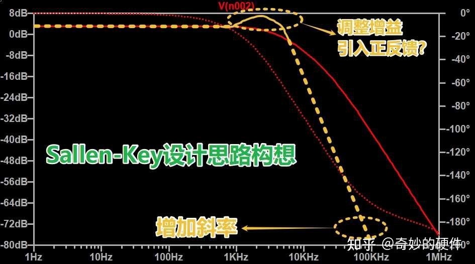

> （**注**：负反馈加电容也能小范围提高抑制度，但效果不明显；另外，**负反馈**的电容更多用于**调节相位裕度**，来保证电路的**稳定性**）  
>

下面我将电路做如下**变形**：一阶RC的电容**去除接地线**，并在输出端引入一个反馈，接到这个电容(红虚线)。由于这根线是接到同向端，故这是一个**正反馈**

> 变形完后，就得到一个**标准的Sallen-Key拓扑**。此时，他的反馈路径如红色虚箭头所示。  
>

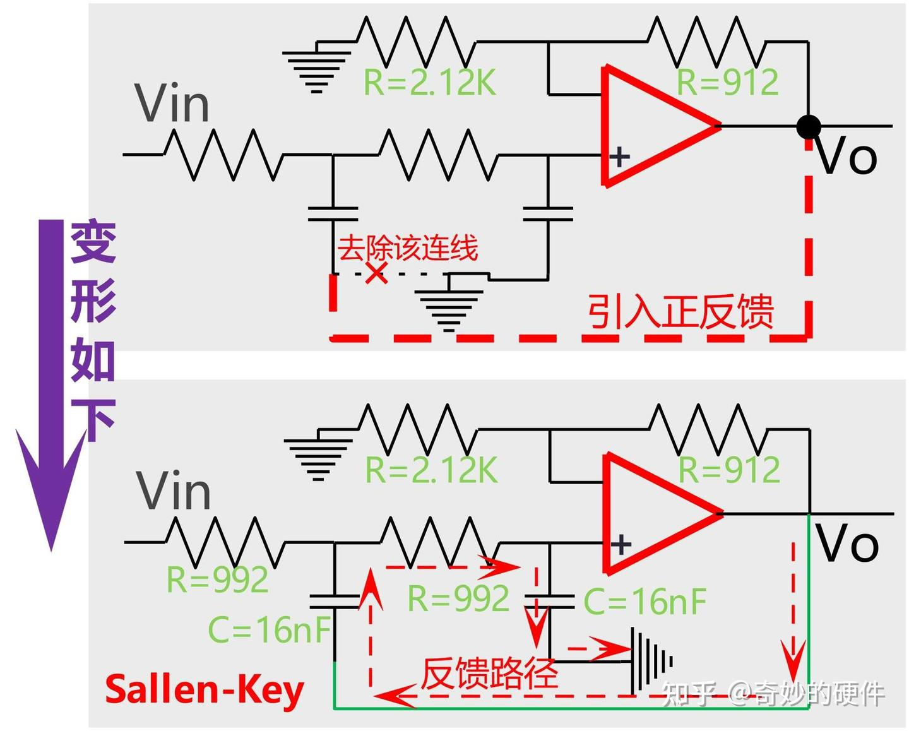

**极端分析法：**  
● 当f→0时直流，正反馈截止(电容断路)，此项相当于缓冲器(电压跟随器)  
● 当f→∞时直流，正反馈截止(电容断路) ➡️ 故存在某一个容值(f=fc时)，正反馈会起作用（此时担心**正反馈的自激作用**）

**定性推导：**

> 既然有**自激风险**，我们做一个定性推导，来判断**自激条件**是什么  
>

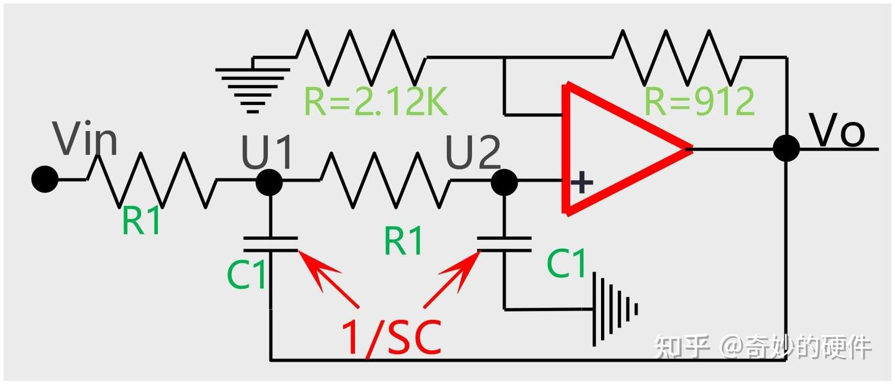

●**通带增益得**([负反馈增益](https://zhida.zhihu.com/search?content_id=259706930&content_type=Article&match_order=1&q=%E8%B4%9F%E5%8F%8D%E9%A6%88%E5%A2%9E%E7%9B%8A&zhida_source=entity))

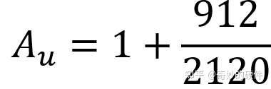

对上图列如下公式：  
●**对U2在U1电的分压得**

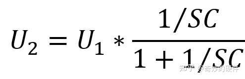

（**注**：电容得S域阻抗为1/SC） ●**对U1节点使用KCL得**

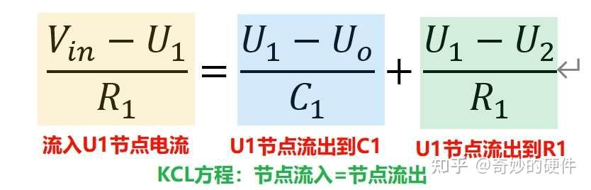

●**联立上述三式可得**（二阶传递函数）：

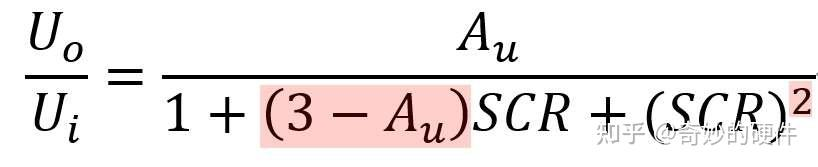

由于S得最高次幂为2，故这是**2阶**Sallen-Key有源滤波

> **结论：由传递函数知，实际使用过程中要保证增益Au<3dB，否则可能不稳定**  
>

**仿真结果：**

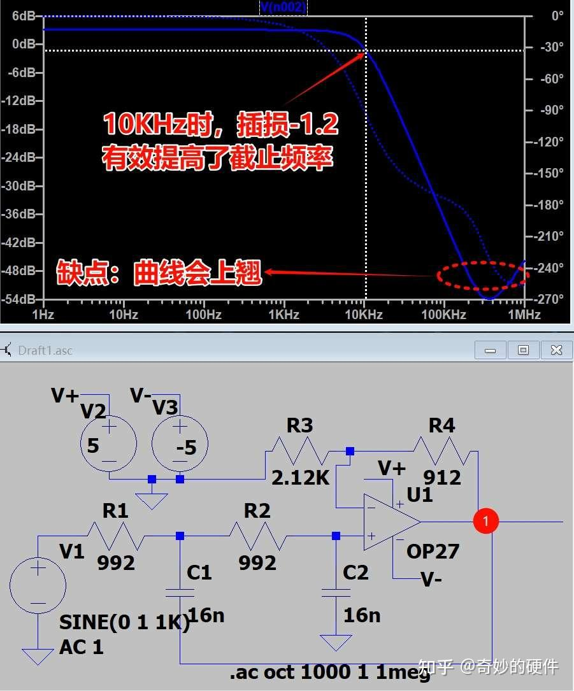

**由仿真结果可知**：  
✱**截止频率**：带宽提高了(RC结构10Khz插损约为-8)。  
✱**缺点**：滤波曲线在高频上会有上翘

> Sallen-Key拓扑结构曲线高频上翘**原因**:实际的电容也是有带宽的，不可避免，需要通过其他手段,给他压下去（如后面并联**高频率波电容**，**更换拓扑结构**等）  
>

### MultiFeed Back拓扑设计
再次变换拓扑结构：MultiFeed　Back（以下简称MFB）如下图所示：

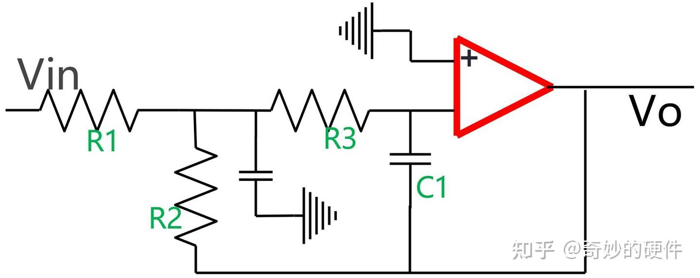

> **MFB拓扑变化**：　　　　　　　●保持了一阶RC不变，将二阶RC的电容接入负反馈；　　　　　　　　　 ●增加一个电阻，也接入负反馈；　　　　　　　　　　　　●输入端接到了放大器的反向端，输出信号会是反向的效果  
>

由于同样也是二阶的滤波器，推导过程不赘述（直接看后文总结），直接看仿真结果：

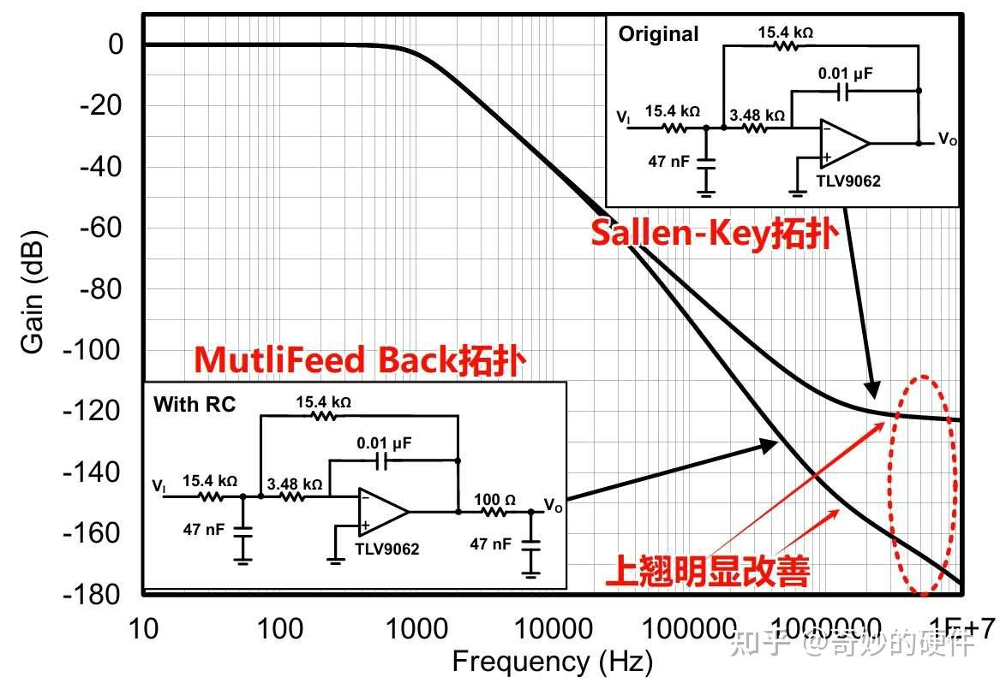

> 相同的器件搭建出来不同的拓扑结构，滤波的效果是不一样的。 MFB结构的**高频上翘得到了明显改善**  
>

多提一句，MFB还能支持差分输出，将反向端的电路**镜像**到同向端即可，具体电路见下图：

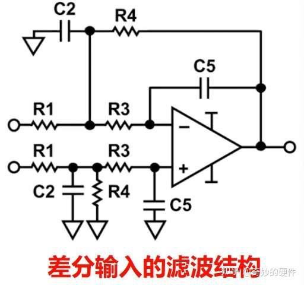

### MFB和Sallen-Key拓扑总结
**⚔️****传递函数对比：**

为了更清楚他们的拓扑选型和应用场景。我们在此处将两个拓扑结构做**详细对比**，供大家参考

| 特性 | Sallen-Key | MFB |
| --- | --- | --- |
| 拓扑结构 | 电压控制电压源 (VCVS) | 反相放大器结构 |
| 信号相位 | 输出同相 | 输出信号相位反转 |
| 设计难度 | 较低（电阻/电容比值小） | 较高（需要精密元件匹配） |
| Q值 | 对元件值敏感，高Q实现困难 | 对元件变化较不敏感，易实现高Q |
| 带外抑制 | 受限，高频曲线上翘 | 优秀（负反馈提供更好抑制） |
| 适用拓扑 | 仅单端结构 | 支持单端和差分 |
| 运放要求 | 与运放带宽无关；可用CFB实现 | 需高增益带宽积运放（GBW） |
| 典型应用 | 基础低通/高通滤波器 | 高精度带通/低通滤波器 |
| 结构差异 | 非积分器结构 | 基于积分器结构 |
| 实现成本 | 较低（元件数量少） | 稍高（额外反馈元件） |

### ADI有源滤波设计工具：
连接如下： [https://tools.analog.com/cn/filterwizard/](https://link.zhihu.com/?target=https%3A//tools.analog.com/cn/filterwizard/)

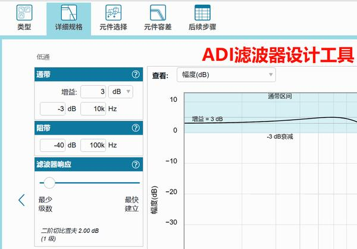

ADI有源滤波工具

> **友情提示：****工具设计方便，我们也应该****在了解它原理的基础上去使用**。这样节省的时间成本，才是有意义的。后续使用应用场景出问题，也方便溯源  
>

