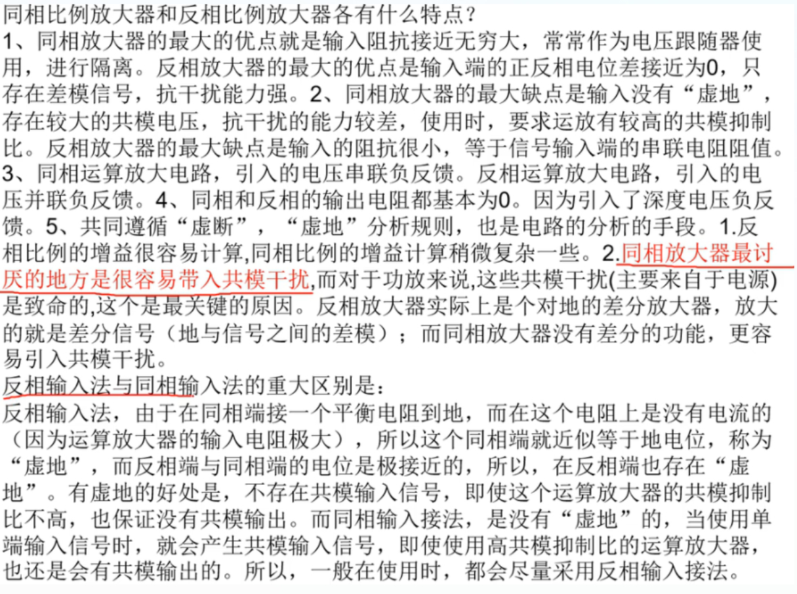
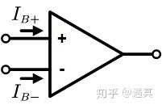
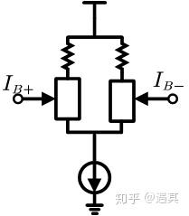
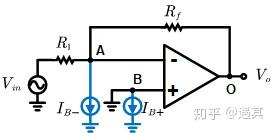
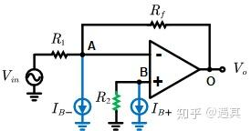

## 1、增益带宽积
[如何理解运算放大器的增益带宽积-运放增益-CSDN博客](https://blog.csdn.net/qq_21794157/article/details/122920050)

## 2、压摆率
[运放参数——压摆率(SR)-CSDN博客](https://blog.csdn.net/wwt18811707971/article/details/78492480)

[运放的转换速率（压摆率）SR的意义和如何选取_maximum slew rate是什么-CSDN博客](https://blog.csdn.net/dxshappy/article/details/8065798)

[压摆率（Slew Rate）-CSDN博客](https://blog.csdn.net/BiGmowang/article/details/142715678?spm=1001.2101.3001.6650.4&utm_medium=distribute.pc_relevant.none-task-blog-2%7Edefault%7Ebaidujs_baidulandingword%7ECtr-4-142715678-blog-8065798.235%5Ev43%5Epc_blog_bottom_relevance_base7&depth_1-utm_source=distribute.pc_relevant.none-task-blog-2%7Edefault%7Ebaidujs_baidulandingword%7ECtr-4-142715678-blog-8065798.235%5Ev43%5Epc_blog_bottom_relevance_base7&utm_relevant_index=9)

[运放的压摆率：为什么它很重要，如何计算-电源网星球号](https://www.dianyuan.com/eestar/article-7623.html)

## 3、噪声密度

## 4、放大器反馈电容
[高速运放应用中需要并联反馈电容的原因](https://zhuanlan.zhihu.com/p/592181226)

## 5、输入失调电压
 输入失调电压 (VOS) 定义为必须在运算放大器的两个输入端子之间施加的电压，以便在输出端获得零伏电压。VOS 用一个与正极输入端子或负极输入端子串联的电压源表示（这两种方式在数学上是等效的）。VOS 被视为直流误 差，无论有无输入信号，从上电至关断，一直都存在。它发生在运算放大器的偏置期间，其影响只能降低而无法 消除。 它的极性可以是负极，也可以是正极，并且可能因同一晶圆批次的器件（裸片）而异。 

[放大器.pdf](https://www.yuque.com/attachments/yuque/0/2025/pdf/43593038/1755094215363-f0b03001-0935-4ddf-81de-73ad342627c8.pdf)

[运算放大器(运放)输入失调电压-CSDN博客](https://blog.csdn.net/USALCD/article/details/140336753)

## 6、输入失调电流

[运放-输入偏置电流与输入失调电流](https://zhuanlan.zhihu.com/p/163373369)

### 一、输入偏置电流（Input Bias Current）
定义

对于理想的运算放大器，如下图所示，根据虚断，输入电流$I_{B+}=I_{B-}=0$。但是实际的元件的性能却并不是如此。尽管这两个电流很小，但是仍然是存在的。这个电流的平均值就叫做**输入偏置电流**(Input Bias Current)

理想运算放大器

偏置电流的存在是因为，运放（以下简称OP）的输入一般是基于BJT（就是Bipolar Junction Transistor，简单来说就是三极管）或者FET结构的长尾式差分输入，如下图所示（方框内就是BJT或者FET）。对于BJT来说，由于三极管工作在放大区是需要提供一定的偏置电流的，因此需要提供输入电流，一般有**nA到uA**级别；对于FET来说，由于[场效应管](https://zhida.zhihu.com/search?content_id=124439077&content_type=Article&match_order=1&q=%E5%9C%BA%E6%95%88%E5%BA%94%E7%AE%A1&zhida_source=entity)本身是场控器件，但还是存在一定的漏电流，但是电流非常小，一般是**fA或者pA**级别。有时候为了ESD，还会增加钳位二极管，从而更加增大了这个漏电流大小。那么到这里我们可以定义bias电流也就是使得运放的输入级能够正常工作的注入的电流。那么它有什么影响呢？

影响

考虑下图所示这样一个电路。Bias电流的作用相当于在输入节点各接入一个电流源，如图中蓝色部分所示。

反向放大电路

理想情况下，由于虚断， $I_{B+}=I_{B-}=0$，从而输出增益为 $-\frac{R_f}{R_1}$。假定bias电流大小为100nA（比如LM358的Bias电流最大就是100nA），$R_1$ 为 10kΩ $R_f$为 100kΩ 。根据叠加定理，单独分析两个电流源的影响。由于B点直接接地，再根据虚短，A点电位也为0，因此流经 R_1 上电流为0，从而流经 $R_f$的电流为 $I_{B-}$。故由于Bias电流的存在，输出电压存在$I_{B-}R_f=100nA*100k\Omega=10mV$的误差。这样的信号在大部分场合都已经是一个非常大的误差了。如果换用FET结构的OP，由于其具有很小的bias current，这个问题可以解决。不过FET价格相对于Bipolar还是更贵，从成本角度考虑，如果不是要求特别高还是会用Bipolar，比如现在很多的通用型OP都是Bipolar的类型。因此在选用运放的时候，需要多注意Bias电流是否会对电路实际的工作造成影响。

那么有什么办法可以减小这部分误差呢？增加**补偿电阻**$R_2$，如下图所示。

增加补偿电阻后的反向放大电路

同样，根据叠加定理，$V_{in}$ 视为短路，单独求解电路中 $I_{B+}$ 和 $I_{B-}$ 对输出的响应。

$V_{o\Delta}=I_{B}^{+} \cdot R_{2} \cdot\left(1+\frac{R f}{R_{1}}\right)-I_B^- \cdot R_{f}=I_B^+R_f R_2(\frac{1}{R_1||R_f})-I_B^-R_f$

因此，如果 $R_2=R_1||R_f$，则有：$V_{o\Delta}=(I_B^+-I_B^-)R_f$一般来说，由于电路的对称性，理想情况下， $I_B^+=I_B^−$，从而通过补偿电阻的引入，消除了由于偏置电路造成的输出误差。但是实际上这种完美的对称性还是不存在的，或多或少这两个值都会有一定的误差，这个误差就叫做输入失调电流(Input offset current)

### 二、输入失调电流(Input offset current)
### 定义
前一节已经提到了，同相输入端和反向输入端的偏置电流的误差就叫做输入失调电流，以下简称offset电流。一般来说，输入失调电流都比输入偏置电流。通常是同一个数量级或者十分之一的数量级。其大小一般随着运算放大器的种类不同而有区别。

1. **高速运算放大器(High speed amplifier)**：其特点是slew rate很高，带宽高，但是其offset电流往往比较大，可能会有nA级别，比如LT6274是3nA（不过我看到TI的FET高速运放的offset电流也能做到1pA级别，这个点先存疑吧）。
2. **通用运算放大器(General purpose amplifier)：**特点是成本低，性能一般，offset电流往往是nA级别，比如LM358点offset电流为5nA
3. **高精度运放(Precise amplifier):** 一般来说offset电流可以做到fA到pA级别，适用于对于精度要求非常高的场合，比如OPA656的offset电流为2pA。

影响

介绍了什么是输入失调电流，那么有什么影响呢？还是从前一节的电路来看。由于Bias电流的存在，输出会引入的误差为

$V_{o\Delta}=(I_B^+-I_B^-)R_f=I_{os}R_f$其中$I_{os}$就是offset电流。因此即便引入了补偿电阻，由于运放差分对的不对称性，输出仍然会有有误差，这部分误差正比于offset电流与反馈电阻的大小。通常情况下，这部分误差大小可能无关紧要。比如失调电流是1nA，反馈电阻是10k，那么引入的误差是1nA*10k=10uV，这样的误差是可以忽略的。但是对于要放大很微小的信号的场合，比如信号本身是uV级别，这个时候反馈电阻会很大，比如 $R_f=10M\Omega$，此时引入的误差$V_{o\Delta}=10M\Omega\cdot1nA=10mV$

此时误差可能就不能忽略了，因此需要选用高精度运放，以满足这么大的放大比例的需求。

### 三、结语
本文主要是介绍了输入偏置电流以及输入失调电流的定义以及各自的影响和解决办法。对于输入偏置电流，一般需要引入补偿电阻来消除其造成的误差。而对于微弱信号放大的场合，需要使用具有低失调电流的高精度运放。

## 7、共模抑制比（CMRR）
CMRR是指共模抑制比（Common Mode Rejection Ratio），它衡量的是运放抑制共模信号并放大差模信号的能力。具体来说，CMRR是差模增益与共模增益的比值，通常以分贝（dB）为单位表示。理想情况下，差模增益应很大，而共模增益应接近零，使得CMRR理论上无穷大。在实际应用中，CMRR值越高，运放抑制共模干扰的能力越强。例如，80dB的CMRR意味着共模电压变化1V会导致输出电压变化0.1mV。CMRR对于确保信号测量的准确性至关重要，特别是在存在共模噪声的环境中。

[AD8065_8066.pdf](https://www.yuque.com/attachments/yuque/0/2025/pdf/43593038/1755763146350-a0dbce75-ab7c-4a3f-9f61-fc376d292b0d.pdf)

