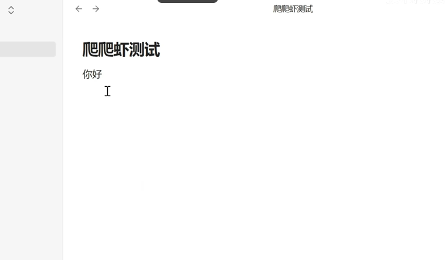
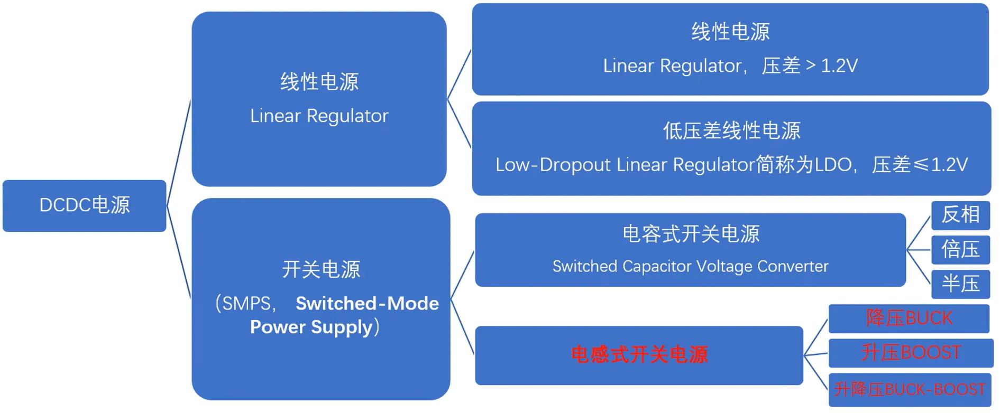
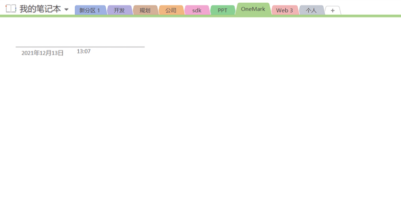
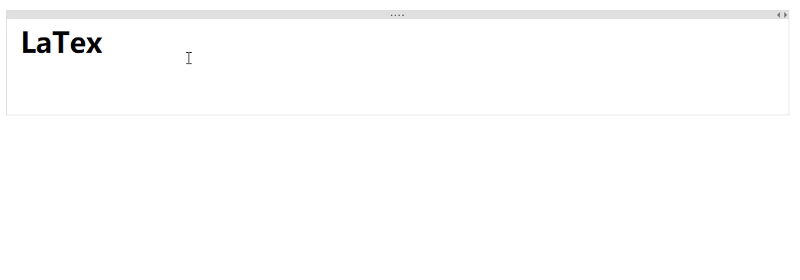

ggg[[你好]]
[[修改验证github同步#你1]]
[[修改验证github同步#^b4d95c]]

[百度]

[百度](Obsidian快速上手，25分钟学会它 你的知识不再遗忘_哔哩哔哩_bilibili](https://www.bilibili.com/video/BV1AatPe1Efo/?spm_id_from=333.337.search-card.all.click&vd_source=ba62f878ab81b77525d122fe32118844) ^0fdf1b

![[d4741e636dd62ba90d170fd84d726649_MD5.webp]]









- 大家安静的
	- 单价低
		- 的骄傲降低 ^2c6234
		- 
			- 景帝即位 ^00aa80
	+ 
	>ndiahao1dajk密达九万i

		&openanhd
			&djaikdjwi
1. first 
2. second
3. third
		- idanda
		- djiajdia
```C 
dkdkkdkd
dkkadkdak
kdkadka
kdjjdj
```

``` C++
dkadkakd
djajdjajda
djajdajdj
```
***
---
4<5
```
<table>
    <tr>
        <td>Foo</td>
    </tr>
</table>
```


# Dhaulagiri

### [ssss](#Dhaulagiri)

| 表头    | 年   | 月   | 日   |
| ----- | --- | --- | --- |
| mon   | 2   | i   | o   |
| jkdjj | i   | i   | i   |
|       |     |     |     |
|       |     |     |     |
$jduahuwhdu$
# G
## G
### G
#### G
##### G
nihao1
djaidjhi1
